```{r setup, include=FALSE}
knitr::opts_chunk$set(echo = TRUE)
```

In this tutorial, we will walk through the logistics of setiting up a course that teaches how to analyze data. It is separated into two sections. First, we will discuss recommended strategies on how to set up the course before the first day of class. Then, we will talk about the logistics for one the class begins (e.g. lectures, homework assignment, grading, etc). These recommendations are based on our experience of teaching three Introduction to Data Science courses: 

* [CS 109 taught in 2014 at Harvard Unviersity](http://cs109.github.io/2014/)
* [BST 260 taught in 2016 at Harvard T.H. Chan School of Public Health](http://datasciencelabs.github.io/2016/)
* [BST 260 taught in 2017 at Harvard T.H. Chan School of Public Health](http://datasciencelabs.github.io)


Here is brief summary of the background of students in the BST 260 Course taught in 2016:

```{r, echo=FALSE,  out.width = "600px", out.extra='style="display: block; margin-left: auto; margin-right: auto; background-color: #000; padding:3px;"'}
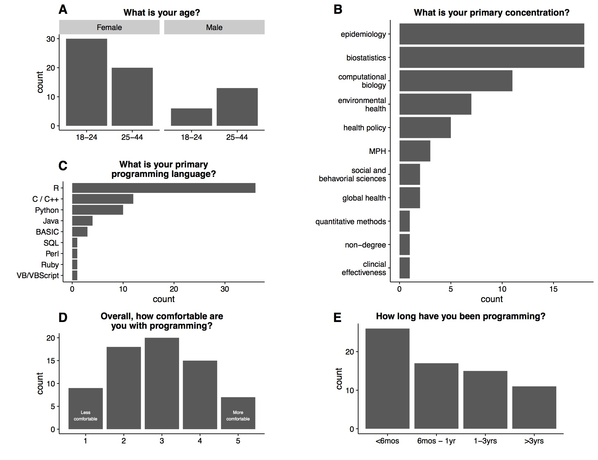
```

We have also written a [Guide to Teaching Data Science](https://www.tandfonline.com/doi/full/10.1080/00031305.2017.1356747) based on these experiences. 

Finally, this tutorial relies heavily on material from the [dsbook](https://rafalab.github.io/dsbook/) by Rafael Irizarry. 

# Before the first day of class

Generally speaking, we do not recommend using point-and-click approaches for data analysis. Instead, **we recommend scripting languages, such as R, since they are more flexible and greatly facilitate reproducibility**. Similarly, we recommend against the use of point-and-click approaches to organizing files and document preparation. In this chapter, we demonstrate alternative approaches. Specifically, we recommend to use freely available tools that, although at first may seem cumbersome and non-intuitive, will eventually make you a much more efficient and productive data scientist. 

Three general guiding principles that motivate what we learn here are

1. Be systematic when organizing your filesystem
2. Automatize when possible
3. Minimize the use of the mouse

As you become more proficient at coding, you will find that

1. You want to minimize the time you spend remembering what you called a file or where you put it
2. If you find yourself repeating the same task over and over, there is probably a way to automatize
3. Anytime your fingers leave the keyboard, it results in loss of productivity 

## Why we use R, R Markdown and RStudio?

### R 

R is not a programming language like C or Java. It was not created by software engineers for software development. Instead, it was developed by statisticians as an interactive environment for data analysis. You can read the full history [here](https://pdfs.semanticscholar.org/9b48/46f192aa37ca122cfabb1ed1b59866d8bfda.pdf). The interactivity is an indispensable feature in data science because, as you will soon learn, the ability to quickly explore data is a necessity for success in this field. However, like in other programming languages, you can save your work as scripts that can be easily executed at any moment. These scripts serve as a record of the analysis you performed, a key feature that facilitates reproducible work. If you are an expert programmer, you should not expect R to follow the conventions you are used to since you will be disappointed. If you are patient, you will come to appreciate the unequal power of R when it comes to data analysis and data visualization specifically.

Other attractive features of R are the following:

1. R is free and [open source](https://opensource.org/history).
2. It runs across all major platforms: Windows, Mac Os, UNIX/Linux.
3. Scripts and data objects can be shared seamlessly across platforms.
4. There is a large, growing, and active community of R users and, as a result, there are numerous resources for [learning](https://stats.stackexchange.com/questions/138/free-resources-for-learning-r) and [asking](https://www.r-project.org/help.html) [questions](https://stackoverflow.com/documentation/r/topics). 
5. It easy for others to contribute add-ons which enables developers to share software implementations of new data science methodologies. This gives R users early access to the latest methods and to tools which are developed for a wide variety of disciplines, including ecology, molecular biology, social sciences, and geography, just to name a few examples. 

To learn more about R, follow these tutorials: 

* [Getting started with R](https://rafalab.github.io/dsbook/getting-started.html)
* [Installing R](https://rafalab.github.io/dsbook/getting-started.html#installing-r)
* [The very basics in R](https://rafalab.github.io/dsbook/the-very-basics.html)


### R Markdown 

* R markdown is a format for _literate programming_ document. It is based on _markdown_, a markup language that is widely used to generate html pages. You can learn more about markdown [here](https://www.markdowntutorial.com/). 
* Literate programming weaves instructions, documentation and detailed comments in between machine executable code, producing a document that describes the program that is best for human understanding (Knuth 1984). Unlike a word processor, such as Microsoft Word, where you what you see is what you get, with R markdown you need to _compile_ the document into the final report. The R markdown document looks different than the final product. This seems like a disadvantage at first, but it is not at all because, for example, instead of producing plots and inserting them one by one into the word processing document, the plots are automatically added. 
* The reason we are interested in using R Markdown in a data analysis course, is because it allows you to write reports, incorporating text and code into a single document. This is important because the final product of a data analysis is often a report. Many scientific publications can be thought of us a final report of a data analysis. The same is true for news articles based on data, an analysis report for your company, or lecture notes for a class on how to analyze data. The reports are often on paper or a PDF that includes a textual description of the finding along with some figures and tables resulting from the analysis. Imagine after you finish the analysis and the report, you are told that you were given the wrong dataset, You are sent you a new one and you are asked run the same analysis with this new dataset. Or what if you realize that a mistake was made and need to re-examine the code, fix the error and re-run the analysis? Or imagine that someone you are training wants to see the code and be able to reproduce the results to learn about the approach? Situations like the ones just described are actually quite common for a data scientist. 
* Here, we describe how to generate reproducible reports with R Markdown and `knitR` in a way that will greatly help with situations such as the ones described here. The main feature is that code and textual descriptions can be combined into the same document, and the figures and tables produced by the code are automatically added to the document.

### Rstudio

We will put all this together using the powerful integrated desktop environment 
[RStudio](https://www.rstudio.com/). RStudio will be our launching pad for data science projects. It not only provides an editor for us to create and edit our scripts but many other useful tools. In this section, we go over some of the basics.

In terms of course logistics, we recommend spending one lecture at the beginning of the course introducing the programming language R and tools, R Markdown and RStudio. 

## Why we use unix?

A typical data analysis challenge may involve several parts, each involving several data files, including files containing the scripts we use to analyze data. Keeping all this organized can be challenging. One approach to overcome this challenge is to use the _Unix shell_ as a tool for managing files and directories on your computer system. Using Unix will permit you to use the keyboard rather than the mouse when creating folders, moving from directory to directory, and renaming, deleting or moving files. 


## Why we use Git and GitHub?

The data analysis process is iterative and adaptive. As result, we are constantly editing our scripts and reports. In this course, we introduce you to the version control system _Git_ which is a powerful tool for keeping track of these changes. We also introduce you to [GitHub](http://github.com), a service that permits you to host and share your code, including building webpages for your code and courses.

Although we could recommend organizing courses with a standard teaching tool, such as Blackboard, we recommend exposing students to the notion of version control. We can achieve this by using one of the most popular systems, [git](https://git-scm.com), along with the web-based git repository hosting service, [GitHub](http://github.com). GitHub is currently the most widely used resource for code developers including data scientists.  

There are three main reasons to use Git and GitHub.

1. Share: Even if we do not take advantage of the advanced and powerful version control functionality, we can still use Git and GitHub to share our code. We have already shown how we can do this with RStudio. 

2. Collaborating: Once you set up a central repo, you can have multiple people make changes to code and keep versions synched. GitHub provides a free service for centralized repos. GitHub also has a special utility, called a _pull request_, that can be used by anybody to suggest changes to your code. You can easily either accept or deny the request.

3. Version control: The version control capabilities of Git permit us to keep track of changes we make to our code. We can also revert back to previous versions of files. Git also permits us to create _branches_ in which we can test out ideas, then decide if we _merge_ the new branch with the original.

In terms of course logistics, we recommend spending one lecture at the beginning of the course introducing the concept of version control, git and GitHub. In our course, to demonstrate the mechanics, we created a test repository (https://github.com/datasciencelabs/test_repo) and asked all the students to use git to obtain a copy of this repository during the lecture. We also introduced the concept of making changes to local repositories and pushing the changes to remote repositories. After this lecture, students were able to stay in sync with the course repository to access the course material at the beginning of each lecture. 

## Use GitHub Pages to create a course website

Now that we know about git and GitHub, here we explain how to create a course website using [GitHub Pages](https://pages.github.com/). To learn more about this topic, we highly recommend the following resources:

* [Getting started with GitHub Pages](https://guides.github.com/features/pages/)
* [GitHub Pages Basics](https://help.github.com/categories/github-pages-basics/)


### Register a GitHub organization

For this course, we registered the GitHub organziation `howtoteachdatascience`. Hypothetically, if a course is called `Statistics 110` at _ABC University_, you could try registering the GitHub organization `ABC-Stat110`, for example.

```{r, echo=FALSE,  out.width = "800px", out.extra='style="display: block; margin-left: auto; margin-right: auto; background-color: #000; padding:3px;"'}
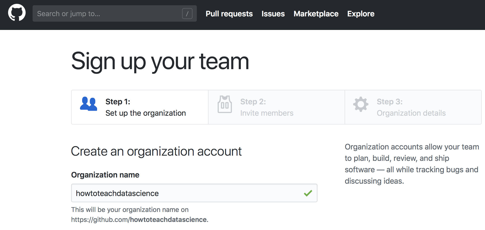 
```

A GitHub Organization is similar to a GitHub User, except multiple people can be admins for the organization and it is not tied to any particular user. Members could include multiple instructors or teaching assistants. 

```{r, echo=FALSE,  out.width = "800px", out.extra='style="display: block; margin-left: auto; margin-right: auto; background-color: #000; padding:3px;"'}
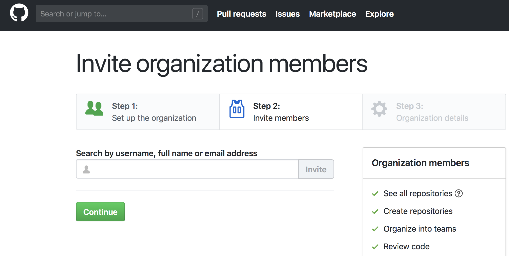 
```

Once you have created an organization, you will want to added GitHub repositories like you in your own user account. 

```{r, echo=FALSE,  out.width = "800px", out.extra='style="display: block; margin-left: auto; margin-right: auto; background-color: #000; padding:3px;"'}
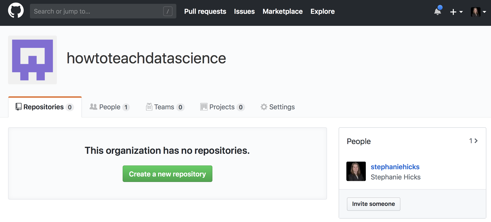 
```

### Create a repository ending with `github.io`

Next, create a special repository that begings with the GitHub Organizaiton name and ends with `.github.io`. In this case, we created `howtoteachdatascience.github.io`. 

```{r, echo=FALSE,  out.width = "800px", out.extra='style="display: block; margin-left: auto; margin-right: auto; background-color: #000; padding:3px;"'}
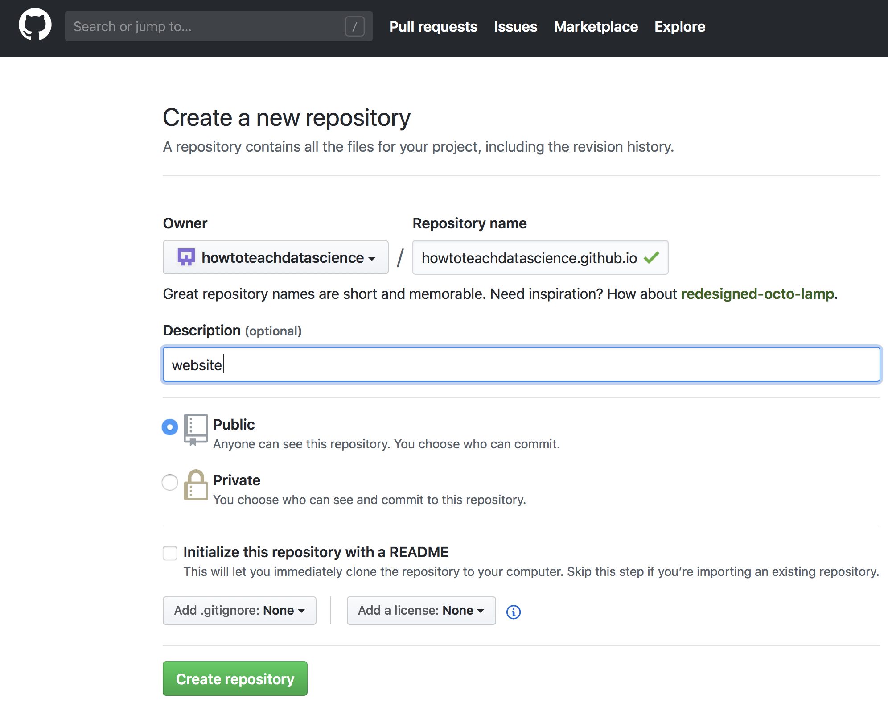 
```

Once you create the repository, GitHub will ask that you add files to the repository, commit the changes, and push to GitHub. 

```{r, echo=FALSE,  out.width = "800px", out.extra='style="display: block; margin-left: auto; margin-right: auto; background-color: #000; padding:3px;"'}
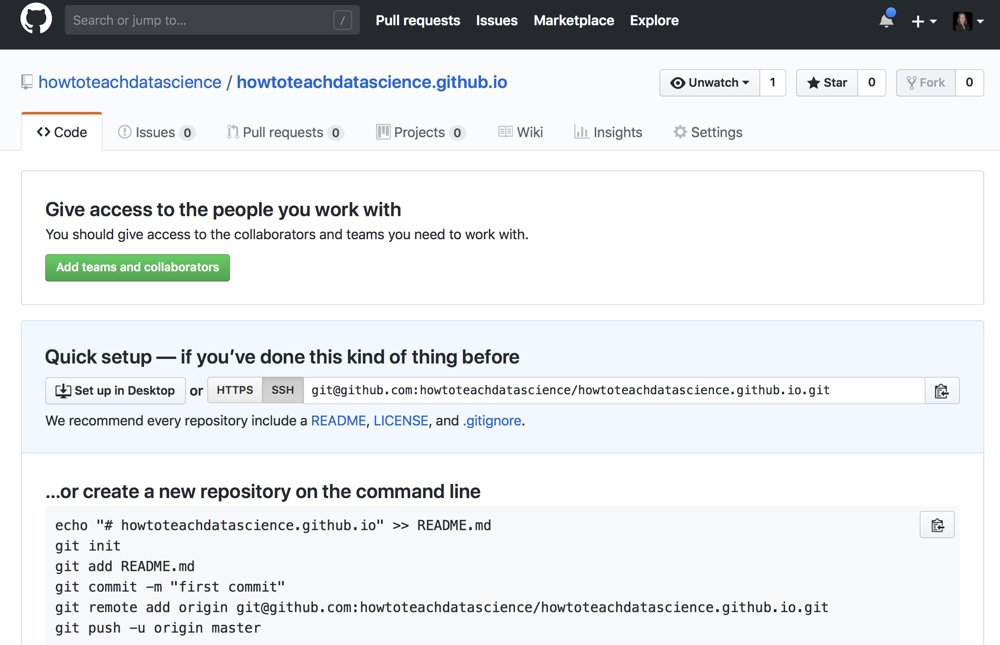 
```

When you push `.html` files to GitHub in this special repository name, specifically with a `index.html` file, a webpage will be created. We can create the `.html` files by creating R Markdown files ending in `.Rmd` and knitting them to `.html` files. We can also create a special file called `_site.yml`. This tells GitHub Pages how to organize your `.html` files. 


```{r, echo=FALSE,  out.width = "800px", out.extra='style="display: block; margin-left: auto; margin-right: auto; background-color: #000; padding:3px;"'}
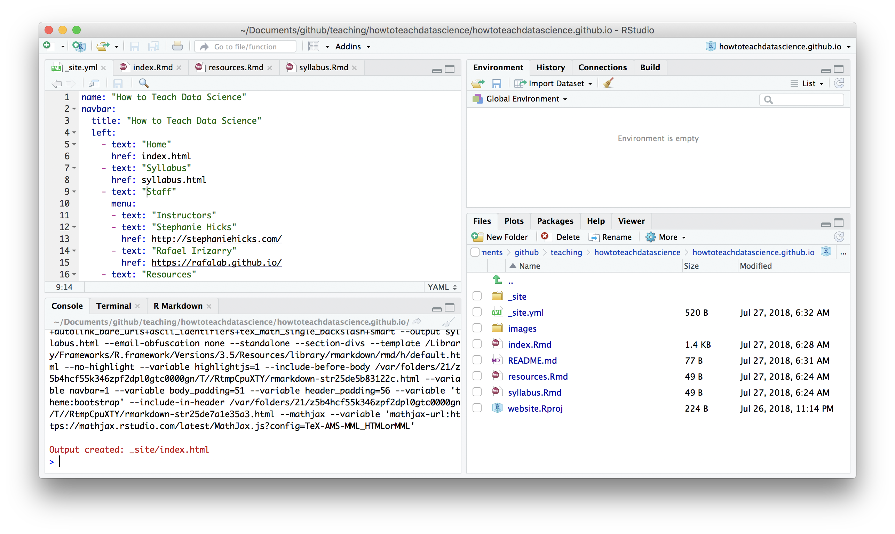 
```

Finally, if we knit the files in our repository, we can get a preview of what the website will look like. 

```{r, echo=FALSE,  out.width = "800px", out.extra='style="display: block; margin-left: auto; margin-right: auto; background-color: #000; padding:3px;"'}
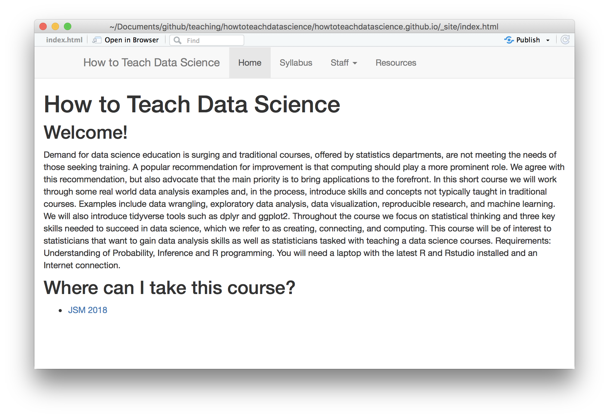 
```

Once you are happy with the website, push the changes and you will see the course website! 

### Create a repository with course material

In this course, we created the `JSM2018` [GitHub repository](https://github.com/howtoteachdatascience/JSM2018) to organize and store the course material. 
 
```{r, echo=FALSE,  out.width = "800px", out.extra='style="display: block; margin-left: auto; margin-right: auto; background-color: #000; padding:3px;"'}
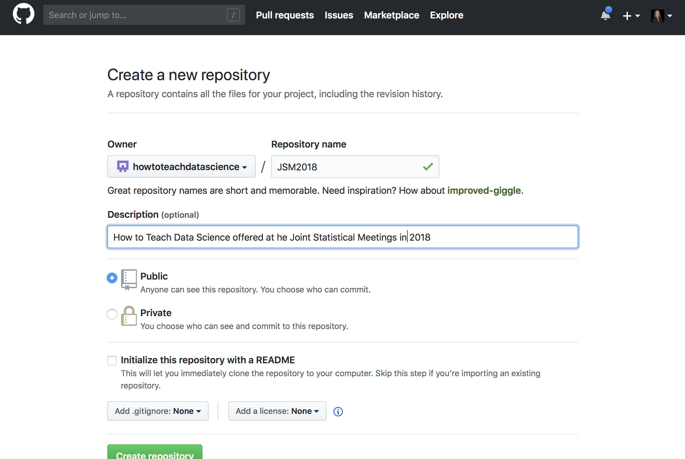 
```

 
 
## Set up syllabus on webpage

There are several ways to set up a syllabus, but one way that allows for a bit more flexiblity is to create a spreadsheet on Google Drive and embed the spreadsheet in an R Markdown on the course website. 

Here is an example from our course in 2016: [http://datasciencelabs.github.io/2016/pages/lectures.html](http://datasciencelabs.github.io/2016/pages/lectures.html)


# Once the class begins

In this part of the tutorial, we explain what we found useful based on our experience of teaching three Introduction to Data Science courses: 

* [CS 109 taught in 2014 at Harvard Unviersity](http://cs109.github.io/2014/)
* [BST 260 taught in 2016 at Harvard T.H. Chan School of Public Health](http://datasciencelabs.github.io/2016/)
* [BST 260 taught in 2017 at Harvard T.H. Chan School of Public Health](http://datasciencelabs.github.io)

Each lecture and homework assignment was created using literate programming. We prepared lectures using R Markdown and R Presentations and rendered the presentations using RStudio, which provides functionality to easily convert from these formats to PDF or HTML. More importantly, using RStudio also permitted us to run live data analysis during lecture. These documents were available on GitHub (https://github.com/datasciencelabs/2016) to allow students to follow along and run code on their own laptops during class. For each lecture, there were three to four TAs available in the classroom who were walking around to answer questions in person. In addition, we included a link to a Google Document at the top of the R Markdown in each lecture to allow students a venue to ask questions if they did not want to interrupt the lecture. Note that in the course in which we used Python, we used Jupyter Notebooks which provide similar functionality to Rmd and Rpres. Karl Broman has provided several useful tutorials  in these formats and others.

## Lectures

### Using active learning techniques to teach data science
We divided lectures into 10 to 30 minute modules and included 3-5 assessment problems in between. These questions consisted of multiple-choice or open-ended questions with most requiring a short data analysis. The solutions, in the form of code required to solve these assessments, were presented and discussed in class and added to the lectures only after the lecture was complete. We asked students to enter their answers in Google Forms that we created before lecture. Seeing these responses permitted us to adapt the pace of the lectures.

```{r, echo=FALSE,  out.width = "600px", out.extra='style="display: block; margin-left: auto; margin-right: auto; background-color: #000; padding:3px;"'}
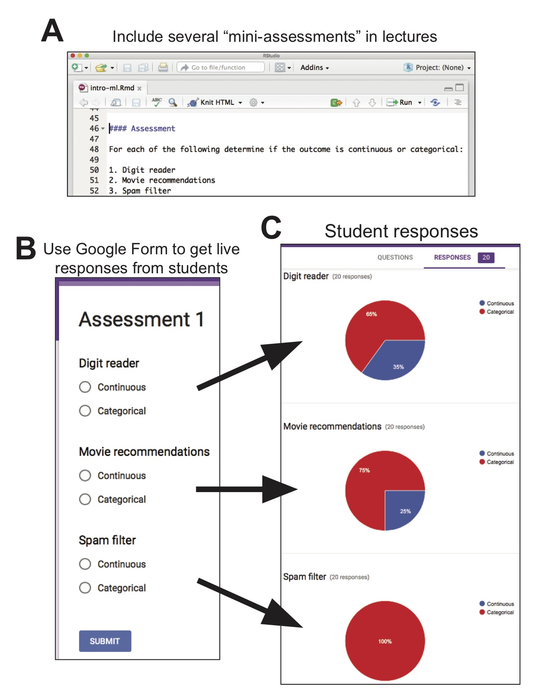 
```
Using Google Forms as an active learning tool. (A) Three to five assessments were included in the R Markdown for each lecture, which consisted of either multiple?choice or open-ended questions. (B) Students were given a few minutes during the lecture to answer the questions. (C) Student responses were recorded and instructors could see the responses instantly. The live responses helped adapt the pace of the lectures.

## Homeworks

* We used git and GitHub to create private repositories for students to submit their homework assignments. 
* GitHub Classroom (https://classroom.github.com/) offers free private repositories to instructors, which can be used to create assignments and distribute starter code to students.
* Each student was given access to make changes to his or her own private repository to submit their homework assignment. The last commit was used as the final submission. 
* The TAs were able to quickly and efficiently access and grade the homework submissions. Note that GitHub regularly offers new services so we recommend keeping up to date with the latest.

```{r, echo=FALSE,  out.width = "800px", out.extra='style="display: block; margin-left: auto; margin-right: auto; background-color: #000; padding:3px;"'}
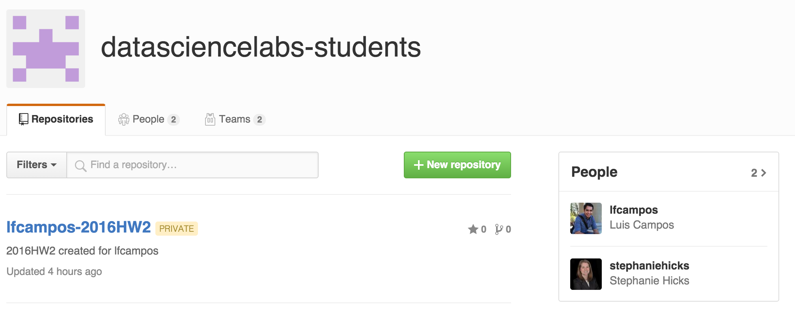 
```

Homework assignments were created in R Markdown and specific code chunks were created for the students to add their code as solutions. 

```{r, echo=FALSE,  out.width = "800px", out.extra='style="display: block; margin-left: auto; margin-right: auto; background-color: #000; padding:3px;"'}
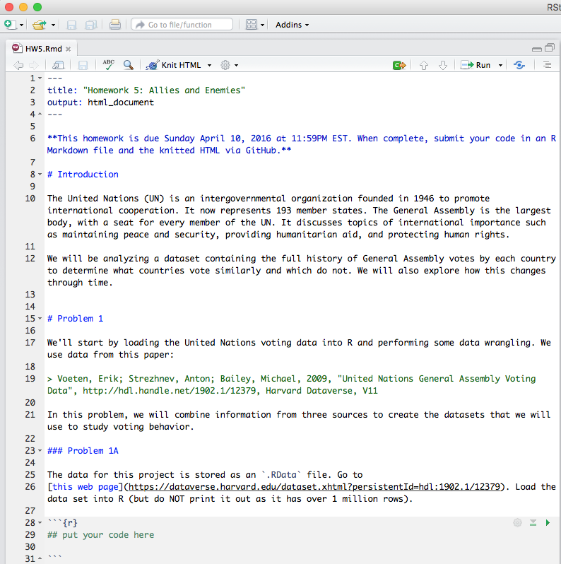 
```

Once the student was satisfied with their solutions, the homework submission was committed to the private GitHub repository as an R Markdown and HTML. The TAs were able to quickly and efficiently access and grade the homework submissions in the individual repositories.

```{r, echo=FALSE,  out.width = "800px", out.extra='style="display: block; margin-left: auto; margin-right: auto; background-color: #000; padding:3px;"'}
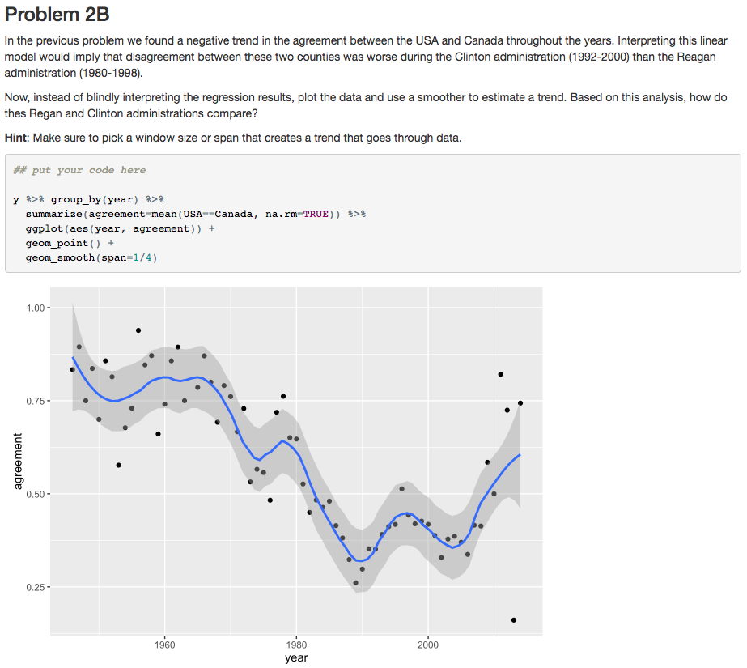 
```


## Grading

A complete description of the grading for the Biostatistics 260 course is described [here](http://datasciencelabs.github.io/2016/pages/syllabus.html). 

Generally, the grading was based on the following: 

* 6 homeworks (30%)
* 2 midterms (30%)
* 1 final project (35%)
* participation in discussions (5%)

We also had a Late Day Policy: 

* Each student is given six late days for homework at the beginning of the semester. A late day extends the individual homework deadline by 24 hours without penalty. No more than two late days may be used on any one assignment. Assignments handed in more than 48 hours after the original deadline will not be graded. We do not accept any homework under any circumstances more than 48 hours after the original deadline. Late days are intended to give you flexibility: you can use them for any reason no questions asked. You don’t get any bonus points for not using your late days. Also, you can only use late days for the individual homework deadlines all other deadlines (e.g., project milestones) are hard.
* Although the each student is only given a total of 6 late days, we will be accepting homework from students that pass this limit. However, we will be deducting 2 points for each extra late day. For example, if you have already used all of your late days for the semester, we will deduct 2 points for assignments <24 hours late, and 4 points for assignments 24-48 hours late.


## Final projects

The students also completed a [month long final project](http://datasciencelabs.github.io/2016/pages/projects.html) on a topic of their choice either on their own or in a group. This portion of the course most closely mimicked the data scientist’s experience. 

The deliverables for the project included 

* a project proposal
* a written report of the data analysis in an R Markdown
* a website
* a two-minute video communicating what the group learned

The project proposal described the motivation for the project, the project objectives, a description of the data, how to obtain the data, an overview of the computational methods proposed to analyze the data and a timeline for completing the project. 

TAs were paired together with 3-4 groups to meet to discuss the proposed projects and provide guidance. The students used the concepts learned in and outside of the course to complete the projects. Once the projects were complete, the submitted deliverables were reviewed and the best projects were highlighted at the end of the course.

Some examples of final projects are listed at the bottom of this page: [http://datasciencelabs.github.io/2016/pages/projects.html](http://datasciencelabs.github.io/2016/pages/projects.html)
