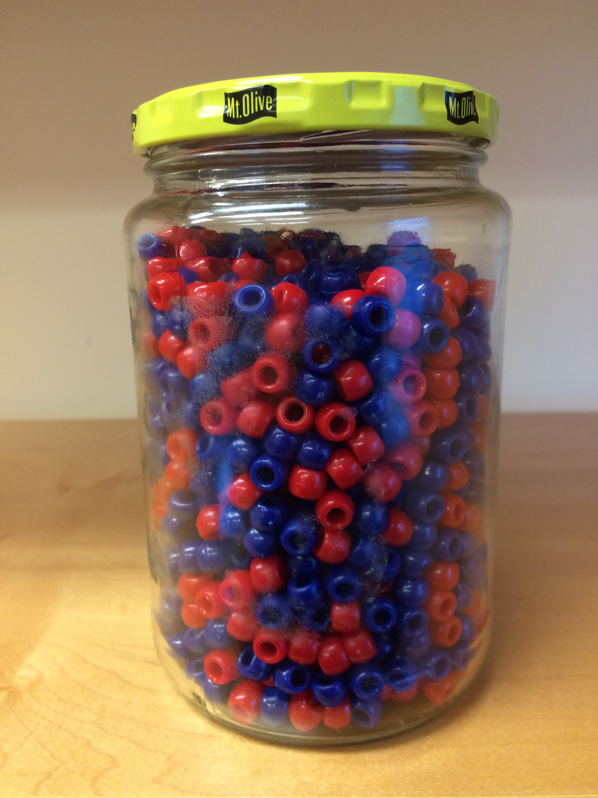

# Introduction

The day before the 2008 presidential election, Nate Silver's FiveThirtyEight stated that "Barack Obama appears poised for a decisive electoral victory". They went further and predicted that Obama would win the election with 349 electoral votes to 189, and the popular vote by a margin of 6.1%. FiveThirtyEight also attached a probabilistic statement to their prediction claiming that Obama had a 91% chance of winning the election. The predictions were quite accurate since, in the final results, Obama won the electoral college 365 to 173 and the popular vote by a 7.2% difference. Their performance in the 2008 election brought FiveThirtyEight to the attention of political pundits and TV personalities. The week before the 2012, FiveThirtyEight's Nate Silver was giving Obama a 90% chance of winning despite many of the experts thinking the final results would be closer. Political commentator Joe Scarborough said [during his show](https://www.youtube.com/watch?v=TbKkjm-gheY):

>>Anybody that thinks that this race is anything but a tossup right now is such an ideologue ... they're jokes." 

To which Nate Silver responded via Twitter:

>> If you think it's a toss-up, let's bet. If Obama wins, you donate $1,000 to the American Red Cross. If Romney wins, I do. Deal?

How was Mr. Silver so confident? We will demonstrate how _poll aggregators_, such as FiveThirtyEight, collected and combined data reported by different experts to produce improved predictions. The two main statistical tools used by the aggregators are the topic here: inference and modeling. To begin to understand how election forecasting works, we need to understand the basic data point they use: poll results.

Opinion polling has been conducted since the 19th century. The general goal of these is to describe the opinions held by a specific population on a given set of topics. In recent times, these polls have been pervasive during presidential elections. Polls are useful when interviewing every member of a particular population is logistically impossible. The general strategy is to interview a smaller group, chosen at random, and then infer the opinions of the entire population from the opinions of the smaller group. Statistical theory is used to justify the process. This theory is referred to as  _inference_ and is the main topic here.


# Random variables

Random variables are numeric outcomes resulting from random processes. We can easily generate random variables using some of the simple examples we have shown. For example, define `X` to be 1, if a bead is blue and red otherwise.

```{r,echo=FALSE, message=FALSE}
library(tidyverse)
dslabs::ds_theme_set()
set.seed(1)
```

```{r}
beads <- rep( c("red", "blue"), times = c(2,3))
X <- ifelse(sample(beads, 1) == "blue", 1, 0)
```

Here `X` is a random variable: every time we select a new bead the outcome changes randomly.  See below:

```{r}
ifelse(sample(beads, 1) == "blue", 1, 0)
ifelse(sample(beads, 1) == "blue", 1, 0)
ifelse(sample(beads, 1) == "blue", 1, 0)
```

Sometimes it's 1 and sometimes it's 0.

In data science, we often deal with data that is affected by chance in some way: the data comes from a random sample, the data is affected by measurement error or the data measures some outcome that is random in nature. Being able to quantify the uncertainty introduced by randomness is one of the most important jobs of a data scientist. Statistical inference offers a framework, as well as several practical tools, for doing this. The first step is to learn how to mathematically describe random variables. We start with games of chance.


## Sampling models

Many data generation procedures, those that produce the data we study, can be modeled quite well as draws from a urn. For instance, we can model the process of polling likely voters as drawing 0s (Republicans) and 1s (Democrats) from an urn containing the 0 and 1 code for all likely voters. In epidemiological studies, we often assume that the subjects in our study are a random sample from the population of interest. The data related to a specific outcome can be modeled as a random sample from an urn containing that outcome for the entire population of interest. Similarly, in experimental research, we often assume that the individual organisms we are studying, for example worms, flies, or mice, are a random sample from a larger population. Randomized experiments can also be modeled by draws from an urn given the way individuals are assigned into groups: when getting assigned, you draw your group at random. Sampling models are therefore ubiquitous in data science. Casino games offer a plethora of examples of real world situations in which sampling models are used to answer specific questions. We will therefore start with such examples.

Suppose a very small casino hires you to consult on whether they should set up roulette wheels. To keep the example simple, we will assume that 1,000 people will play and that the only game you can play on the roulette wheel is to bet on red or black. The casino wants you to predict how much money they will make or lose. They want a range of values and, in particular, they want to know what's the chance of losing money. If this probability is too high, they will pass on installing roulette wheels.

We are going to define a random variable `S` that will represent the casino's total winnings. Let's start by constructing the urn. A roulette wheel has 18 red pockets, 18 black pockets and 2 green ones. So playing a color in one game of roulette is equivalent to drawing from this urn: 

```{r}
color <- rep(c("Black","Red","Green"), c(18,18,2))
```

The 1,000 outcomes from 1,000 people playing are independent draws from this urn. If red comes up, the gambler wins and the casino loses a dollar, so we draw a -\$1. Otherwise, the casino wins a dollar and we draw a \$1. We code these draws like this:

To construct our random variable `S` we can use this code:

```{r}
n <- 10000
X <- sample(ifelse( color=="Red", -1, 1),  n, replace = TRUE)
X[1:10]
```

Because we know the proportions of 1s and -1s, we can generate the draws with one line of code, without defining `color`:

```{r}
X <- sample(c(-1,1), n, replace = TRUE, prob=c(9/19, 10/19))
```

We call this a **sampling model** since we are modelling the random behavior of roulette with the sampling of draws from an urn. The total winnings `S` is simply the sum of these 1,000 independent draws:

```{r}
X <- sample(c(-1,1), n, replace = TRUE, prob=c(9/19, 10/19))
S <- sum(X)
S
```


## The probability distribution of a random variable

If you run the code above, you see that $S$ changes every time. This is, of course, because `S` is a **random variable**. The probability distribution of a random variable tells us the probability of the observed value falling at any given interval. So, for example, if we want to know the probability that we lose money, we are asking the probability that `S` is in the interval $S<0$. 

Note that if we can define a cumulative distribution function $F(a) = \mbox{Pr}(S\leq a)$, then we will be able to answer any question related to the probability of events defined by our random variable $S$, including the event $S<0$. We call this $F$ the random variable's _distribution function_. 

We can estimate the distribution function for the random variable $S$ by using a Monte Carlo simulation to generate many realizations of the random variable. With this code, we run the experiment of having 1,000 people play roulette, over and over, specifically `B`=10,000 times:

```{r}
n <- 1000
B <- 10000
roulette_winnings <- function(n){
  X <- sample(c(-1,1), n, replace = TRUE, prob=c(9/19, 10/19))
  sum(X)
}
S <- replicate(B, roulette_winnings(n))
```

So now we can ask the following: in our simulations, how often did we get sums less than or equal to`a`?

```{r, eval=FALSE}
mean(S <= a)
```

This will be a very good approximation of $F(a)$. In fact, we can visualize the distribution by creating a histogram showing the probability $F(b)-F(a)$ for several intervals $(a,b]$:

```{r sum-density, echo=FALSE}
data.frame(S) %>% ggplot(aes(S, ..density..)) + geom_histogram(color = "black", binwidth = 10)  + ylab("Probability")
```

Now we can easily answer the casino's question: how likely is it that we will lose money?

```{r}
mean(S<0)
```

We can see it is quite low.

In the histogram above, we see that the distribution appears to be approximately normal. A qq-plot will confirm that the normal approximation is close to perfect. If in fact the distribution is normal, then all we need to define the distribution is the average and the standard deviation. Because we have the original values from which the distribution is created, we can easily compute these:

```{r}
mean(S)
sd(S)
```

If we add a normal density with this average and standard deviation to the histogram above, we see that it matches very well:

```{r normal-approximates-distribution, echo=FALSE}
s <- seq(min(S), max(S), length = 100)
normal_density <- data.frame(s = s, f=dnorm(s, mean(S), sd(S)))
data.frame(S=S) %>% ggplot(aes(S, ..density..)) +
  geom_histogram(color = "black", binwidth = 10)  +
  ylab("Probability") + 
  geom_line(data = normal_density, mapping=aes(s,f), color="blue")
```

This average and this standard deviation have special names. They are referred to as the _expected value_ and _standard error_ of the random variable $S$. 


It turns out that statistical theory provides a way to derive the distribution of random variables defined as independent random draws from an urn. Specifically, in our example above, we can show that $(S+n)/2$ follows a binomial distribution. We therefore do not need to run for Monte Carlo simulations to know the probability distribution of $S$. We did this for illustrative purposes. 

We can use the function `dbinom` and `pbinom` to compute the probabilities exactly. For example, to know compute $\mbox{Pr}(S < 0)$ we note that:

$$\mbox{Pr}(S < 0) = \mbox{Pr}((S+n)/2 < (0+n)/2)$$

and we can use the `pbinom` to compute $$\mbox{Pr}(S \leq 0)$$

```{r}
pbinom(n/2, size = n, prob = 9/19)
```

Because this is a discrete probability function, to get $\mbox{Pr}(S < 0)$ rather than $\mbox{Pr}(S \leq 0)$ we write:

```{r}
pbinom(n/2-1, size = n, prob = 9/19)
```

For the details of the binomial distribution you can consult any basic probability book or even [Wikipedia](https://en.wikipedia.org/wiki/Binomial_distribution). 

Here we do not cover these details. Instead, we will discuss an incredibly useful approximation provided by mathematical theory that applies generally to sums and averages of draws from any urn: the Central Limit Theorem (CLT).

## Central Limit Theorem

The Central Limit Theorem (CLT) tells us that when the number of draws, also called the _sample size_, is large, the probability distribution of the sum of the independent draws is approximately normal. Because sampling models are used for so many data generation processes, the CLT is considered one of the most important mathematical insights in history.

Previously, we discussed that if we know that the distribution of a list of numbers is approximated by the normal distribution, all we need to describe the list are the average and standard deviation. We also know that the same applies to probability distributions. If a random variable has a probability distribution that is approximated with the normal distribution, then all we need to describe the probability distribution are the average and standard deviation, referred to as the expected value and standard error.


## The expected value and standard error

We have described sampling models for draws. We will now go over the mathematical theory that lets us approximate the probability distributions for the sum of draws. Once we do this, we will be able to help the casino predict how much money they will make. The same approach we use for the sum of draws will be useful for describing the distribution of averages and proportion which we will need to understand how polls work.

The first important concept to learn is the _expected value_. 
In statistics books, it is common to use letter $\mbox{E}$ like this:

$$\mbox{E}[X]$$ 

to denote the expected value of the random variable $X$.

A random variable will vary around its expected value in a way that if you take the average of many, many draws, the average of the draws will approximate the expected value, getting closer and closer the more draws you take.

Theoretical statistics provides techniques that facilitate the calculation of expected values in different circumstances. For example, a useful formula tells us that the expected value of a random variable defined by one draw is the average of the numbers in the urn. So in the urn used to model betting on red in roulette, we have 20 one dollars, and 18 negative one dollars. The expected value is thus:

$$
\mbox{E}[X] = (20 + -18)/38
$$

which is about 5 cents. It is a bit counterintuitive to say that $X$ varies around 0.05, when the only values it takes is 1 and -1. One way to make sense of the expected value in this context is by realizing that if we play the game over and over, the casino wins, on average, 5 cents per game. A Monte Carlo simulation confirms this:

```{r}
B <- 10^6
X <- sample(c(-1,1), B, replace = TRUE, prob=c(9/19, 10/19))
mean(X)
```

In general, if the urn has two possible outcomes, say $a$ and $b$, with proportions $p$ and $1-p$ respectively, the average is: 

$$ap + b(1-p).$$ 

To see this, notice that if there are $n$ beads in the urn, then we have $np$ $a$s, $n(1-p)$ $b$s and because the average is the sum, $n\times a \times p + n\times b \times (1-p)$, divided by the total $n$, we get that the average is $ap + b(1-p)$.

Now the reason we define the expected value is because this mathematical definition turns out to be useful for approximating the probability distributions of sum, which then is useful for describing the distribution of averages and proportions. The first useful fact is that the expected value of the sum of the draws is:

$$
\mbox{number of draws } \times \mbox{ average of the numbers in the urn}
$$

So if 1,000 people play roulette, the casino expects to win, on average, about 1,000 $\times$ \$0.05  = \$50.  But this is an expected value. How different can one observation be from the expected value? The casino really needs to know this. What is the range of possibilities? If negative numbers are too likely, they will not install roulette wheels. Statistical theory once again answers this question. The _standard error_  (SE) gives us an idea of the size of the variation around the expected value. In statistics books, it's common to use: 

$$\mbox{SE}[X]$$ 

to denote the standard error of a random variable.

**If our draws are independent**, then the standard error of the sum is given by the equation:

$$
\sqrt{\mbox{number of draws }} \times \mbox{ standard deviation of the numbers in the urn}
$$

Using the definition of standard deviation, we can derive, with a bit of math, that if a jar contains two values $a$ and $b$ with proportions $p$ and $(1-p)$ respectively, the standard deviation is: 

$$\mid b - a \mid \sqrt{p(1-p)}.$$

So in our roulette example, the standard deviation of the values inside the urn is: $\mid 1 - (-1) \mid \sqrt{10/19 \times 9/19}$ or


```{r}
2 * sqrt(90)/19
```

The standard error tells us the typical difference between a random variable and its expectation. Since one draw is obviously the sum of just one draw, we can use the formula above to calculate that the random variable defined by one draw has an expected value of 0.05 and a standard error of about 1. This makes sense since we either get 1 or -1, with 1 slightly favored over -1.

Using the formula above, the sum of 1,000 people playing has standard error of about \$32:

```{r}
n <- 1000
sqrt(n) * 2 * sqrt(90)/19
```

As a result, when 1,000 people bet on red, the casino is expected to win \$50 with a standard error of \$32. It therefore seems like a safe bet. But we still haven't answered the question: how likely is it to lose money? Here the CLT will help.

**Advanced note**: Before continuing we should point out that exact probability calculations for the casino winnings can be performed with the binomial distribution. However, here we focus on the CLT which can be generally applied to sums of random variables in a way that the binomial distribution can't.

## Central Limit Theorem approximation

The Central Limit Theorem (CLT) tells us that the sum `S` is approximated by a normal distribution. Using the formulas above, we know that the expected value and standard error are:

```{r}
n * (20-18)/38 
sqrt(n) * 2 * sqrt(90)/19 
```

The theoretical values above match those obtained with the Monte Carlo simulation:

```{r}
mean(S)
sd(S)
```

Using the CLT, we can skip the Monte Carlo simulation and instead compute the probability of the casino losing money using this approximation:

```{r}
mu <- n * (20-18)/38
se <-  sqrt(n) * 2 * sqrt(90)/19 
pnorm(0, mu, se)
```

which is also in very good agreement with our Monte Carlo result:

```{r}
mean(S < 0)
```

## Statistical properties of averages

There are two useful mathematical results that we used above and often employ when working with data. We list them below.

1. The expected value of the sum of random variables is the sum of each random variable's expected value. We can write it like this:
    
    $$ 
    \mbox{E}[X_1+X_2+\dots+X_n] =  \mbox{E}[X_1] + \mbox{E}[X_2]+\dots+\mbox{E}[X_n]
    $$
    
    If the $X$ are independent draws from the urn, then they all have the same expected value. Let's call it $\mu$ and thus:
    
    $$ 
    \mbox{E}[X_1+X_2+\dots+X_n]=  n\mu
    $$
    
    which is another way of writing the result we show above for the sum of draws.
    
2. The expected value of a non-random constant times a random variable is the non-random constant times the expected value of a random variable. This is easier to explain with symbols:
    $$
    \mbox{E}[aX] =  a\times\mbox{E}[X]
    $$
    
    To see why this is intuitive, consider change of units. If we change the units of a random variable, say from dollars to cents, the expectation should change in the same way. A consequence of the above two facts is that the expected value of the average of independent draws from the same urn is the expected value of the urn, call it $\mu$ again:
    
    $$
    \mbox{E}[(X_1+X_2+\dots+X_n) / n]=   \mbox{E}[X_1+X_2+\dots+X_n] / n = n\mu/n = \mu 
    $$
    

3. The square of the standard error of the sum of **independent** random variables is the sum of the square of the standard error of each random variable. This one is easier to understand in math form:
    $$ 
    \mbox{SE}[X_1+X_2+\dots+X_n] = \sqrt{\mbox{SE}[X_1]^2 + \mbox{SE}[X_2]^2+\dots+\mbox{SE}[X_n]^2  }
    $$
    
    The square of the standard error is referred to as the _variance_ in statistical textbooks.
 
4. The standard error of a non-random constant times a random variable is the non-random constant times the random variable's standard error. As with the expectation:
    $$
    \mbox{SE}[aX] =  a \times \mbox{SE}[X]
    $$
 
    To see why this is intuitive, again think of units. 
    
    A consequence of 3 and 4 is that the standard error of the the average of independent draws from the same urn is the standard deviation of the urn divided by the square root of $n$ (the number of draws), call it $\sigma$:

$$
\begin{aligned}
\mbox{SE}[(X_1+X_2+\dots+X_n) / n] &=   \mbox{SE}[X_1+X_2+\dots+X_n]/n \\
&= \sqrt{\mbox{SE}[X_1]^2+\mbox{SE}[X_2]^2+\dots+\mbox{SE}[X_n]^2}/n \\
&= \sqrt{\sigma^2+\sigma^2+\dots+\sigma^2}/n\\
&= \sqrt{n\sigma^2}/n\\
&= \sigma / \sqrt{n}    
\end{aligned}
$$  
  
    
5. If $X$ is a normally distributed random variable, then if $a$ and $b$ are non-random constants, $aX + b$ is also a normally distributed random variable. All we are doing is changing the units of the random variable by multiplying by $a$, then shifting the center by $b$. 


## Exercises {-}


1. In American Roulette you can also bet on green. Remember there are 18 reds, 18 blacks and 2 greens (0 and 00). What are the chances the green comes out?


2. The payout for winning on green is \$17 dollars. This means that if you bet a dollar and it lands on green, you get \$17. Create a sampling model using sample to simulate the random variable $X$ for your winnings. Hint: see the example below for how it should look like when betting on red.

    ```{r}
    X <- sample(c(1,-1), 1, prob = c(9/19, 10/19))
    ```
3. Compute the expected value of $X$.


4. Compute the standard error of $X$.

    
5. Now create a random variable $S$ that is the sum of your winnings after betting on green 1000 times. Hint: change the argument `size` and `replace` in your answer to question 2. Start your code by setting the seed to 1 with `set.seed(1)`.

6. What is the expected value of $S$?


7. What is the standard error of $S$?


8. What is the probability that you end up winning money? Hint: use the CLT.


9. Create a Monte Carlo simulation that generates 10,000 outcomes of $S$. Compute the average and standard deviation of the resulting list to confirm the results of 6 and 7. Start your code by setting the seed to 1 with `set.seed(1)`.


10. Now check your answer to 8 using the Monte Carlo result. 

11. The Monte Carlo result and the CLT approximation are close, but not that close. What could account for this?
    - A. 10,000 simulations is not enough. If we do more, they match.
    - B. The CLT does not work as well when the probability of success is small. In this case, it was 1/19. If we make the number of roulette plays bigger, they will match better.
    - C. The difference is within rounding error.
    - D. The CLT only works for the averages.


12. Now create a random variable $Y$ that is your average winnings per bet after playing off your winnings after betting on green 10,000 times.

13. What is the expected value of $Y$?

14. What is the standard error of $S$?

15. What is the probability that you end up winnings per game that are positive? Hint: use the CLT.


16. Create a Monte Carlo simulation that generates 2,500 outcomes of $S$. Compute the average and standard deviation of the resulting list to confirm the results of 6 and 7. Start your code by setting the seed to 1 with `set.seed(1)`


17. Now check your answer to 8 using the Monte Carlo result. 


18. The Monte Carlo result and the CLT approximation are now much closer.  What could account for this?
    - A. We are now computing averages instead of sums.
    - B. 2,500 Monte Carlo simulations is not better than 10,000.
    - C. The CLT does works better when the sample size is larger. We increased from 1,000 to 10,000.
    - D. It is not closer. The difference is within rounding error.


# Polls

Perhaps the best know opinion polls are those conducted to determine which candidate is preferred by voters in a given election. Political strategists make extensive use of polls to decide, among other things, how to invest resources. For example, they may want to know which geographical locations to focus their get out the vote efforts. 

Elections are a particularly interesting case of opinion polls because the actual opinion of the entire population is revealed on election day. Of course, it costs millions of dollars to run an actual election which makes polling a cost effective strategy for those that want to forecast the results. 

Although typically the results of these polls are kept private, similar polls are conducted by news organizations because results tend to be of interest to the general public and, therefore, are often made public. We will eventually be looking at such data.

[Real Clear Politics](http://www.realclearpolitics.com) is an example of a news aggregator that organizes and publishes poll results. For example, [here](http://www.realclearpolitics.com/epolls/2016/president/us/general_election_trump_vs_clinton-5491.html) are examples of polls reporting estimates of the popular vote for the 2016 presidential election:

```{r, echo=FALSE}

```

Although in the United States the popular vote does not determine the result of the presidential election, we will use it as an illustrative and simple example of how well polls work. Forecasting the election is a more complex process since it involves combining results from 50 states and DC.

Let's make some observations about the table above. First, note that different polls, all taken days before the election, report a different _spread_:  the estimated difference between support for the two candidates. Notice also that the reported spreads hover around what ended up being the actual result: Clinton won the popular vote by 2.1%. We also see a column titled **MoE** which stands for _margin of error_. 

In this section we will show how the probability concepts we learned in the previous section can be applied to develop the statistical approaches that make polls an effective tool. We will learn the statistical concepts necessary to define _estimates_ and _margins of errors_, and show how we can use these to forecast final results relatively well and also provide an estimate of the precision of our forecast. Once we learn this, we will be able to understand two concepts that are ubiquitous in data science: _confidence intervals_ and _p-values_. Finally, to understand probabilistic statements about the probability of a candidate winning, we will have to learn about Bayesian modelling. In the final sections, we put it all together to recreate the simplified version of the FiveThirtyEight model and apply it to the 2016 election. 

We start by connecting probability theory to the task of using polls to learn about a population.


## The sampling model for polls

To help us understand the connection between polls and what we have learned, let's construct a similar situation to the one pollsters face. We will use an urn instead of voters and, rather than competing with other pollsters for media attention, we will have a competition with a \$25 dollar prize. The challenge is to guess the spread between the proportion of blue and red beads in this urn (in this case, a pickle jar):


```{r, echo=FALSE, out.width="268px"}

```

Before making a prediction, you can take a sample (with replacement) from the urn. To mimic the fact that running polls is expensive, it cost you \$0.10 per each bead you sample. Therefore, if your sample size is 250, and you win, you will break even since you will pay me \$25 to collect your \$25 prize. Your entry into the competition can be an interval. If the interval you submit contains the true proportion, you get half what you paid and pass to the second phase of the competition. In the second phase, the entry with the smallest interval is selected as the winner. 

The `dslabs` package includes a function that shows a random draw from this urn:

```{r, echo=FALSE}
set.seed(1)
```

```{r first-simulated-poll, comment=FALSE, warning=FALSE}
library(tidyverse)
library(dslabs)
ds_theme_set()
take_poll(25)
```

Think about how you would construct your interval based on the data shown above. 

We have just described a simple sampling model for opinion polls. The beads inside the urn represent the individuals that will vote on election day. Those that will vote for the Republican candidate are represented with red beads and the Democrats with the blue beads. For simplicity, assume there are no other colors; that is, that there are just two parties. 

# Populations, samples, parameters and estimates

We want to predict the proportion of blue beads in the urn. Let's call this quantity $p$, which then tells us the proportion of red beads $1-p$, and the spread $p - (1-p)$, which simplifies to $2p - 1$. 

In statistical textbooks, the beads in the urn are called the _population_. The proportion of blue beads in the population $p$  is called a _parameter_. The 25 beads we see in the previous plot are called a _sample_. The task of statistical inference is to predict the parameter $p$ using the observed data in the sample. 

Can we do this with the 25 observations above? It is certainly informative. For example, given that we see 13 red and 12 blue beads, it is unlikely that $p$ > .9 or $p$ < .1. But are we ready to predict with certainty that there are more red beads than blue?  

We want to construct an estimate of $p$ using only the information we observe. An estimate can be thought of as a summary of the observed data that we think is informative about the parameter of interest. It seems intuitive to think that the proportion of blue beads in the sample $0.48$ must be at least related to the actual proportion $p$. But do we simply predict $p$ to be 0.48? First, remember that the sample proportion is a random variable. If we run the command `take_poll(25)` four times:

```{r four-simulated-polls, echo=FALSE}
par(mfrow=c(2,2), mar = c(3, 1, 3, 0), mgp = c(1.5, 0.5, 0)) 
take_poll(25); take_poll(25); take_poll(25); take_poll(25)
```

we get a different answer each time since the sample proportion is a random variable. 
 
Note that in the four random samples shown above, the sample proportions range from 0.44 to 0.60. By describing the distribution of this random variable, we will be able to gain insights into how good this estimate is and how we can make it better.

## The sample average

Conducting an opinion poll is being modeled as taking a random sample from an urn. We are proposing the use of the proportion of blue beads in our sample as an _estimate_ of the parameter $p$. Once we have this estimate we can can easily report an estimate for the spread $2p-1$, but for simplicity we will illustrate the concepts for estimating $p$. We will use our knowledge of probability to defend our use of the sample proportion and quantify how close we think it is from the population proportion $p$.

We start by defining the random variable $X=1$ if we pick a blue bead at random and $0$ if it is red. This implies that the population is a list of 0s and 1s. If we sample $N$ beads, then the average of the draws $X_1, \dots, X_N$ is equivalent to the proportion of blue beads in our sample. This is because adding the $X$s is equivalent to counting the blue beads and dividing it by the total $N$ turns this into a proportion. We use the symbol $\bar{X}$ to represent this average. In general, in statistics textbooks a bar on top of a symbol means the average.

The theory tells us that the sum of draws becomes useful because if we know the distribution of the sum $N \bar{X}$, we know the distribution of the average $\bar{X}$ because $N$ is a non-random constant. 

For simplicity, let's assume that the draws are independent: after we see each sampled bead, we return it to the urn. In this case, what do we know about the distribution of the sum of draws? First, we know that the expected value of the sum of draws is $N$ times the average of the values in the urn. We know that the average of the 0s and 1s in the urn must be $p$, the proportion of blue beads.

Here we encounter an important difference with what we do in probability: we don't know what is in the urn. We know there are blue and red beads, but we don't know how many of each. This is what we want to find out: we are trying to **estimate** $p$. 

## Parameters

Just like we use variables to define unknowns in systems of equations, in statistical inference we define _parameters_ to define unknown parts of our models. In the urn model which we are using to mimic an opinion poll, we do not know the proportion of blue beads in the urn. We define the parameters $p$ to represent this quantity. $p$ is the average of the urn since, if we take the average of the 1s (blue) and 0s (red), we get the proportion of blue beads. Since our main goal is figuring out what is $p$, we are going to _estimate this parameter_. 

The ideas presented here on how we estimate parameters and provide insights into how good these estimates are, extrapolate to many data science tasks. For example, we may want to determine the difference in health improvement between patients receiving treatment and a control group. We may ask what are the health effects of smoking on a population? What are the differences in racial groups of fatal shootings by police? What is the rate of change in life expectancy in the US during the last 10 years? All these questions can be framed as a task of estimating a parameter from a sample.

## Polling versus forecasting

Before we continue, let's make an important clarification related to the practical problem of forecasting the election. If a poll is conducted four months before the election, it is estimating the $p$ for that moment and not for election day. The $p$ for election night might be different since people's opinions fluctuate through time. The polls provided the night before the election tend to be the most accurate since opinions don't change that much in a day. However, forecasters try to build tools that model how opinions vary across time and try to predict the election night result taking into consideration the fact that opinions fluctuate. We will describe some approaches for doing this in our a later section. 

## Properties of our estimate: expected value and standard error 

To understand how good our estimate is, we will describe the statistical properties of the random variable defined above: the sample proportion $\bar{X}$. Remember that $\bar{X}$ is the sum of independent draws so the rules we covered in random variable section.

Using what we have learned, the expected value of the sum $N\bar{X}$ is $N \times$ the average of the urn, $p$. So dividing by the non-random constant $N$ gives us that the expected value of the average $\bar{X}$ is $p$. We can write it using our mathematical notation:

$$
\mbox{E}(\bar{X}) = p
$$

We can also use what we learned to figure out the standard error: the standard error of the sum is $\sqrt{N} \times$ the standard deviation of the urn. Can we compute the standard error of the urn? We learned a formula that tells us that it is $(1-0) \sqrt{p (1-p)}$ = $\sqrt{p (1-p)}$. Because we are dividing the sum by $N$, we arrive at the following formula for the standard error for the average:

$$
\mbox{SE}(\bar{X}) = \sqrt{p(1-p)/N}
$$

This result reveals the power of polls. The expected value of the sample proportion $\bar{X}$ is the parameter of interest $p$ and we can make the standard error as small as we want by increasing $N$. The law of large numbers tells us that with a large enough poll our estimate converges to $p$.

If we take a large enough poll to make our standard error about 1%, we will be quite certain about who will win. But how large does the poll have to be for the standard error to be this small? 

One problem is that we do not know $p$, so we can't compute the standard error. For illustrative purposes let's assume that $p=0.51$ and make a plot of the standard error versus the sample size $N$: 

```{r standard-error-versus-sample-size, echo=FALSE, message=FALSE, warning=FALSE}
p <- 0.51
N <- 10^seq(1,5, len=100)
data.frame(N=N, SE = sqrt(p*(1-p)/N)) %>% ggplot(aes(N, SE)) + geom_line() + scale_x_continuous(breaks = c(10,100,1000,10000), trans = "log10")
```

From the plot we see that we would need a poll of over 10,000 people to get the standard error that low. We rarely see polls of this size due in part to costs. From the Real Clear Politics table we learn that the sample sizes in opinion polls range from 500-3,500 people. For a sample size of 1,000 and $p=0.51$, the standard error is:
```{r}
sqrt(p*(1-p))/sqrt(1000)
```

or 1.5 percentage points. So even with large polls, for close elections, $\bar{X}$ can lead us astray if we don't realize it is a random variable. Nonetheless, we can actually say more about how close we get the $p$.

## Exercises {-}

1. Suppose you poll a population in which a proportion $p$ of voters are Democrats and $1-p$ are Republicans. Your sample size is $N=25$. Consider the random variable $S$ which is the **total** number of Democrats in your sample. What is the expected value of this random variable? Hint: it's a function of $p$.


2. What is the standard error of $S$ ? Hint: it's a function of $p$.

3. Consider the random variable $S/N$. This is equivalent to the sample average, which we have been denoting as $\bar{X}$. What is the expected value of the $\bar{X}$? Hint: it's a function of $p$.

4. What is the standard error of $\bar{X}$? Hint: it's a function of $p$.

5. Write a line of code that gives you the standard error `se` for the problem above for `p <- seq(0, 1, length = 100)`. Make a plot of `se` versus `p`. 


6. Copy the code above and put it inside a for-loop to make the plot for $N=25$, $N=100$ and $N=1000$. 


7. If we are interested in the difference in proportions, $p - (1-p)$, our estimate is $d = \bar{X} - (1-\bar{X})$. Use the rules we learned about sums of random variables and scaled random variables to derive the expected value of $d$.


8. What is the standard error of $d$?


9. If the actual $p=.45$, it means the Republicans are winning by a relatively large margin since $d= -.1$, which is a 10% margin of victory. What is the standard error of $2\hat{X}-1$ in this case? 


10. Given the answer to 9, which of the following best describes your strategy of using a sample size of $N=25$?
    - A. The expected value of our estimate $2\bar{X}-1$ is $d$ so our prediction will be right on.
    - B. Our standard error is larger than the difference, so the chances of $2\bar{X}-1$ being positive and throwing us off were not that small. We should pick a larger sample size.
    - C. The difference is 10% and the standard error is about 0.2, therefore much smaller than the difference.
    - D. Because we don't know $p$, we have no way knowing that making $N$ larger would actually improve our standard error.


# Central Limit Theorem in practice

The CLT tells us that the distribution function for a sum of draws is approximately normal. We also learned that dividing a normally distributed random variable by a constant is also a normally distributed variable. This implies that the distribution of $\bar{X}$ is approximately normal. 

In summary, we have that $\bar{X}$ has an approximately normal distribution with expected value $p$ and standard error $\sqrt{p(1-p)/N}$. 

Now how does this help us? Suppose we want to know what is the probability that we are within 1% from $p$. We are basically asking if:

$$
\mbox{Pr}(| \bar{X} - p| \leq .01)
$$
which is the same as:

$$
\mbox{Pr}(\bar{X}\leq p + .01) - \mbox{Pr}(\bar{X} \leq p - .01)
$$

Can we answer this question?  We can use the mathematical trick. Subtract the expected value and divide by the standard error to get a standard normal random variable, call it $Z$, on the left. Since $p$ is the expected value and $\mbox{SE}(\bar{X}) = \sqrt{p(1-p)/N}$ is the standard error we get:

$$
\mbox{Pr}\left(Z \leq \,.01 / \mbox{SE}(\bar{X}) \right) -
\mbox{Pr}\left(Z \leq - \,.01 / \mbox{SE}(\bar{X}) \right) 
$$

One problem we have is that since we don't know $p$, we don't know $\mbox{SE}(\bar{X})$. But it turns out that the CLT still works if we estimate the standard error by using $\bar{X}$ in place of $p$. We say that we _plug-in_ the estimate. Our estimate of the standard error is therefore:

$$
\hat{\mbox{SE}}(\bar{X})=\sqrt{\bar{X}(1-\bar{X})/N}
$$
In statistics textbooks, we use a little hat to denote estimates. The estimate can be constructed using the observed data and $N$. 

Now we continue with our calculation, but dividing by $\hat{\mbox{SE}}(\bar{X})=\sqrt{\bar{X}(1-\bar{X})/N})$ instead. In our first sample we had 12 blue and 13 red so $\bar{X} = 0.48$ and so our estimate of standard error is 

```{r}
X_hat <- 0.48
se <- sqrt(X_hat*(1-X_hat)/25)
se
```

And now we can answer the question of the probability of being close to $p$. The answer is:

```{r}
pnorm(0.01/se) - pnorm(-0.01/se)
```

So there is a small chance that we will be close. A poll of only $N=25$ people is not really very useful, at least not for a close election. 

Earlier we mentioned the _margin of error_. Now we can define it because it is simply two times the standard error, which we can now estimate. In our case it is:

```{r}
2*se
```

Why do we multiply by 2? Because if you ask what is the probability that we are within two standard errors from $p$, we get:

$$
\mbox{Pr}\left(Z \leq \, 2\mbox{SE}(\bar{X})  / \mbox{SE}(\bar{X}) \right) -
\mbox{Pr}\left(Z \leq - 2 \mbox{SE}(\bar{X}) / \mbox{SE}(\bar{X}) \right) 
$$
which is:

$$
\mbox{Pr}\left(Z \leq 2 \right) -
\mbox{Pr}\left(Z \leq - 2\right) 
$$

which we know is about 95\%:

```{r}
pnorm(2)-pnorm(-2)
```

So there is a 95% probability that $\bar{X}$ will be within $2\times \hat{SE}(\bar{X})$, in our case `r round(2*se)`, to $p$. Note that 95% is somewhat of an arbitrary choice and sometimes other percentages are used, but it is the most commonly used value to define _margin of error_. 

In summary, the CLT tells us that our poll based on a sample size of $25$ is not very useful. We don't really learn much when the margin of error is this large. All we can really say is that the popular vote will not be won by a large margin. This is why pollsters tend to use larger sample sizes. 

From the table above. we see that typical sample sizes range from 700 to 3500. To see how this gives us a much more practical result, notice that if we had obtained a $\bar{X}$=0.48 with a sample size of 2,000, our standard error $\hat{\mbox{SE}}(\bar{X})$ would have been `r n<-2000;se<-sqrt(0.48*(1-0.48)/n);se`. So our result is an estimate of `48`% with a margin of error of `r round(2*se*100)`%. In this case, the result is much more informative and would make us think that there are more red balls than blue. But keep in mind, this is hypothetical. We did not take a poll of 2,000 since we don't want to ruin the competition.


## A Monte Carlo simulation


Suppose we want to use a Monte Carlo simulation to corroborate the tools we have built using probability theory. To create the simulation, we would write code like this:

```{r, eval=FALSE}
B <- 10000
N <- 1000
Xhat <- replicate(B, {
  X <- sample(c(0,1), size=N, replace=TRUE, prob=c(1-p, p))
  mean(X)
})
```

The problem is, of course, we don't know `p`. We could construct an urn like the one pictured above and run an analog (without a computer) simulation. It would take a long time, but you could take 10,000 samples, count the beads and keep track of the proportions of blue. We can use the function `take_poll(n=1000)` instead of drawing from an actual urn, but it would still take time to count the beads and enter the results.

One thing we therefore do to corroborate theoretical results is to pick one or several values of `p`, and run the simulations.  Let's set `p=0.45`.  We can then simulate a poll:

```{r}
p <- 0.45
N <- 1000

X <- sample(c(0,1), size=N, replace=TRUE, prob=c(1-p, p))
Xhat <- mean(X)
```

In this particular sample our estimate is `Xhat`. We can use that code to do a Monte Carlo simulation:

```{r}
B <- 10000
Xhat <- replicate(B, {
  X <- sample(c(0,1), size=N, replace=TRUE, prob=c(1-p, p))
  mean(X)
})
```

To review, the theory tells us that $\bar{X}$ is approximately normally distributed, has expected value $p=$ `r p` and standard error $\sqrt{p(1-p)/N}$ = `r sqrt(p*(1-p)/N)`. The simulation confirms this:

```{r}
mean(Xhat)
sd(Xhat)
```

A histogram and qq-plot confirm that the normal approximation is accurate as well:

```{r normal-approximation-for-polls, echo=FALSE, warning=FALSE}
library(gridExtra)
p1 <- data.frame(Xhat=Xhat) %>% 
  ggplot(aes(Xhat)) + 
  geom_histogram(binwidth = 0.005, color="black")
p2 <-  data.frame(Xhat=Xhat) %>% 
  ggplot(aes(sample=Xhat)) + 
  stat_qq(dparams = list(mean=mean(Xhat), sd=sd(Xhat))) +
  geom_abline() + 
  ylab("Xhat") + 
  xlab("Theoretical normal")
grid.arrange(p1,p2, nrow=1)
```

Of course, in real life we would never be able to run such an experiment because we don't know $p$. But we could run it for various values of $p$ and $N$ and see that the theory does indeed work well for most values. You can easily do this by re-running the code above after changing `p` and `N`.

## The spread

The competition is to predict the spread, not the proportion $p$. However, because we are assuming there are only two parties, we know that the spread if $p - (1-p) = 2p - 1$.  As a result, everything we have done can easily be adapted to an estimate of $2p - 1$. Once we have our estimate $\bar{X}$ and $\hat{\mbox{SE}}(\bar{X})$, we estimate the spread with $2\bar{X} - 1$ and, since we are multiplying by 2, the standard error is $2\hat{\mbox{SE}}(\bar{X})$. Note that subtracting 1 does not add any variability so it does not affect the standard error. 

For our 25 sample above, our estimate $p$ is `.48` with margin of error `.20` and our estimate of the spread is `0.04` with margin of error `.40`. Again, not a very useful sample size. However, the point is that once we have an estimate and standard error for $p$, we have it for the spread $2p-1$.


## Bias: why not run a very large poll?

For realistic values of $p$, say from 0.35 to 0.65, if we run a very large poll with 100,000 people, theory tells us that we would predict the election perfectly since the largest possible margin of error is around 0.3\%. Here are the calculations:

```{r standard-error-versus-p}
N <- 100000
p <- seq(0.35, 0.65, length = 100)
SE <- sapply(p, function(x) 2*sqrt(x*(1-x)/N))

data.frame(p=p, SE = SE) %>% 
  ggplot(aes(p, SE)) + 
  geom_line()
``` 

One reason is that running such a poll is very expensive. Another possibly more important reason is that theory has its limitations. Polling is much more complicated than picking beads from an urn. Some people might lie to pollsters and others might not have phones. But perhaps the most important way an actual poll differs from an urn model is that we actually don't know for sure who is in our population and who is not. How do we know who is going to vote? Are we reaching all possible voters? Hence, even if our margin of error is very small, it might not be exactly right that our expected value is $p$. We call this bias. Historically, we observe that polls are indeed biased, although not by that much. The typical bias appears to be about 1-2%. This makes election forecasting a bit more interesting and we will talk about how to model this later.

## Exercises {-}

1. Write an _urn model_ function that takes the proportion of Democrats $p$ and the sample size $N$ as arguments and returns the sample average if Democrats are 1s and Republicans are 0s. Call the function `take_sample`. 

2. Now assume `p <- 0.45` and that your sample size is $N=100$. Take a sample of $N = 100$ observations, repeat that 10,000 times and save the vector of `mean(X)- p` into an object called `errors`. Hint: use the function you wrote for exercise 1 to write this in one line of code.


3. Vector `errors` contains, for each simulated sample, the difference between the actual $p$ and our estimate $\bar{X}$. We refer to this difference as the _error_. Compute the average and make a histogram of the errors generated in the Monte Carlo simulation and select which of the following best describes their distributions:

```{r, eval=FALSE}
mean(errors)
hist(errors)
```


4. The error $\bar{X}-p$ is a random variable. In practice, the error is not observed because we do not know $p$. Here we observe it because we constructed the simulation. What we can do in practice is describe the size of the error. What is the average size of the error if we define the size by taking the absolute value $\mid \bar{X} - p \mid$ ?


5. The standard error is related to the value we just computed. It is related to the typical **size** of the error we make when predicting. We say **size** because we just saw that the errors are centered around 0, so in that sense the typical error is 0. For mathematical reasons related to the central limit theorem, we actually use the standard deviation of `errors` rather than the average of the absolute values. As we have discussed, the standard error is the squared root of the average squared distance $(\bar{X} - p)^2$. What is this standard deviation, defined as the squared root of the distance squared?

6. The theory we just learned tells us what this standard deviation is going to be because it is the standard error of $\bar{X}$. Generate a sample and create an estimate of the standard error of $\bar{X}$.


7. In practice, we don't know $p$, so we construct an estimate of the theoretical prediction based by plugging in $\bar{X}$ for $p$. Compute this estimate. Set the seed at 1 with `set.seed(1)`.


8. Note how close the standard error estimates obtained from the Monte Carlo simulation (exercise 5), the theoretical prediction (exercise 6), and the estimate of the theoretical prediction (exercise 7) are. The theory is working and it gives us a practical approach to knowing the typical error we will make if we predict $p$ with $\hat{X}$. Another advantage that the theoretical result provides is that it gives an idea of how large a sample size is required to obtain the precision we need. Earlier we learned that the largest standard errors occur for $p=0.5$. Create a plot of the largest standard error for $N$ ranging from 100 to 5,000. Based on this plot, how large does the sample size have to be to have a standard error of about 1%?

    A. 100
    B. 500
    C. 2,500
    D. 4,000


9. For $N=100$, the central limit theorem tells us that the distribution of $\hat{X}$ is:

    A. practically equal to $p$.
    B. approximately normal with expected value $p$ and standard error $\sqrt{p(1-p)/N}$.
    C. approximately normal with expected value $\bar{X}$ and standard error $\sqrt{\bar{X}(1-\bar{X})/N}$.
    D. not a random variable.
    

10. Based on the answer from exercise 8, errors $\bar{X} - p$ are:

    A. practically equal to 0.
    B. approximately normal with expected value $0$ and standard error $\sqrt{p(1-p)/N}$.
    C. approximately normal with expected value $p$ and standard error $\sqrt{p(1-p)/N}$.
    D. not a random variable.
    

11. To corroborate your answer to exercise 9, make a qq-plot of the `errors` you generated in exercise 2 to see if they follow a normal distribution. 


12. If $p=0.45$ and $N=100$ as in exercise 2, use the CLT to estimate the probability that $\bar{X}>0.5$. You can assume you know $p=0.45$ for this calculation.


13. Assume you are in a practical situation and you don't know $p$. Take a sample of size $N=100$ and obtain a sample average of $\bar{X} = 0.51$. What is the CLT approximation for the probability that your error is equal or larger than 0.01?


# Confidence intervals

Confidence intervals are a very useful concept widely employed by data scientists. A version of these that are commonly seen come from the `ggplot` geometry `geom_smooth`. Here is an example using a temperature dataset available in R:

```{r first-confidence-intervals-example, message=FALSE}
data("nhtemp")
data.frame(year = as.numeric(time(nhtemp)), temperature=as.numeric(nhtemp)) %>%
  ggplot(aes(year, temperature)) + 
  geom_point() + 
  geom_smooth() + 
  ggtitle("Average Yearly Temperatures in New Haven")
```


We will later learn how the curve is formed, but for now consider the shaded area around the curve. This is created using the concept of confidence intervals.

In our earlier competition, you were asked to give an interval. If the interval you submitted includes the $p$, you get half the money you spent on your "poll" back and pass to the next stage of the competition. One way to pass to the second round is to report a very large interval. For example, the interval $[0,1]$ is guaranteed to include $p$. However, with an interval this big, we have no chance of winning the competition. Similarly, if you are an election forecaster and predict the spread will be between -100% and 100%, you will be ridiculed for stating the obvious. Even a smaller interval, such as saying the spread will be between -10 and 10%, will not be considered serious. 

On the other hand, the smaller the interval we report, the smaller our chances are of winning the prize. Likewise, a bold pollster that reports very small intervals and misses the mark most of the time will not be considered a good pollster. We want to be somewhere in between.

We can use the statistical theory we have learned to compute the probability of any given interval including $p$.  If we are asked to create an interval with, say, a 95\% chance of including $p$, we can do that as well. These are called 95\% confidence intervals.

When a pollster reports an estimate and a margin of error, they are, in a way, reporting a 95\% confidence interval. Let's show how this works mathematically. 

We want to know the probability that the interval $[\bar{X} - 2\hat{\mbox{SE}}(\bar{X}), \bar{X} - 2\hat{\mbox{SE}}(\bar{X})]$ contains the true proportion $p$. First, consider that the start and end of these intervals are random variables: every time we take a sample, they change. To illustrate this, run the Monte Carlo simulation above twice. We use the same parameters as above:

```{r}
p <- 0.45
N <- 1000
```

And notice that the interval here:

```{r}
X <- sample(c(0,1), size=N, replace=TRUE, prob=c(1-p, p))
X_hat <- mean(X)
SE_hat <- sqrt(X_hat*(1-X_hat)/N)
c(X_hat - 2*SE_hat, X_hat + 2*SE_hat)
```

is different from this one:

```{r}
X <- sample(c(0,1), size=N, replace=TRUE, prob=c(1-p, p))
X_hat <- mean(X)
SE_hat <- sqrt(X_hat*(1-X_hat)/N)
c(X_hat - 2*SE_hat, X_hat + 2*SE_hat)
```

Keep sampling and creating intervals and you will see the random variation.

To determine the probability that the interval includes $p$, we need to compute this:
$$
\mbox{Pr}\left(\bar{X} - 2\hat{\mbox{SE}}(\bar{X}) \leq p \leq \bar{X} + 2\hat{\mbox{SE}}(\bar{X})\right)
$$

By subtracting and dividing the same quantities in all parts of the equation, we
get that the above is equivalent to:
 
$$
\mbox{Pr}\left(-2 \leq \frac{\bar{X}- p}{\hat{\mbox{SE}}(\bar{X})} \leq  2\right)
$$

 
The term in the middle is an approximately normal random variable with expected value 0 and standard error 1, which we have been denoting with $Z$, so we have:

$$
\mbox{Pr}\left(-2 \leq Z \leq  2\right)
$$

which we can quickly compute using :

```{r}
pnorm(2) - pnorm(-2)
```

proving that we have a 95\% probability. 

If we want to have a larger probability, say 99\%, we need to multiply by whatever `z` satisfies the following:


$$
\mbox{Pr}\left(-z \leq Z \leq  z\right) = 0.99
$$

Using:

```{r}
z <- qnorm(0.995)
z
```

will achieve this because by definition `pnorm(qnorm(0.995)` is 0.995 and by symmetry `pnorm(1-qnorm(0.995))` is 1 - 0.995.  As a consequence, we have that 


```{r}
pnorm(z)-pnorm(-z)
```

is `0.995 - 0.005 = 0.99`. We can use this approach for any percentile $q$: we use $1 - (1 - q)/2$. Why this number? Because $1 - (1 - q)/2 + (1 - q)/2 = q$. 

To get exactly 0.95 confidence interval, we actually use a slightly smaller number than 2:

```{r}
qnorm(0.975)
```

## A Monte Carlo simulation

We can run a Monte Carlo simulation to confirm that, in fact, a 95\% confidence interval includes $p$ 95\% of the time.

```{r, echo=FALSE}
set.seed(1)
```

```{r}
B <- 10000
inside <- replicate(B, {
  X <- sample(c(0,1), size=N, replace=TRUE, prob=c(1-p, p))
  X_hat <- mean(X)
  SE_hat <- sqrt(X_hat*(1-X_hat)/N)
  between(p, X_hat - 2*SE_hat, X_hat + 2*SE_hat)
})
mean(inside)
```


The following plot shows the first 100 confidence intervals. In this case, we created the simulation so the black line denotes the parameter we are trying to estimate:

```{r confidence-interval-coverage, message=FALSE, echo=FALSE}
set.seed(1)
tab <- replicate(100, {
  X <- sample(c(0,1), size=N, replace=TRUE, prob=c(1-p, p))
  X_hat <- mean(X)
  SE_hat <- sqrt(X_hat*(1-X_hat)/N)
  hit <- between(p, X_hat - 2*SE_hat, X_hat + 2*SE_hat)
  c(X_hat, X_hat - 2*SE_hat, X_hat + 2*SE_hat, hit)
})

tab <- data.frame(poll=1:ncol(tab), t(tab))
names(tab)<-c("poll", "estimate", "low", "high", "hit")
tab <- mutate(tab, p_inside = ifelse(hit, "Yes", "No") )
ggplot(tab, aes(poll, estimate, ymin=low, ymax=high, col = p_inside)) + 
  geom_point()+
  geom_errorbar() + 
  coord_flip() + 
  geom_hline(yintercept = p)
```


## Exercises {-}

For these exercises, we will use actual polls from the 2016 election. You can load the data from the `dslabs` package.

```{r}
library(dslabs)
data("polls_us_election_2016")
```

Specifically, we will use all the national polls that ended within one week before the election.

```{r, message=FALSE, comment=FALSE}
library(tidyverse)
polls <- polls_us_election_2016 %>% filter(enddate >= "2016-10-31" & state == "U.S.") 
```

1. For the first poll you can obtain the samples size and estimated Clinton percentage with:

```{r}
N <- polls$samplesize[1]
X_hat <- polls$rawpoll_clinton[1]/100
```

Assume there are only two candidates and construct a 95% confidence interval for the election night proportion $p$. 


2. Now use `dplyr` to add a confidence interval as two columns, call them `lower` and `upper`, to the object `poll`. Then use `select` to show the `pollster`, `enddate`, `X_hat`,`lower`, `upper` variables. Hint: define temporary columns `X_hat` and `se_hat`. 

3. The final tally for the popular vote was Clinton 48.2%	and Trump 46.1%. Add a column, call it `hit`, to the previous table stating if the confidence interval included the true proportion $p=0.482$ or not. 


4. For the table you just created, what proportion of confidence intervals included $p$?


5. If these confidence intervals are constructed correctly, and the theory holds up, what proportion should include $p$?


6. A much smaller proportion of the polls than expected produce confidence intervals containing $p$. If you look closely at the table, you will see that most polls that fail to include $p$ are underestimating. The reason for this is undecided voters, individuals polled that do not yet know who they will vote for or do not want to say. Because, historically, undecideds divide evenly between the two main candidates on election day, it is more informative to estimate the spread or the difference between the proportion of two candidates $d$, which in this election was $0.482 - 0.461 = 0.021$. Assume that there are only two parties and that $d = 2p - 1$, define:

```{r, message=FALSE, comment=FALSE}
polls <- polls_us_election_2016 %>% filter(enddate >= "2016-10-31" & state == "U.S.")  %>%
  mutate(d_hat = rawpoll_clinton/100 - rawpoll_trump/100)
```

and re-do exercise 1, but for the difference.


7. Now repeat exercise 3, but for the difference.


8. Now repeat exercise 4, but for the difference.


9. Although the proportion of confidence intervals goes up substantially, it is still lower that 0.95. Later, we learn the reason for this. To motivate this, make a plot of the error, the difference between each poll's estimate and the actual $d=0.021$. Stratify by pollster.

10. Re-do the plot that you made for exercise 9, but only for pollsters that took five or more polls.


# Statistical models

```{r, echo=FALSE, message=FALSE}
set.seed(2)
```

"All models are wrong, but some are useful" -George E. P. Box

## Poll aggregators
 
As we described earlier, in the 2012 Nate Silver was giving a Obama a 90% chance of winning. How was Mr. Silver so confident? We will demonstrate Mr. Silver saw what others did not by using a Monte Carlo simulation. We generate results for 12 polls taken the week before the election. We mimic sample sizes from actual polls and construct and report 95\% confidence intervals for each of the 12 polls:

```{r}
d <- 0.039
Ns <- c(1298, 533, 1342, 897, 774, 254, 
        812, 324, 1291, 1056, 2172, 516)
p <- (d + 1)/2

confidence_intervals <- sapply(Ns, function(N) {
  X <- sample(c(0,1), size=N, replace=TRUE, prob=c(1-p, p))
  X_hat <- mean(X)
  SE_hat <- sqrt(X_hat*(1-X_hat)/N)
  2*c(X_hat, X_hat - 2*SE_hat, X_hat + 2*SE_hat)-1
})
```

Let's save the results from this simulation in a data frame:

```{r}
polls <- data.frame(poll=1:ncol(confidence_intervals), 
                  t(confidence_intervals), 
                  sample_size=Ns) %>%
  setNames(c("poll", "estimate", "low", "high", "sample_size"))
polls
```

Here is a visualization showing the intervals the pollsters would have reported for the difference between Obama and Romney:

```{r simulated-polls, message=FALSE, echo=FALSE}
ggplot(polls, aes(poll, estimate, ymin=low, ymax=high)) + 
  geom_hline(yintercept = 0) + 
  geom_point(col="#00B6EB")+
  geom_errorbar(col="#00B6EB") + 
  coord_flip() +
  scale_x_continuous(breaks=c(1,ncol(polls))) +
  scale_y_continuous( limits = c(-0.17, 0.17)) +
  geom_hline(yintercept = 2*p-1, lty=2) 
```

Not surprisingly, all 12 polls report confidence intervals that include the election night result (dashed line). However, all 12 polls also include 0 (solid black line) as well. Therefore, if asked individually for a prediction, the pollsters would have to say: it's a toss-up. Below we describe a key insight they are missing.
 
Poll aggregators, such as Nate Silver, realized that by combining the results of different polls you could greatly improve precision. By doing this, we are effectively conducting a poll with a huge sample size. We can therefore report a smaller 95\% confidence interval and a more precise prediction. 

Although as aggregators we do not have access to the raw poll data, we can use mathematics to reconstruct what we would have obtained had we made one large poll with:

```{r}
sum(polls$sample_size)
```

participants. Basically, we construct an estimate of the spread, let's call it $d$, with a weighted average in the following way:

```{r}
d_hat <- polls %>% 
  summarize(avg = sum(estimate*sample_size) / sum(sample_size)) %>% 
  .$avg
```

Once we have an estimate of $d$, we can construct an estimate for the proportion voting for Obama, which we can then use to estimate the standard error. Once we do this, we see that our margin of error is `r p_hat <- (1+d_hat)/2; moe <- 2*1.96*sqrt(p_hat*(1-p_hat)/sum(polls$sample_size)); moe`. 

Thus we can predict that the spread will be `r round(d_hat*100,1)` plus or minus `r round(moe*100 ,1)`, which not only includes the actual result, but is quite far from including 0. Once we combine the 12 polls, we become quite certain that Obama will win the popular vote.

```{r confidence-coverage-2008-election,echo=FALSE}
polls2 <- rbind(polls,c(13, d_hat, d_hat-moe, d_hat+moe, sum(polls$sample_size)))
polls2[,1]<-as.character(polls2[,1]);polls2[13,1] <- "Avg"
polls2$col <- as.character(c(rep(2,12),1))
ggplot(polls2, aes(poll, estimate, ymin=low, ymax=high, color=col)) + 
  geom_hline(yintercept = 0) + 
  geom_point(show.legend = FALSE)+
  geom_errorbar(show.legend = FALSE) + 
  coord_flip() +
  scale_y_continuous( limits = c(-0.17, 0.17)) +
  geom_hline(yintercept = 2*p-1, lty=2) 
```

Of course, this was just a simulation to illustrate the idea. The actual data science exercise of forecasting elections is much more complicated and it involves modeling. Below we explain how pollsters fit multilevel models to the data and use this to forecast election results. In the 2008 and 2012 US presidential elections, Nate Silver used this approach to make an almost perfect prediction and silence the pundits.

Since the 2008 elections, other organizations have started their own election forecasting group that, like Nate Silver's, aggregates polling data and uses statistical models to make predictions. In 2016, forecasters underestimated Trump's chances of winning greatly. 


```{r, echo=FALSE}

```

For example, the Princeton Election Consortium gave Trump less than 1% chance of winning, while the Huffington Post gave him a 2% chance. In contrast, FiveThirtyEight had Trump's probability of winning at 29%, higher than tossing two coins and getting two heads. In fact, four days before the election FiveThirtyEight published an article titled [_Trump Is Just A Normal Polling Error Behind Clinton_](https://fivethirtyeight.com/features/trump-is-just-a-normal-polling-error-behind-clinton/). 
By understanding statistical models and how these forecasters use them, we will start to understand how this happened.

Although not nearly as interesting as predicting the electoral college, for illustrative purposes we will start by looking at predictions for the popular vote. FiveThirtyEight predicted a 3.6% advantage for Clinton, included the actual result of 2.1% (48.2% to 46.1%) in their interval, and was much more confident about Clinton winning the election, giving her a 81.4% chance.


```{r, echo=FALSE}

```

We introduce actual data from the 2016 US presidential election to show how models are motivated and built to produce these predictions.

## Poll data

We use public polling data organized by FiveThirtyEight for the 2016 presidential election. The data is included as part of of the `dslabs` package:

```{r}
data(polls_us_election_2016)
names(polls_us_election_2016)
```

The table includes results for national polls, as well as state polls, taken during the year prior to the election. For this first example, we will filter the data to include national polls that happened during the week before the election. We also remove polls that FiveThirtyEight has determined not to be reliable and graded with a "B" or less. Some polls have not been graded and we include those:

```{r}
polls <- polls_us_election_2016 %>% 
  filter(state == "U.S." & enddate >= "2016-10-31" &
           (grade %in% c("A+","A","A-","B+") | is.na(grade)))
```

We add a spread estimate:

```{r}
polls <- polls %>% 
  mutate(spread = rawpoll_clinton/100 - rawpoll_trump/100)
```

For illustrative purposes, we will assume that there are only two parties and call $p$ the proportion voting for Clinton and $1-p$ the proportion voting for Trump. We are interested in the spread $2p-1$. Let's call the spread $d$ (for difference). 


Note that we have `r nrow(polls)` estimates of the spread. The theory we learned tells us that these estimates are a random variable with a probability distribution that is approximately normal. The expected value is the election night spread $d$ and the standard error is $\sqrt{p (1 - p) / N}$. Assuming the urn model we described earlier is a good one, we can use this information to construct a confidence interval based on the aggregated data. The estimated spread is:

```{r}
d_hat <- polls %>% 
  summarize(d_hat = sum(spread * samplesize) / sum(samplesize)) %>% 
  .$d_hat
```

and the standard error is:

```{r}
p_hat <- (d_hat+1)/2 
moe <- 1.96 * 2 * sqrt(p_hat*(1-p_hat)/sum(polls$samplesize))
moe
```

So we report a spread of `r round(d_hat*100,2)`\% with a margin of error of `r round(moe*100,2)`\%. On election night, we discover that the actual percentage was 2.1\%, which is outside a 95\% confidence interval. What happened? 

A histogram of the reported spreads shows a problem:
```{r polls-2016-spread-histogram}
polls %>%
  ggplot(aes(spread)) +
  geom_histogram(color="black", binwidth = .01)
```

The data does not appear to be normally distributed and the standard error appears to be larger than `r moe`. The theory is not quite working here.

## Pollster bias

Notice that various pollsters are involved and some are taking several polls a week:

```{r}
polls %>% group_by(pollster) %>% summarize(n())
```

Let's visualize the data for the pollsters that are regularly polling:

```{r pollster-bias}
polls %>% group_by(pollster) %>% 
  filter(n() >= 6) %>%
  ggplot(aes(pollster, spread)) + 
  geom_point() +
  theme(axis.text.x = element_text(angle = 90, hjust = 1))
```

This plot reveals a unexpected result. First, consider that the standard error predicted by theory for each poll:

```{r}
polls %>% group_by(pollster) %>% 
  filter(n() >= 6) %>%
  summarize(se = 2 * sqrt( p_hat * (1-p_hat) / median(samplesize)))
```

is between 0.018 and 0.033, which agrees with the within poll variation we see. However, there appears to be differences _across the polls_. Note, for example, how the USC Dornsife/LA Times pollster is predicting a 4%\ win for Trump, while Ipsos is predicting a win larger than 5\% for Clinton. The theory we learned says nothing about different pollsters producing polls with different expected values. All the polls should have the same expected value. FiveThirtyEight refers to these differences as "house effects". We can also call them _pollster bias_. 

In the following section, rather than use the urn model theory, we are instead going to develop a data-driven model. 


## Data driven model

For each pollster, let's collect their last reported result before the election:

```{r}
one_poll_per_pollster <- polls %>% group_by(pollster) %>% 
  filter(enddate == max(enddate)) %>%
  ungroup()
```

Here is a histogram of the data for these `r nrow(one_poll_per_pollster)` pollsters:
 
```{r pollster-bias-histogram}
one_poll_per_pollster %>%
  ggplot(aes(spread)) + 
  geom_histogram(binwidth = 0.01)
```

In the previous section, we saw that using the urn model theory to combine these results might not be appropriate due to the pollster effect. Instead we will model this spread data directly.

The new model can also be thought of as an urn model, although the connection is not as direct. Rather than 0s (Republicans) and 1s (Democrats), our urn now contains poll results from all possible pollsters. We _assume_ that the expected value of our urn is the actual spread $d=2p-1$. 

Because instead of 0s and 1s, our urn contains continuous numbers between -1 and 1, the standard deviation of the urn is no longer $\sqrt{p(1-p)}$. Rather than voter sampling variability, the standard error now includes the pollster to pollster variability. Our new urn, also includes the sampling variability from the polling. Regardless, this standard deviation is now an unknown parameter. In statistics textbooks, the Greek symbol $\sigma$ is used to represent this parameter. 

In summary, we have two unknown parameters: the expected value $d$ and the standard deviation $\sigma$.

Our task is to estimate $d$. Because we model the observed values $X_1,\dots X_N$ as a random sample from the urn, the CLT still works in this situation because it is an average of independent random variables. For a large enough sample size $N$, the probability distribution of the sample average $\bar{X}$ is approximately normal with expected value $\mu$ and standard error $\sigma/\sqrt{N}$. If we are willing to consider $N=15$ large enough, we can use this to construct confidence intervals. 

A problem is that we don't know $\sigma$. But theory tells us that we can estimate the urn model $\sigma$ with the _sample standard deviation_ defined as:

$$
s = \sqrt{ \frac{1}{N-1}\sum_{i=1}^N (X_i - \bar{X})^2}
$$

Unlike for the population standard deviation definition, we now divide by $N-1$. This makes $s$ a better estimate of $\sigma$. There is a mathematical explanation for this, which is explained in most statistics textbooks, but we don't cover it here.

The `sd` function in R computes the sample standard deviation:

```{r}
sd(one_poll_per_pollster$spread)
```

We are now ready to form a new confidence interval based on our new data driven model:

```{r}
results <- one_poll_per_pollster %>% 
  summarize(avg = mean(spread), 
            se = sd(spread)/sqrt(length(spread))) %>% 
  mutate(start = avg - 1.96*se, 
         end = avg + 1.96*se) 

round(results*100,1)
```

Our confidence interval is wider now since it incorporates the pollster variability. It does include the election night result of 2.1%. Also, note that it was small enough not to include 0, which means we were confident Clinton would win the electoral vote.

Are we now ready to declare a probability of Clinton winning the popular vote? Not yet. In our model $d$ is a fixed parameter so we can't talk about probabilities. To provide probabilities, we will need to learn about Bayesian statistics.

## Exercises {-}

1. We have been using urn models to motivate the use of probability models. Most data science applications are not related to data obtained from urns. More common are data that come from individuals. The reason probability plays a role here is because the data come from a random sample. The random sample is taken from a population and the urn serves as an analogy for the population. 

Let's revisit the heights dataset. Suppose we consider the males in our course the population.

```{r}
library(dslabs)
data(heights)
x <- heights %>% filter(sex == "Male") %>%
  .$height
```

Mathematically speaking, `x` is our population. Using the urn analogy, we have an urn with the values of  `x` in it. What are the population average and standard deviation of our population?


2.  Call the population average computed above $\mu$ and the standard deviation $\sigma$. Now take a sample of size 50, with replacement, and construct an estimate for $\mu$ and $\sigma$. Set the seed at 1 based on what has been described in this section.

3. What does the theory tell us about the sample average $\bar{X}$ and how it is related to $\mu$? 

  A. It is practically identical to $\mu$.
  B. It is a random variable with expected value $\mu$ and standard error $\sigma/\sqrt{N}$.
  C. It is a random variable with expected value $\mu$ and standard error $\sigma$.
  D. Contains no information.
  
  
4. So how is this useful?  We are going to use an oversimplified yet illustrative example. Suppose we want to know the average height of our male students, but we only get to measure 50 of the 708. We will use $\bar{X}$ as our estimate. We know from the answer to exercise 3 that the standard estimate of our error $\bar{X}-\mu$ is $\sigma/\sqrt{N}$. We want to compute this, but we don't know $\sigma$. Based on what is described in this section, show your estimate of $\sigma$.


5. Now that we have an estimate of $\sigma$, let's call our estimate $s$. Construct a 95% confidence interval for $\mu$.


6. Now run a Monte Carlo simulation in which you compute 10,000 confidence intervals as you have just done. What proportion of these intervals include $\mu$? Set the seed to 1.

7. In this section we talked about pollster bias. We used visualization to motivate the presence of such bias. Here we will give it a more rigorous treatment. We will consider two pollsters that conducted daily polls. We will look at national polls for the month before the election. 

```{r}
data(polls_us_election_2016)
polls <- polls_us_election_2016 %>% 
  filter(pollster %in% c("Rasmussen Reports/Pulse Opinion Research","The Times-Picayune/Lucid") &
           enddate >= "2016-10-15" &
           state == "U.S.") %>% 
  mutate(spread = rawpoll_clinton/100 - rawpoll_trump/100) 
```

We want to answer the question: is there a poll bias? Make a plot showing the spreads for each poll.


8. The data does seem to suggest there is a difference. However, these
data are subject to variability. Perhaps the differences we observe are due to chance. 
    The urn model theory says nothing about pollster effect. Under the urn model, both pollsters have the same expected value: the election day difference, that we call $d$. 
    To answer the question: is there an urn model?, we will model the observed data $Y_ij$ in the following way:

$$
Y_{ij} = d + b_i + \varepsilon_{ij}
$$

with $i=1,2$ indexing the two pollsters, $b_i$ the bias for pollster $i$ and $\varepsilon_ij$ poll to poll chance variability. We assume the $\varepsilon$ are independent from each other, have expected value $0$ and standard deviation $\sigma_i$ regardless of $j$. 

    Which of the following best represents our question?
    - A. Is $\varepsilon_ij$ = 0?
    - B. How close are the $Y_ij$ to $d$?
    - C. Is $b_1 \neq b_2$?
    - D. Are $b_1 = 0$ and $b_2 = 0$ ?
  
9. In the right side of this model only $\varepsilon_ij$ is a random variable. The other two are constants. What is the expected value of $Y_{1j}$?

  
10. Suppose we define $\bar{Y}_1$ as the average of poll results from the first poll, $Y_{11},\dots,Y_{1N_1}$ with $N_1$ the number of polls conducted by the first pollster:

    ```{r}
polls %>% 
  filter(pollster=="Rasmussen Reports/Pulse Opinion Research") %>% 
  summarize(N_1 = n())
```

    What is the expected values $\bar{Y}_1$?


11. What is the standard error of $\bar{Y}_1$ ?

12. What is the expected value $\bar{Y}_2$?

13. What is the standard error of $\bar{Y}_2$ ?

14. Using what we learned by answering the questions above, what is the expected value of $\bar{Y}_{2} - \bar{Y}_1$?

15. Using what we learned by answering the questions above, what is the standard error of $\bar{Y}_{2} - \bar{Y}_1$?

    $$ \mbox{SE}(\bar{Y}_{2} - \bar{Y}_1) = \sqrt{\mbox{SE}(\bar{Y}_{2})^2 + \mbox{SE}(\bar{Y}_1)^2} = \sqrt{\sigma_2^2/N_2 + \sigma_1^2/N_1}$$

16. The answer to the question above depends on $\sigma_1$ and $\sigma_2$, which we don't know. We learned that we can estimate these with the sample standard deviation. Write code that computes these two estimates.


17. What does the CLT tells us about the distribution of $\bar{Y}_2 - \bar{Y}_1$?
    - A. Nothing because this not the average of a sample.
    - B. Because the $Y_{ij}$ are approximately normal, so are the averages.
    - C.  $\bar{Y}_2$ and $\bar{Y}_1$ are sample averages so if we assume $N_2$ and $N_1$ are large enough, each is approximately normal. The difference of normals is also normal.
    - D. The data are not 0 or 1, so CLT does not apply.
    
18. So we have constructed a random variable that has expected value $b_2 - b_1$, the pollster bias difference. If our model holds, then this random variable has an approximately normal distribution and we know its standard error. The standard error depends on $\sigma_1$ and $\sigma_2$, but we can plug the sample standard deviations we computed above. We started off by asking: is $b_2 - b_1$ different from 0? Use all the information we have learned above to construct a 95% confidence interval for the difference $b_2$ and $b_1$.

19. The confidence interval tells us there is relatively strong pollster effect resulting in a difference of about 5%. Random variability does not seem to explain it. We can compute a p-value to relay the fact that chance does not explain it. What is the p-value?


20. The statistic formed by dividing our estimate of $b_2-b_1$ by its estimated standard error:

$$
\frac{\bar{Y}_2 - \bar{Y}_1}{\sqrt{s_2^2/N_2 + s_1^2/N_1}}
$$

is called a the t-statistic. Later we learn of another approximation for the distribution of this statistic for values of $N_2$ and $N_1$ that aren't large enough for the CLT. Now note that we have more than two pollsters. We can also test for pollster effect using all pollsters, not just two. The idea is to compare the variability across polls to variability within polls. We can actually construct statistics to test for effects and approximate their distribution. The area of statistics that does this is called Analysis of Variance or ANOVA. We do not cover it here, but ANOVA provides a very useful set of tools to answer questions such as: is there a pollster effect? 

For this exercise, create a new table:

    ```{r}
polls <- polls_us_election_2016 %>% 
  filter(enddate >= "2016-10-15" &
           state == "U.S.") %>%
  group_by(pollster) %>%
  filter(n() >= 5) %>% 
  mutate(spread = rawpoll_clinton/100 - rawpoll_trump/100) %>%
  ungroup()
```

Compute the average and standard deviation for each pollster and examine the variability across the averages and how it compares to the variability within the pollsters, summarized by the standard deviation.


# Election forecasting

In previous section we generated these data tables:
```{r}
polls <- polls_us_election_2016 %>% 
  filter(state == "U.S." & enddate >= "2016-10-31" &
           (grade %in% c("A+","A","A-","B+") | is.na(grade))) %>% 
  mutate(spread = rawpoll_clinton/100 - rawpoll_trump/100)

one_poll_per_pollster <- polls %>% group_by(pollster) %>% 
  filter(enddate == max(enddate)) %>%
  ungroup()

results <- one_poll_per_pollster %>% 
  summarize(avg = mean(spread), se = sd(spread)/sqrt(length(spread))) %>% 
  mutate(start = avg - 1.96*se, end = avg + 1.96*se) 
```

We will use these below for our forecasting.

## Bayesian approach

Pollsters tend to make probabilistic statements about the results of the election. For example, "The chance that Obama wins the electoral colleges is 91%" is a probabilistic statement about the parameter $d$. We showed that for the 2016 election, FiveThirtyEight gave Clinton a 81.4% chance of winning the popular vote. To do this, they used the Bayesian approach we described. 

We assume a hierarchical model similar to what we did to predict the performance of a baseball player. Statistical textbooks will write the model like this:

$$
\begin{aligned}
d &\sim N(\mu, \tau^2) \mbox{ describes our best guess had we not seen any polling data}\\
\bar{X} \mid d &\sim N(d, \sigma^2) \mbox{ describes randomness due to sampling and the  pollster effect}
\end{aligned}
$$

For our best guess, we note that before any poll data is available we can use data sources other than polling data. A popular approach is to use what are called _fundamentals_, which are based on properties about the current economy that historically appear to have an effect in favor or against the incumbent party. We won't use these here. Instead we will use $\mu = 0$, which is interpreted as a model that simply does not provide any information on who will win. For the standard deviation, we will use recent historical data that shows the winner of the popular vote has an average spread of about 3.5%. Therefore we set $\tau = 0.035$.

Now we can use the formulas for the posterior distribution for the parameter $d$: the probability of $d>0$ given the observed poll data:

```{r}
mu <- 0
tau <- 0.035
sigma <- results$se
Y <- results$avg
B <- sigma^2 / (sigma^2 + tau^2)

posterior_mean <- B*mu + (1-B)*Y
posterior_se <- sqrt( 1/ (1/sigma^2 + 1/tau^2))

posterior_mean
posterior_se
```

To make a probability statement, we use the fact that the posterior distribution is also normal. And we have a credible interval of: 

```{r}
posterior_mean + c(-1.96, 1.96)*posterior_se
```

The posterior probability $\mbox{Pr}(d>0 \mid \bar{X})$ is: 

```{r}
1 - pnorm(0, posterior_mean, posterior_se)
```

This says we are 100\% sure Clinton will win the popular vote which seems too overconfident. Also, it is not in agreement with FiveThirtyEight's 81.4%. What explains this difference?

## The general bias 

After elections are over, one can look at the difference between pollster predictions and actual result. An important observation that our model does not take into account, is that it is common to see the general bias that affects many pollsters in the same way. There is no good explanation for this, but we do observe it in historical data: in one election, the average of polls favors Democrats by 2%, then in the following election they favor Republicans by 1%, then in the next election there is no bias, then in the following one Republicans are favored by 3%, and so on. In 2016, the polls were biased in favor of the democrats by 1-2%. 

Although we know this bias term affects our polls, we have no way of knowing what this bias is until election. So we can't correct our polls accordingly. What we can do is include a term in our model that accounts for this variability.

## Mathematical representations of models

Suppose we are collecting data from one pollster and we assume there is no general bias. The pollster collects several polls with a sample size of $N$, so we observe several measurements of the spread $X_1, \dots, X_J$. The theory tells us that these random variables have expected value $d$ and $2 \sqrt{p(1-p)/N}$. For reasons that will soon become clear, we can represent this model mathematically like this:

$$
X_j = d + \varepsilon_j
$$
We use the index $j$ to represent the different polls and we define $\varepsilon_j$ to be a random variable that explains the poll to poll variability introduced by sampling error. To do this, we assume its average is 0 and standard error is $2 \sqrt{p(1-p)/N}$. If $d$ is 2.1 and the sample size for these polls is 2,000, we can simulate $J=6$ data points from this model like this:

```{r}
set.seed(3)
J<- 6
N <- 2000
d <- .021
p <- (d + 1)/2
X <- d + rnorm(J,0,2*sqrt(p*(1-p)/N))
```

Now suppose we $J=6$ data points from have data from $I=5$ different pollsters. To represent this we now need two indexes, one for pollster and one for the polls each pollster takes. We use $X_{ij}$ with $i$ representing the pollster and $j$ representing the $j$-th poll from that pollster. If we apply the same model, we write:


$$
X_{i,j} = d + h_i + \varepsilon_{i,j}
$$

To simulate data, we now have to loop through the pollsters:

```{r}
I <- 5
J <- 6
N <- 2000
X <- sapply(1:I, function(i){
  d + rnorm(J,0,2*sqrt(p*(1-p)/N))
})
```

The simulated data: 

```{r simulated-data-without-bias, echo=FALSE}
data.frame(Spread = as.vector(X) , Pollster = as.factor(rep(1:I, each=J))) %>%
  ggplot(aes(Pollster, Spread)) + 
  geom_point() + 
  scale_y_continuous(limit = c(-0.056,0.092))
```

does not really seem to capture the features of the actual data:

```{r pollster-bias-data, echo=FALSE}
polls %>% group_by(pollster) %>% 
  filter(n() >= 6) %>%
  ggplot(aes(pollster, spread)) + 
  geom_point() +
  theme(axis.text.x = element_text(angle = 90, hjust = 1)) +
  scale_y_continuous(limit = c(-0.056,0.092))
```

The model above does not account for pollster to pollster variability. To fix this, we add a new term for the pollster effect. We will use $\theta_i$ to represent the house effect of the $i$-th pollster. The model is now augmented to: 

$$
X_{i,j} = d + h_i + \varepsilon_{i,j}
$$

To simulate data from a specific pollster, we now need to draw an $h_i$ and then add the $\varepsilon$s. Here is how we would do it for one specific pollster. We assume $\sigma_h$ is 0.025:

```{r}
I <- 5
J <- 6
N <- 2000
d <- .021
p <- (d + 1)/2
h <- rnorm(I, 0, 0.025)
X <- sapply(1:I, function(i){
  d + h[i] + rnorm(J,0,2*sqrt(p*(1-p)/N))
})
```

The simulated data now looks more like the actual data:

```{r simulated-pollster-data, echo=FALSE}
data.frame(Spread = as.vector(X) , Pollster = as.factor(rep(1:I, each=J))) %>%
  ggplot(aes(Pollster, Spread)) +
  geom_point() +
  scale_y_continuous(limit = c(-0.056,0.092))
```

Note that $h_i$ is common to all the observed spreads from a specific pollster. Different pollsters have a different $h_i$, which explains why we can see the groups of points shift up and down from pollster to pollster.

Now, in the model above, we assume the average house effect is 0. We think that for every pollster biased in favor of our party, there is another one in favor of the other and assume the standard deviation is $\sigma_h$. But historically we see that every election has a general bias affecting all polls. We can observe this with the 2016 data, but if we collect historical data we see that the average of polls misses by more than models like the one above predict. To see this, we would take the average of polls for each election year and compare it to the actual value. If we did this, we would see a difference with a standard deviation of between 2-3%. To incorporate this into the model, we can add another term to account for this variability:
$$
X_{ij} = d + b + h_i + \varepsilon_{ij}
$$

and model $b$ as having expected value 0 and, based on historical data, assume the standard error for $b$ is $\sigma_b = 0.025$. 

$$
X_{ij} = d + b + h_i + \varepsilon_{ij}
$$


The variability of $b$ is not observed because every single poll we observe in 2016 has this general bias.

An implication of adding this term to the model is that the standard deviation for $X_{ij}$ is actually higher than what we earlier called $\sigma$, which combines the pollster variability and the sample in variability, and was estimated with:

```{r}
sd(one_poll_per_pollster$spread)
```

since we have to add $\sigma_b$.

And note that: 

$$
\bar{X} = d + b + \frac{1}{N}\sum_{i=1}^N X_i
$$

which implies that the standard deviation of $\bar{X}$ is:

$$
\sqrt{\sigma^2/N + \sigma_b^2}
$$
Since the same $b$ is in every measurement, the average does not reduce its variance. This is an important point: it does not matter how many polls you take, this bias does not get reduced.

If we redo the Bayesian calculation taking this variability into account, we get a result much closer to FiveThirtyEight's:
```{r}
mu <- 0
tau <- 0.035
sigma <- sqrt(results$se^2 + .025^2)
Y <- results$avg
B <- sigma^2 / (sigma^2 + tau^2)

posterior_mean <- B*mu + (1-B)*Y
posterior_se <- sqrt( 1/ (1/sigma^2 + 1/tau^2))

1 - pnorm(0, posterior_mean, posterior_se)
```


## Predicting the electoral college 

Up to now we have focused on the popular vote. But in the United States, elections are not decided by the popular vote but rather by what is known as the electoral college. Each state gets a number of electoral votes that depends, in a somewhat complex way, on the population size of the state. Here are the top 5 states ranked by electoral votes:

```{r}
results_us_election_2016 %>% top_n(5, electoral_votes)
```

With some minor exceptions we don't discuss, the electoral votes are won all or nothing. For example, if you win California by just 1 vote, you still get all 55 of its electoral votes. This means that by winning a few big states by a large margin, but losing many small states by small margins, you can win the popular vote and yet lose the electoral college. This happened in 1876, 1888, 2000 and 2016. The idea behind this is to avoid a few large states having the power to dominate the presidential election. Nonetheless, many people in the US consider the electoral college unfair and would like to see it abolished. 

We are now ready to predict the electoral college result for 2016. We start by aggregating results from a poll taken during the last week before the election:

```{r}
results <- polls_us_election_2016 %>%
  filter(state!="U.S." & 
           !grepl("CD", state) & 
           enddate >="2016-10-31" & 
           (grade %in% c("A+","A","A-","B+") | is.na(grade))) %>%
  mutate(spread = rawpoll_clinton/100 - rawpoll_trump/100) %>%
  group_by(state) %>%
  summarize(avg = mean(spread), sd = sd(spread), n = n()) %>%
  mutate(state = as.character(state))
```

Here are the 10 closest races according to the polls:

```{r}
results %>% arrange(abs(avg))
```

We now introduce the command `left_join` that will let us easily add the number of electoral votes for each state from the data set `us_electoral_votes_2016`.  Here, we simply say that the function combines the two datasets so that the information from the second argument is added to the information in the first:

```{r}
results <- left_join(results, results_us_election_2016, by = "state")
```

Notice that some states have no polls because the winner is pretty much known:

```{r}
results_us_election_2016 %>% filter(!state %in% results$state)
```

No polls were conducted in DC, Rhode Island, Alaska, and Wyoming because the first two are sure to be Democrats and the last two Republicans. 

The code below assigns a standard deviation, the median of the rest, to states with just one poll.

```{r}
results <- results %>%
  mutate(sd = ifelse(is.na(sd), median(results$sd, na.rm=TRUE), sd))
```

To make probabilistic arguments, we will use a Monte Carlo simulation. For each state, we apply the Bayesian approach to generate an election day $d$. We could construct the priors for each state based on recent history. However, to keep it simple, we assign a prior to each state that assumes we know nothing about what will happen. Since from election year to election year the results from a specific state don't change that much, we will assign a standard deviation of 2% or $\tau=0.02$. The Bayesian calculation looks like this:

```{r}
mu <- 0
tau <- 0.02
results %>% mutate(sigma = sd/sqrt(n), 
                   B = sigma^2 / (sd^2 + tau^2),
                   posterior_mean = B*mu + (1-B)*avg,
                   posterior_se = sqrt( 1/ (1/sigma^2 + 1/tau^2))) %>%
  arrange(abs(posterior_mean))
```

The estimates based on posterior does move the estimates towards 0, although the states with many polls are influenced less. This is expected as the more poll data we collect, the more we trust those results:

```{r posterior-versus-original-estimates}
results %>% mutate(sigma = sd/sqrt(n), 
                   B = sigma^2 / (sigma^2 + tau^2),
                   posterior_mean = B*mu + (1-B)*avg,
                   posterior_se = sqrt( 1/ (1/sigma^2 + 1/tau^2))) %>%
  ggplot(aes(avg, posterior_mean, size = n)) + geom_point() + 
  geom_abline(slope = 1, intercept = 0)
```

Now we repeat this 10,000 times and generate an outcome from the posterior. In each iteration, we keep the total number of electoral votes for Clinton. Note that we add 7 to account for Rhode Island and D.C.:

```{r, cache=TRUE}
mu <- 0
tau <- 0.02
clinton_EV <- replicate(1000, {
  results %>% mutate(sigma = sd/sqrt(n), 
                   B = sigma^2 / (sigma^2 + tau^2),
                   posterior_mean = B*mu + (1-B)*avg,
                   posterior_se = sqrt( 1/ (1/sigma^2 + 1/tau^2)),
                   simulated_result = rnorm(length(posterior_mean), posterior_mean, posterior_se),
                   clinton = ifelse(simulated_result>0, electoral_votes, 0)) %>% 
    summarize(clinton = sum(clinton)) %>% 
    .$clinton + 7## 7 for Rhode Island and D.C.
})
mean(clinton_EV>269)
```

This model gives Clinton over 99% chance of winning. Here is a histogram of the possible outcomes:

```{r election-forecast-posterior-no-bias, echo=FALSE}
data.frame(clinton_EV) %>% 
  ggplot(aes(clinton_EV)) + 
  geom_histogram(binwidth = 1) +
  geom_vline(xintercept = 269)
```

A similar prediction was made by the Princeton Election Consortium. We now know it was quite off. What happened?

The model above ignores the general bias. The general bias in 2016 was not that big compared to other years: it was between 1 and 2%. But because the election was close in several big states, a large number of polls made the estimates of standard errors small, and by ignoring the variability introduced by the general bias, pollsters were over confident on the poll data. FiveThirtyEight, which models the general bias in a rather sophisticated way, reported a closer result. We can simulate the results now with a bias term. For the state level, the general bias can be larger so we set it at $\sigma_b = 0.03$:


```{r  election-forecast-posterior-with-bias, , cache=TRUE}
tau <- 0.02
bias_sd <- 0.03
clinton_EV_2 <- replicate(1000, {
  results %>% mutate(sigma = sqrt(sd^2/n  + bias_sd^2),  
                   B = sigma^2 / (sigma^2 + tau^2),
                   posterior_mean = B*mu + (1-B)*avg,
                   posterior_se = sqrt( 1/ (1/sigma^2 + 1/tau^2)),
                   simulated_result = rnorm(length(posterior_mean), posterior_mean, posterior_se),
                   clinton = ifelse(simulated_result>0, electoral_votes, 0)) %>% 
    summarize(clinton = sum(clinton) + 7) %>% .$clinton ## 7 for Rhode Island and D.C.
})
mean(clinton_EV_2>269)
```

This gives us a much more sensible result. Looking at the outcomes of the simulation, we see how the bias term adds variability to the final results.


```{r comparison-forecast-with-and-without-bias, echo=FALSE}
data.frame(no_bias=clinton_EV, with_bias=clinton_EV_2) %>% gather(approach, result) %>%
  ggplot(aes(result)) + 
  geom_histogram(binwidth = 1) +
  geom_vline(xintercept = 269) +
  facet_grid(approach~., scales="free")
```


FiveThirtyEight includes many other features we do not include here.  One is that they model variability with distributions that have high probabilities for extreme events compared to the normal. They predicted a probability of 71%.

## Forecasting

Forecasters like to make predictions well before the election. The predictions are adapted as new polls come out. However, an important question forecasters must ask is: how informative are polls taken several weeks before the election? Here we study the variability of poll results across time.


To make sure the variability we observe is not due to pollster effects, let's study data from one pollster:

```{r poplular-vote-time-trend}
one_pollster <- polls_us_election_2016 %>% 
  filter(pollster == "Ipsos" & state == "U.S.") %>% 
  mutate(spread = rawpoll_clinton/100 - rawpoll_trump/100)
```

Since there is no pollster effect, then perhaps the theoretical standard error matches the data-derived standard deviation. We compute both here:

```{r}
se <- one_pollster %>% 
  summarize(empirical = sd(spread), 
            theoretical = 2*sqrt(mean(spread)*(1-mean(spread))/min(samplesize)))
se
```

The empirical standard deviation is higher than the highest possible theoretical estimate. Furthermore, the spread data does not look normal as the theory would predict:

```{r time-trend-variability}
one_pollster %>% ggplot(aes(spread)) + 
  geom_histogram(binwidth = 0.01, color = "black")
```

Where is the extra variability coming from? The following plots make a strong case that the extra variability comes from time annunciations not accounted for by the theory that assumes $p$ is fixed:


```{r time-trend-estimate, echo=FALSE}
one_pollster %>% ggplot(aes(enddate, spread)) + 
  geom_point() + 
  geom_smooth(method = "loess", span = 0.1)
```

Some of the peaks and valleys we see coincide with events such as the party conventions, which tend to give the candidate a boost. We can see them consistently across several pollsters:

```{r time-trend-estimate-several-pollsters}
polls_us_election_2016 %>%
  filter(state == "U.S." & enddate>="2016-07-01") %>%
  group_by(pollster) %>%
  filter(n()>=10) %>%
  ungroup() %>%
  mutate(spread = rawpoll_clinton/100 - rawpoll_trump/100) %>%
  ggplot(aes(enddate, spread)) + 
  geom_smooth(method = "loess", span = 0.1) + 
  geom_point(aes(color=pollster), show.legend = FALSE, alpha=0.6) 
```

This implies that, if we are going to forecast, our model must include a term to model that accounts for the time effect. We need to write a model including a bias term for time:

$$
Y_{ijt} = d + b + h_j + b_t + \varepsilon_{ijt}
$$

The standard deviation of $b_t$ would depend on $t$ since the closer we get to election day, the smaller this bias term should be. 

Pollsters also try to estimate trends, call them $f(t)$, from these data and incorporate these into their predictions. The blue lines in the plots above: 


$$
Y_{ijt} = d + b + h_j + b_t + f(t) + \varepsilon_{ijt}
$$

We usually see the estimated $f(t)$ not for the difference, but for the actual percentages for each candidate:

```{r trend-estimate-for-all-pollsters}
polls_us_election_2016 %>%
  filter(state == "U.S." & enddate>="2016-07-01") %>%
  select(enddate, pollster, rawpoll_clinton, rawpoll_trump) %>%
  rename(Clinton = rawpoll_clinton, Trump = rawpoll_trump) %>%
  gather(candidate, percentage, -enddate, -pollster) %>% 
  mutate(candidate = factor(candidate, levels = c("Trump","Clinton")))%>%
  group_by(pollster) %>%
  filter(n()>=10) %>%
  ungroup() %>%
  ggplot(aes(enddate, percentage, color = candidate)) +  
  geom_point(show.legend = FALSE, alpha=0.4)  + 
  geom_smooth(method = "loess", span = 0.15) +
  scale_y_continuous(limits = c(30,50))
```

Once a model like the one above is selected, we can use historical and present data to estimate all the necessary parameters to make predictions. There are a variety of methods for fitting models which we don't discuss here. 


## Exercise {-}

1. Create this table:

```{r}
library(tidyverse)
library(dslabs)
data("polls_us_election_2016")
polls <- polls_us_election_2016 %>% 
  filter(state != "U.S." & enddate >= "2016-10-31") %>% 
  mutate(spread = rawpoll_clinton/100 - rawpoll_trump/100)
```

    Now for each poll use the CLT to create a 95% confidence interval for the spread reported by each poll. Call the resulting object cis with columns lower and upper for the limits of the confidence intervals. Use the `select` function to keep the columns `state, startdate, end date, pollster, grade, spread, lower, upper`.

2. You can add the final result to the `cis` table you just created using the `right_join` function like this:

```{r, eval=FALSE}
add <- results_us_election_2016 %>% mutate(actual_spread = clinton/100 - trump/100) %>% select(state, actual_spread)
cis <- cis %>% mutate(state = as.character(state)) %>% left_join(add, by = "state")
```

    Now determine how often the 95% confidence interval includes the actual result.
    
   
   

3. Now repeat this, but show the proportion of hits for each pollster. Show only pollsters with more than 5 polls and order them from best to worst. Show the number of polls conducted by each pollster and the FiveThirtyEight grade of each pollster. Hint: use `n=n(), grade = grade[1]` in the call to summarize.


4. Repeat exercise 3, but instead of pollster, stratify by state. Here we can't show grades. 


5. Make a barplot based on the result of exercise 4. Use `coord_flip`.


6. For forecasters, it is important to call the correct winner. Hence, even if your confidence interval is incorrect, if you correctly called the right winner, your overall predictions will do better. Add two columns to the `cis` table by computing, for each poll, the difference between the predicted spread and the actual spread, and define a column `hit` that is true if the signs are the same. Hint: use the function `sign`. Call the object `resids`


7. Create a plot like in exercise 5, but for the proportion of times the sign of the spread agreed.

8. In exercise 7, we see that for most states the polls had it right 100% of the time. For only 9 states did the polls miss more than 25% of the time. In particular, notice that in Wisconsin every single poll got it wrong. In Pennsylvania and Michigan more than 90% of the polls had the signs wrong. Make a histogram of the errors. What is the median of these errors?


9. We see that at the state level, the median error was 3% in favor of Clinton. The distribution is not centered at 0, but at 0.03. This is the general bias we described in the section above. Create a boxplot to see if the bias was general to all states or it affected some states differently. Use `filter(grade %in% c("A+","A","A-","B+") | is.na(grade))) ` to only include pollsters with high grades.


10. Some of these states only have a few polls. Repeat exercise 9, but only include states with 5 good polls or more. Hint: use `group_by`, `filter` then `ungroup`.You will see that the West (Washington, New Mexico, California) underestimated Hillary's performance, while the Midwest (Michigan, Pennsylvania, Wisconsin, Ohio, Missouri) overestimated it. In our simulation, we did not model this behavior since we added general bias, rather than a regional bias. Some pollsters are now modeling correlation between similar states and estimating this correlation from historical data. To learn more about this, you can learn about random effects and mixed models. 


