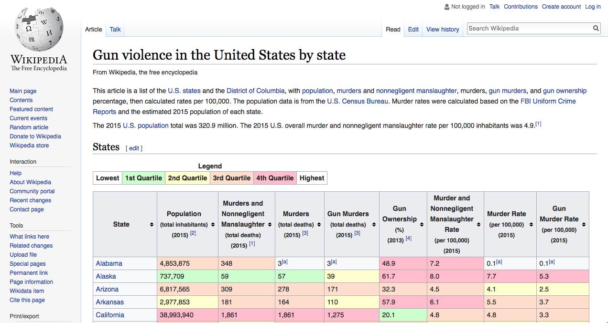
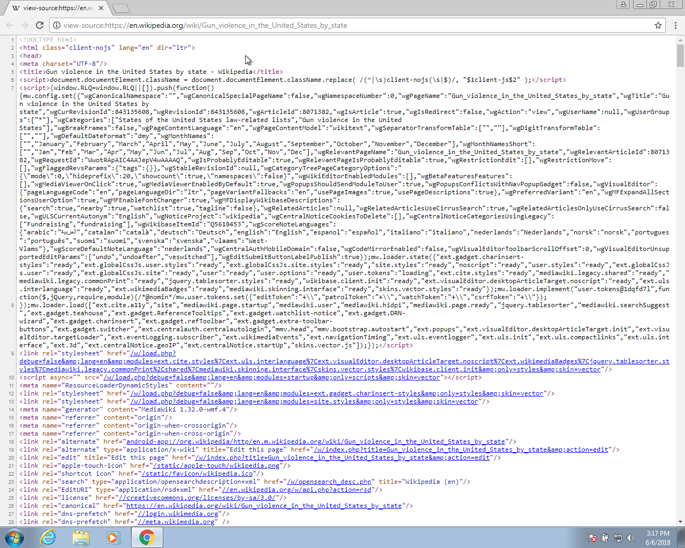

# Introduction

The datasets used up to now have been made available to you as R objects, specifically as data frames. The US murders data, the reported heights data, the Gapminder data, and the poll data are all examples. These datasets come included in the dslabs package and we loaded them using the `data` function. Furthermore, we have made the data available in what is referred to as `tidy` form, a concept we define later. The _tidyverse_ packages and functions assume that the data is `tidy` and this assumption is a big part of the reason these packages work so well together. 

However, very rarely in a data science project is data easily available as part of a package. We did quite a bit of work "behind the scenes" to get the original raw data into the _tidy_ tables you worked with. Much more typical is for the data to be in a file, a database, or extracted from a document, including web pages, tweets, or PDFs. In these cases, the first step is to import the data into R and, when using the _tidyverse_, tidy the data. The first step in the data analysis process  usually involves several, often complicated, steps to covert data from its raw form to the _tidy_ form that greatly facilitates the rest of the analysis. We refer to this process as `data wrangling`.

Here we cover several common steps of the data wrangling process including importing data into R from files, tidying data, string processing, html parsing, working with dates and times, and text mining. Rarely are all these wrangling steps necessary in a single analysis, but data scientists will likely face them all at some point. Some of the examples we use to demonstrate data wrangling techniques are based on the work we did to convert raw data into the the tidy datasets provided by the dslabs package and used in the book as examples.


# Tidy data

```{r, message=FALSE, warning=FALSE}
library(tidyverse)
library(dslabs)
ds_theme_set()
```

To help define tidy data, we refer to an example from the data visualization lecture in which we plotted fertility data across time for two countries: South Korea and Germany. To make the plot, we used this subset of the data:

```{r}
data("gapminder")
tidy_data <- gapminder %>% 
  filter(country %in% c("South Korea", "Germany")) %>%
  select(country, year, fertility)
head(tidy_data)
```

With the data in this format, we could quickly make the desired plot:

```{r}
tidy_data %>% 
  ggplot(aes(year, fertility, color = country)) +
  geom_point()
```

One reason this code works seamlessly is because the data is _tidy_: each point is represented in a row. This brings us to the definition of _tidy data_: each row represents one observation and the columns represent the different variables available for each of these observations.

If we go back to the original data provided by GapMinder, we see that it does not start out _tidy_. We include an example file with the data shown in this graph mimicking the way it was originally saved in a spreadsheet:

```{r}
path <- system.file("extdata", package="dslabs")
filename <- file.path(path,  "fertility-two-countries-example.csv")
wide_data <- read_csv(filename)
```

The object `wide_data` includes the same information as the object `tidy_data` except it's in a different format: a `wide` format. Here are the first nine columns:

```{r}
select(wide_data, country, `1960`:`1967`)
```

Two important differences between the wide and tidy formats are: 1) in the wide format, each row includes several observations and 2) one of the variables, year, is stored in the header.
 
The ggplot code we introduced earlier no longer works here. For one, there is no `year` variable. To use the `tidyverse`, we need to wrangle this data into `tidy` format. 

# Reshaping data

```{r, echo=FALSE}
library(tidyverse) 
path <- system.file("extdata", package="dslabs")
filename <- file.path(path,  "fertility-two-countries-example.csv")
wide_data <- read_csv(filename)
```

As we have seen, having data in _tidy_ format is what makes the tidyverse flow. After the first step in the data analysis process, importing data, a common next step is to reshape the data into a form that facilitates the rest of the analysis. The `tidyr` package includes several functions that are useful for tyding data. 

## `gather`

One of the most used functions in the tidyr package is `gather`, which converts wide data into tidy data. 

In the third argument of the `gather` function, you specify the columns that will be _gathered_. The default is to gather all columns so, in most cases, we have to specify the columns. Here we want columns `1960`, `1961` up to `2015`. The first argument sets the column/variable name that will hold the variable that is currently kept in the wide data column names. In our case, it makes sense to set name to `year`, although we can name it anything. The second argument sets the new column/variable name that will hold the values. In this case, we call it `fertility` since this is what is stored in this file. Note that nowhere in this file does it tell us this is fertility data. Instead, this information was kept in the file name.

The gathering code looks like this:

```{r}
new_tidy_data <- wide_data %>%
  gather(year, fertility, `1960`:`2015`)
```

We can see that the data have been converted to tidy format with columns `year` and `fertility`:

```{r}
head(new_tidy_data)
```

However, each year resulted in two rows since we have two countries and this column was not gathered.

A somewhat quicker way to write this code is to specify which column will **not** be gathered, rather than all the columns that will be gathered:

```{r}
new_tidy_data <- wide_data %>%
  gather(year, fertility, -country)
```

The `new_tidy_data` object looks like the original `tidy_data` we used with just one minor difference. Can you spot it? Look at the data type of the year column:

```{r}
class(tidy_data$year)
class(new_tidy_data$year)
```

The `gather` function assumes that column names are characters. So we need a bit more wrangling before we are ready to make a plot. We need to convert the year column to numbers. The `gather` function has an argument for that, the `convert` argument:

```{r}
new_tidy_data <- wide_data %>%
  gather(year, fertility, -country, convert = TRUE)
class(new_tidy_data$year)
```

We could have also used the `mutate` and `as.numeric`.

Now that the data is tidy, we can use the same ggplot code as before:

```{r}
new_tidy_data %>% ggplot(aes(year, fertility, color = country)) +
  geom_point()
```

## `spread`

As we will see in later examples, it is sometimes useful for data wrangling purposes to convert tidy data into wide data. We often use this as an intermediate step in tidying up data. The `spread` function is basically the inverse of `gather`. The first argument is for the data, but since we are using the pipe, we don't show it. The second argument tells `spread` which variable will be used as the column names. The third argument specifies which variable to use to fill out the cells:

```{r}
new_wide_data <- new_tidy_data %>% spread(year, fertility)
select(new_wide_data, country, `1960`:`1967`)
```

The following diagram can help remind you how these two functions work:

```{r, echo=FALSE}
knitr::include_graphics("img/gather-spread.png")
```

## `separate`

The data wrangling shown above was simple compared to what is usually required. In our example spreadsheet files, we include an illustration that is slightly more complicated. It contains two variables: life expectancy and fertility. However, the way it is stored is not tidy and, as we will explain, not optimal.

```{r}
path <- system.file("extdata", package = "dslabs")
filename <- file.path(path, "life-expectancy-and-fertility-two-countries-example.csv")

raw_dat <- read_csv(filename)
select(raw_dat, 1:5)
```

First, note that the data is in wide format. Second, notice that this table includes values for two variables, fertility and life expectancy, with the column name encoding which column represents which variable. This is not a recommended way to store information, encoded in column names, but it is quite common. We will put our wrangling skills to work to extract this information and store it in a tidy fashion.

We can start the data wrangling with the `gather` function, but we should no longer use the column name `year` for the new column since it also contains the variable type. We will call it `key`, the default, for now:

```{r}
dat <- raw_dat %>% gather(key, value, -country)
head(dat)
```

The result is not exactly what we refer to as tidy since each observation is associated with two, not one, rows. We want to have the values from the two variables, fertility and life expectancy, in two separate columns. The first challenge to achieve this is to separate the `key` column into the year and the variable type. Notice that the entries in this column separate the year from the variable name with an underscore: 

```{r}
dat$key[1:5]
```

Encoding multiple variables in a column name is such a common problem that the readr package includes a function to separate these columns into two or more. Apart from the data, the `separate` function takes three arguments: the name of the column to be separated, the names to be used for the new columns, and the character that separates the variables. So, a first attempt at this is:

```{r, eval=FALSE}
dat %>% separate(key, c("year", "variable_name"), "_")
```

Because "_" is the default separator assumed by `separate`, we do not have to include it in the code:

```{r}
dat %>% separate(key, c("year", "variable_name"))
```

The function does separate the values, but we run into a new problem. We receive the warning `Too many values at 112 locations:` and that the `life_expectancy` variable is truncated to `life`. This is because the `_` is used to separate `life` and `expectancy` not just year and variable name! We could add a third column to catch this and let the `separate` function know which column to _fill in_ with missing values, `NA`, when there is no third value. Here we tell it to fill the column on the right:

```{r}
dat %>% separate(key, c("year", "first_variable_name", "second_variable_name"), 
                 fill = "right")
```

However, if we read the `separate` help file, we find that a better approach is to merge the last two variables when there is an extra separation:

```{r}
dat %>% separate(key, c("year", "variable_name"), extra = "merge")
```

This achieves the separation we wanted. However, we are not done yet. We need to create a column for each variable. As we learned, the `spread` function can do this:

```{r}
dat %>% 
  separate(key, c("year", "variable_name"), extra = "merge") %>%
  spread(variable_name, value) 
```

The data is now in tidy format with one row for each observation with three variables: year, fertility and life expectancy.

## `unite`

It is sometimes useful to do the inverse of `separate`, unite two columns into one. To demonstrate how to use `unite`, we show code that, although this is *not* an optimal approach, serves as an illustration. Suppose that we did not know about `extra` and used this command to separate: 

```{r}
dat %>% 
  separate(key, c("year", "first_variable_name", "second_variable_name"), fill = "right")
```

We can achieve the same final result by uniting the second and third columns like this:

```{r}
dat %>% 
  separate(key, c("year", "first_variable_name", "second_variable_name"), fill = "right") %>%
  unite(variable_name, first_variable_name, second_variable_name, sep="_")
```

Then spreading the columns:

```{r}
dat %>% 
  separate(key, c("year", "first_variable_name", "second_variable_name"), fill = "right") %>%
  unite(variable_name, first_variable_name, second_variable_name, sep="_") %>%
  spread(variable_name, value) %>%
  rename(fertlity = fertility_NA)
```


# Combining tables

```{r, message=FALSE, echo=FALSE}
library(tidyverse)
library(ggrepel)
library(dslabs)
ds_theme_set()
```

The information we need for a given analysis may not be just on one table. For example, when forecasting elections we used the function `left_join` to combine the information from two tables. Here we use a simpler example to illustrate the general challenge of combining tables.

Suppose we want to explore the relationship between population size for US states and electoral votes. We have the population size in this table:

```{r}
data(murders)
head(murders)
```

and electoral votes in this one:

```{r}
data(polls_us_election_2016)
head(results_us_election_2016)
```

Just joining these two tables together will not work since the order of the states is not quite the same:

```{r}
identical(results_us_election_2016$state, murders$state)
```

The _join_ functions, described below, are designed to handle this challenge.

## Joins

The _join_ functions in the `dplyr` package make sure that the tables are combined so that matching rows are together. If you know SQL, you will see that the approach and syntax is very similar. The general idea is that one needs to identify one or more columns that will serve to match the two tables. Then a new table with the combined information is returned. Notice what happens if we join the two tables above by state using `left_join`:

```{r}
tab <- left_join(murders, results_us_election_2016, by = "state")
head(tab)
```

The data has been successfully joined and we can now, for example, make a plot to explore the relationship:

```{r}
tab %>% ggplot(aes(population/10^6, electoral_votes, label = abb)) +
  geom_point() +
  geom_text_repel() + 
  scale_x_continuous(trans = "log2") +
  scale_y_continuous(trans = "log2") +
  geom_smooth(method = "lm", se = FALSE)
```

We see the relationship is close to linear with about 2 electoral votes for every million persons, but with smaller states getting higher ratios.


In practice, it is not always the case that each row in one table has a matching row in the other. For this reason, we have several versions of join. To illustrate this challenge, we will take subsets of the tables above. We create the tables `tab1` and `tab2` so that they have some states in common but not all:

```{r}
tab_1 <- slice(murders, 1:6) %>% 
  select(state, population)
tab_1

tab_2 <- slice(results_us_election_2016, c(1:3, 5, 7:8)) %>% 
  select(state, electoral_votes)
tab_2
```


We will use these two tables as examples in the next sections.

### Left join

Suppose we want a table like `tab_1`, but adding electoral votes to whatever states we have available. For this, we use left join with `tab_1` as the first argument.

```{r}
left_join(tab_1, tab_2)
```

Note that `NA`s are added to the two states not appearing in `tab_2`. Also notice that this function, as well as all the other joins, can receive the first arguments through the pipe:

```{r}
tab_1 %>% left_join(tab_2)
```


### Right join

If instead of a table like `tab_1`, we want one like `tab_2`, we can use `right_join`:

```{r}
tab_1 %>% right_join(tab_2)
```

Now the NAs are in the column coming from `tab_1`.

### Inner join

If we want to keep only the rows that have information in both tables, we use inner join. You can think of this as an intersection:

```{r}
inner_join(tab_1, tab_2)
```

### Full join

If we want to keep all the rows and fill the missing parts with NAs, we can use a full join. You can think of this as a union:

```{r}
full_join(tab_1, tab_2)
```

### Semi join

The `semi_join` lets us keep the part of first table, for which we have information, in the second. It does not add the columns of the second:

```{r}
semi_join(tab_1, tab_2)
```


### Anti join

The function `anti_join` is the opposite of `semi_join`. It keeps the elements of the first table, for which there is no information, in the second:

```{r}
anti_join(tab_1, tab_2)
```

The following diagram summarizes the above joins:


```{r, echo=FALSE}
knitr::include_graphics("img/joins.png")
```

## Binding

Although we have yet to use it in this book, another common way in which datasets are combined is by _binding_ them. Unlike the join function, the binding functions do no try to match by a variable, but instead simply combine datasets. If the datasets don't match by the appropriate dimensions, one obtains an error.

### Binding columns

The `dplyr` function _bind_cols_ binds two objects by making them columns in a tibble. For example, we quickly want to make a data frame consisting of numbers we can use.

```{r}
bind_cols(a = 1:3, b = 4:6)
```

This function requires that we assign names to the columns. Here we chose `a` and `b`. 

Note that there is an R-base function `cbind` with the exact same functionality. An important difference is that `cbind` can create different types of objects, while `bind_cols` always produces a data frame.

`bind_cols` can also bind two different data frames. For example, here we break up the `tab` data frame and then bind them back together:

```{r}
tab_1 <- tab[, 1:3]
tab_2 <- tab[, 4:6]
tab_3 <- tab[, 7:9]
new_tab <- bind_cols(tab_1, tab_2, tab_3)
head(new_tab)
```


### Binding by rows

The `bind_rows` function is similar to `bind_cols`, but binds rows instead of columns:

```{r}
tab_1 <- tab[1:2,]
tab_2 <- tab[3:4,]
bind_rows(tab_1, tab_2)
```

This is based on an R-base function `rbind`.

## Set operators

Another set of commands useful for combing datasets are the set operators. When applied to vectors, these behave as their names suggest, `intersect` and `union`. However, if the `tidyverse` or, more specifically, `dplyr` is loaded, these functions can be used on data frames as opposed to just on vectors.

### Intersect

You can take intersections of vectors of any type, such as numeric:

```{r}
intersect(1:10, 6:15)
```
or characters:

```{r}
intersect(c("a","b","c"), c("b","c","d"))
```

But with `dplyr` loaded, we can also do this for tables having the same column names:

```{r}
tab_1 <- tab[1:5,]
tab_2 <- tab[3:7,]
intersect(tab_1, tab_2)
```


### Union

Similarly _union_ takes the union of vectors. For example:

```{r}
union(1:10, 6:15)
union(c("a","b","c"), c("b","c","d"))
```

But with `dplyr` loaded, we can also do this for tables having the same column names:

```{r}
tab_1 <- tab[1:5,]
tab_2 <- tab[3:7,]
union(tab_1, tab_2)
```


### `setdiff`

The set difference between a first and second argument can be obtained with `setdiff`. Not unlike `instersect` and `union`, this function is not symmetric:


```{r}
setdiff(1:10, 6:15)
setdiff(6:15, 1:10)
```

As in the function shown above, we can apply it to data frames:
```{r}
tab_1 <- tab[1:5,]
tab_2 <- tab[3:7,]
setdiff(tab_1, tab_2)
```

### `setequal`

Finally, the function `set_equal` tells us if two sets are the same, regardless of order. So notice that:

```{r}
setequal(1:5, 1:6)
```

but:

```{r}
setequal(1:5, 5:1)
```

When applied to data frames that are not equal, regardless of order, it provides a useful message letting us know how the sets are different:

```{r}
setequal(tab_1, tab_2)
```


# Web Scraping 

The data we need to answer a question is not always in a spreadsheet, ready for us to read. For example, the US murders dataset originally comes from this Wikipedia page: 
[https://en.wikipedia.org/w/index.php?title=Gun_violence_in_the_United_States_by_state&oldid=843135608](https://en.wikipedia.org/w/index.php?title=Gun_violence_in_the_United_States_by_state&oldid=843135608). You can see the data table when you visit the webpage:


```{r, echo=FALSE}

```

Unfortunately, there is no link to a data file. To make the data frame we loaded using `data(murders)` or reading-in the csv file made available through `dslabs`, we had to do some _web scrapping_. 

_Web scraping_, or _web harvesting_, are the terms we use to describe the process of extracting data from a website. The reason we can do this is because the information used by a browser to render webpages is received as a text file from a server. The text is code written in hyper text markup language (HTML). Every browser has a way to show the html source code for a page, each one different. On Chrome you can use Control-U on a PC and command+alt+U on a Mac.


```{r, echo=FALSE}

```

## HTML

Because this code is accessible, we can download the HTML file, import it into R, and then write programs to extract the information we need from the page. However, once we look at HTML code, this might seem like a daunting task. But we will show you some convenient tools to facilitate the process. To get an idea of how it works, here are a few lines of code from the Wikipedia page that provides the US murders data:

```{r, eval = FALSE}
p>The 2015 U.S. population total was 320.9 million. The 2015 U.S. overall murder rate per 100,000 inhabitants was 4.89.</p>
<h2><span class="mw-headline" id="States">States</span><span class="mw-editsection"><span class="mw-editsection-bracket">[</span><a href="/w/index.php?title=Murder_in_the_United_States_by_state&amp;action=edit&amp;section=1" title="Edit section: States">edit</a><span class="mw-editsection-bracket">]</span></span></h2>
<table class="wikitable sortable">
<tr>
<th>State</th>
<th><a href="/wiki/List_of_U.S._states_and_territories_by_population" title="List of U.S. states and territories by population">Population</a><br />
<small>(total inhabitants)</small><br />
<small>(2015)</small> <sup id="cite_ref-1" class="reference"><a href="#cite_note-1">[1]</a></sup></th>
<th>Murders and Nonnegligent
<p>Manslaughter<br />
<small>(total deaths)</small><br />
<small>(2015)</small> <sup id="cite_ref-2" class="reference"><a href="#cite_note-2">[2]</a></sup></p>
</th>
<th>Murder and Nonnegligent
<p>Manslaughter Rate<br />
<small>(per 100,000 inhabitants)</small><br />
<small>(2015)</small></p>
</th>
</tr>
<tr>
<td><a href="/wiki/Alabama" title="Alabama">Alabama</a></td>
<td>4,853,875</td>
<td>348</td>
<td>7.2</td>
</tr>
<tr>
<td><a href="/wiki/Alaska" title="Alaska">Alaska</a></td>
<td>737,709</td>
<td>59</td>
<td>8.0</td>
</tr>
<tr>
```

You can actually see the data! We can also see a pattern of how it is stored. If you know HTML, you can write programs that leverage knowledge of these patterns to extract what we want. We also take advantage of a language widely used to make webpages look "pretty" called Cascading Style Sheets (CSS). We say more about this in the CSS Selector Section. 

Although we provide tools that make it possible to scrape data without knowing HTML, for data scientists, it is quite useful to learn some HTML and CSS. Not only does this improve your scraping skills, but it might come in handy if you are creating a webpage to showcase you work. There are plenty of online courses and tutorials for learning these. Two examples are [code academy](https://www.codecademy.com/learn/learn-html) and [WWW3 school](https://www.w3schools.com/).

## The rvest package

The `tidyverse` provides a web harvesting package called `rvest`. The first step using this package is to import the webpage into R. The package makes this quite simple:

```{r}
library(rvest)
url <- "https://en.wikipedia.org/w/index.php?title=Gun_violence_in_the_United_States_by_state&oldid=843135608"
h <- read_html(url)
```

Note that the entire Murders in the US Wikipedia webpage is now contained in `h`. The class of this object is:

```{r}
class(h)
```

The rvest package is actually more general; it handles XML documents. XML is a general markup language, that's what the ML stand for, that can be used to represent any kind of data. HTML is a specific type of XML specifically developed for representing webpages. Here we focus on HTML documents.

Now, how do we extract the table from the object `h`? If we print `h`, we don't really see much:

```{r}
h
```

When we know that the information is stored in an HTML table, you can see this in this line of the HTML code above `<table class="wikitable sortable">`. The different parts of an HTML document, often defined with a message in between  `<` and `>`  are referred to as _nodes_. The rvest package includes functions to extract nodes of an HTML document: `html_nodes` extracts all nodes of different types and `html_node` extracts the first one. To extract the tables from the html code we use:
 

```{r} 
tab <- h %>% html_nodes("table")
```

Now, instead of the entire webpage, we just have the html code for the tables in the page:

```{r}
tab
```

The table we are interested is the third one:

```{r}
tab[[3]]
```


We are not quite there yet because this is clearly not a tidy dataset, not even a data frame. In the code above, you can definitely see a pattern and writing code to extract just the data is very doable. In fact, `rvest` includes a function just for converting HTML tables into data frames:


```{r}
tab <- tab[[3]] %>% html_table
class(tab)
```

We are now much closer to having a usable data table:

```{r}
tab <- tab %>% setNames(c("state", "population", "total", "murder_rate"))
head(tab)
```

We still have some wrangling to do. For example, we need to remove the commas and turn characters into numbers. Before continuing with this, we will learn a more general approach to extracting information from web sites.


## CSS selectors

The default look of a webpage made with the most basic HTML is quite unattractive. The aesthetically pleasing pages we see today are made using CSS, which is used to add style to webpages. The fact that all pages for a company have the same style is usually a result that they all use the same CSS file to define the style. The general way these CSS files work is by defining how each of the elements of a webpage will look. The title, headings, itemized lists, tables, and links, for example, each receive their own style including font, color, size, and distance from the margin. CSS does this by leveraging patterns used to define these elements, referred to as _selectors_. An example of such a pattern, which we used above, is `table`, but there are many, many more. 

If we want to grab data from a webpage and we happen to know a selector that is unique to the part of the page containing this data, we can use the `html_nodes` function. However, knowing which selector can be quite complicated. 
In fact, the complexity of webpages has been increasing as they become more sophisticated. For some of the more advanced ones, it seems almost impossible to find the notes that define a particular piece of data. However, selector gadgets actually make this possible.

[SelectorGadget](http://selectorgadget.com/) is piece of software that allows you to interactively determine what CSS selector you need to extract specific components from the webpage. If you plan on scrapping data other than tables, we highly recommend you install it if you are interested in scrapping html pages. A Chrome extension is available which permits you to turn on the gadget and then, as you click through the page, it highlights parts and shows you the selector you need to extract these parts. There are various demos of how to do this including author Hadley Wickham's
[vignetter](https://cran.r-project.org/web/packages/rvest/vignettes/selectorgadget.html), and  [these ](https://stat4701.github.io/edav/2015/04/02/rvest_tutorial/) [two](https://www.analyticsvidhya.com/blog/2017/03/beginners-guide-on-web-scraping-in-r-using-rvest-with-hands-on-knowledge/) tutorials based on the package vignette. 

We add an example here that tries to extract the recipe name, total preparation time, and list of ingredients from [this](http://www.foodnetwork.com/recipes/alton-brown/guacamole-recipe-1940609) Guacamole recipe. Looking at the code for this page, it seems that the task is impossibly complex. For the Guacamole recipe page, we already have determined that we need the following selectors:

```{r}
h <- read_html("http://www.foodnetwork.com/recipes/alton-brown/guacamole-recipe-1940609")
recipe <- h %>% html_node(".o-AssetTitle__a-HeadlineText") %>% html_text()
prep_time <- h %>% html_node(".o-RecipeInfo__a-Description--Total") %>% html_text()
ingredients <- h %>% html_nodes(".o-Ingredients__a-ListItemText") %>% html_text()
```

You can see how complex the selectors are. In any case, we are now ready to extract what we want and create a list:

```{r}
guacamole <- list(recipe, prep_time, ingredients)
guacamole
```

Since recipe pages from this website follow this general layout, we can use this code to create a function that extracts this information: 

```{r}
get_recipe <- function(url){
  h <- read_html(url)
  recipe <- h %>% html_node(".o-AssetTitle__a-HeadlineText") %>% html_text()
  prep_time <- h %>% html_node(".o-RecipeInfo__a-Description--Total") %>% html_text()
  ingredients <- h %>% html_nodes(".o-Ingredients__a-ListItemText") %>% html_text()
  return(list(recipe = recipe, prep_time = prep_time, ingredients = ingredients))
}
```

Then we can use it to extract recipes from any of their webpages:

```{r}
get_recipe("http://www.foodnetwork.com/recipes/food-network-kitchen/pancakes-recipe-1913844")
get_recipe("https://www.foodnetwork.com/recipes/giada-de-laurentiis/pasta-primavera-recipe-1942131")
```


There are several other powerful tools provided by `rvest`. For example, the functions `html_form`, `set_values`, and `submit_form` permit you to query a webpage from R. This is a more advanced topic not covered here.


## JSON

Sharing data on the internet has become more and more common. Unfortunately, providers use different formats which makes it harder for data scientists to wrangle data into R. Yet there are some standards that are also becoming more common. Currently, a format that is widely being adopted is the JavaScript Object Notation or JSON. Because this format is very general, it is nothing like a spreadsheet. This JSON files look more like the code you use to define a list. Here is an example of information stored in a JSON format:

```{r, echo=FALSE}
library(jsonlite)
example <- data.frame(name= c("Miguel", "Sofia", "Aya", "Cheng"), student_id = 1:4, exam_1 = c(85, 94, 87, 90), exam_2 = c(86, 93, 88, 91))
json <- toJSON(example, pretty = TRUE) 
json
```

The file above actually represents a data frame. To read it, we can use the function `fromJSON` from the jsonlite package. Note that JSON files are often made available via the internet. Several organization provide a JSON API or a web service that you can connect directly to and obtain data. Here is an example:

```{r}
library(jsonlite)
citi_bike <- fromJSON("http://citibikenyc.com/stations/json")
```

This downloads a list. The first argument tells you when you downloaded it:

```{r}
citi_bike$executionTime
```

and the second is a data table:

```{r}
head(citi_bike$stationBeanList)
```


You can learn much more by examining tutorials and help files from the jsonlite package. This package is intended for relatively simple tasks such as converging data into tables. For more flexibility, we recommend `rjson`.


# Text mining

With the exception of labels used to represent categorical data, we have focused on numerical data. But in many applications data starts as text. Well known examples are spam filtering, cyber-crime prevention, counter-terrorism and sentiment analysis. In all these examples, the raw data is composed of free form texts. Our task is to extract insights from these data. In this section we learn how to generate useful numerical summaries from text data to which we can apply some of the powerful data visualization and analysis techniques we have learned.  


## Case study: Trump tweets

During the 2016 US presidential election, then candidate Donald J. Trump used his twitter account as a way to communicate with potential voters. On August 6, 2016, Todd Vaziri [tweeted](https://twitter.com/tvaziri/status/762005541388378112/photo/1) about Trump that "Every non-hyperbolic tweet is from iPhone (his staff). Every hyperbolic tweet is from Android (from him)." 
Data scientist David Robinson conducted an [analysis](http://varianceexplained.org/r/trump-tweets/) to determine if data supported this assertion. Here we go through David's analysis to learn some of the basics of text mining. To learn more about text mining in R we recommend [this book](https://www.tidytextmining.com/).

```{r,echo=FALSE}
set.seed(1)
```

We will use the following libraries:
```{r,message=FALSE}
library(lubridate)
library(tidyr)
library(scales)
```

In general, we can extract data directly from twitter using the \emph{rtweet} package. However, in this case, a group has already compiled data for us and made it available at [http://www.trumptwitterarchive.com](http://www.trumptwitterarchive.com). We can get the data from their JSON API using a script like this:

```{r, eval=FALSE}
url <- 'http://www.trumptwitterarchive.com/data/realdonaldtrump/%s.json'
trump_tweets <- map(2009:2017, ~sprintf(url, .x)) %>%
  map_df(jsonlite::fromJSON, simplifyDataFrame = TRUE) %>%
  filter(!is_retweet & !str_detect(text, '^"')) %>%
  mutate(created_at = parse_date_time(created_at, orders = "a b! d! H!:M!:S! z!* Y!", tz="EST")) 
```

For convenience, we include the result of the code above in the dslabs package:

```{r}
library(dslabs)
data("trump_tweets")
```

This is the data frame with information about the tweets:

```{r}
head(trump_tweets)
```

with the following variables included:

```{r}
names(trump_tweets)
```

The help file `?trump_tweets` provides details on what each variable represents. The tweets are represented by the `text` variable:

```{r}
trump_tweets %>% select(text) %>% head
```

and the source variable tells us which device was used to compose and upload each tweet:

```{r}
trump_tweets %>% count(source) %>% arrange(desc(n))
```

To start, we will use `extract` to remove the `Twitter for` part of the source and filter out retweets.

```{r}
trump_tweets %>% 
  extract(source, "source", "Twitter for (.*)") %>%
  count(source) 
```

We are interested in what happened during the campaign, so for this analysis we will focus on what was tweeted between the day Trump announced his campaign and election day. We define the following table containing just the tweets from that time period:

```{r}
campaign_tweets <- trump_tweets %>% 
  extract(source, "source", "Twitter for (.*)") %>%
  filter(source %in% c("Android", "iPhone") &
           created_at >= ymd("2015-06-17") & 
           created_at < ymd("2016-11-08")) %>%
  filter(!is_retweet) %>%
  arrange(created_at)
```

We can now use data visualization to explore the possibility that two different groups were tweeting from these devices. For each tweet, we will extract the hour, East Coast time (EST), it was tweeted and then compute the proportion of tweets tweeted at each hour for each device:

```{r}
ds_theme_set()
campaign_tweets %>%
  mutate(hour = hour(with_tz(created_at, "EST"))) %>%
  count(source, hour) %>%
  group_by(source) %>%
  mutate(percent = n / sum(n)) %>%
  ungroup %>%
  ggplot(aes(hour, percent, color = source)) +
  geom_line() +
  geom_point() +
  scale_y_continuous(labels = percent_format()) +
  labs(x = "Hour of day (EST)",
       y = "% of tweets",
       color = "")
```


We notice a big peak for the Android in the early hours of the morning, between 6 and 8 AM. There seems to be a clear difference in these patterns. We will therefore assume that two different entities are using these two devices. 

We will now study how the tweets differ when we compare Android to iPhone. To do this, we introduce the _tidytext_ package.


## Text as data

The tidytext package helps us convert free form text into a tidy table. Having the data in this format greatly facilitates data visualization and the use of statistical techniques. 

```{r}
library(tidytext)
```

The main function needed to achieve this is `unnest_tokens`. A _token_ refers to the units that we are considering to be a data point. The most common _token_ will be words, but they can also be single characters, ngrams, sentences, lines or a pattern defined by a regex. The functions will take a vector of strings and extract the tokens so that each one gets a row in the new table. Here is a simple example:

```{r}
example <- data_frame(line = c(1, 2, 3, 4),
                      text = c("Roses are red,", "Violets are blue,", "Sugar is sweet,", "And so are you."))
example
example %>% unnest_tokens(word, text)
```

Now let's look at an example from the tweets. We will look at tweet number 3008 because it will later permit us to illustrate a couple of points:

```{r}
i <- 3008
campaign_tweets$text[i]
campaign_tweets[i,] %>% 
  unnest_tokens(word, text) %>%
  select(word)
```

Note that the function tries to convert tokens into words. However, to do this, it strips characters that are important in the context of twitter. Namely, the function removes all the `#` and `@`. A _token_ in the context of twitter is not the same as in the context of spoken or written English. For this reason, instead of using the default, words, we define a regex that captures twitter characters. This may appear complex but all we are defining is a pattern that starts with @, # or neither, and is followed by any combination of letters or digits:

```{r}
pattern <- "([^A-Za-z\\d#@']|'(?![A-Za-z\\d#@]))"
```

We can now use the `unnest_tokens` function with the `regex` option and appropriately extract the hashtags and mentions. We demonstrate with our example tweet:

```{r}
campaign_tweets[i,] %>% 
  unnest_tokens(word, text, token = "regex", pattern = pattern) %>%
  select(word)
```

Another minor adjustment we want to make is to remove the links to pictures:

```{r}
campaign_tweets[i,] %>% 
  mutate(text = str_replace_all(text, "https://t.co/[A-Za-z\\d]+|&amp;", ""))  %>%
  unnest_tokens(word, text, token = "regex", pattern = pattern) %>%
  select(word)
```


Now we are now ready to extract the words for all our tweets. 


```{r}
tweet_words <- campaign_tweets %>% 
  mutate(text = str_replace_all(text, "https://t.co/[A-Za-z\\d]+|&amp;", ""))  %>%
  unnest_tokens(word, text, token = "regex", pattern = pattern) 
```


And we can now answer questions such as "what are the most commonly used words?":

```{r}
tweet_words %>% 
  count(word) %>%
  arrange(desc(n))
```

It is not surprising that these are the top words. The top words are not informative. The _tidytext_ package has a database of these commonly used words, referred to as _stop words_, in text mining:

```{r}
stop_words
```

If we filter out rows representing stop words with `filter(!word %in% stop_words$word)`:

```{r}
tweet_words <- campaign_tweets %>% 
  mutate(text = str_replace_all(text, "https://t.co/[A-Za-z\\d]+|&amp;", ""))  %>%
  unnest_tokens(word, text, token = "regex", pattern = pattern) %>%
  filter(!word %in% stop_words$word ) 
```

we end up with a much more informative set of top 10 tweeted words:

```{r}
tweet_words %>% 
  count(word) %>%
  top_n(10, n) %>%
  mutate(word = reorder(word, n)) %>%
  arrange(desc(n))
```

Some exploration of the resulting words (not shown here) reveals a couple of unwanted characteristics in our tokens. First, some of our tokens are just numbers (years, for example). We want to remove these and we can find them using the regex `^\d+$`. Second, some of our tokens come from a quote and they start with `'`. We want to remove the `'` when it is at the start of a word so we will just `str_replace`. We add these two lines to the code above to generate our final table:


```{r}
tweet_words <- campaign_tweets %>% 
  mutate(text = str_replace_all(text, "https://t.co/[A-Za-z\\d]+|&amp;", ""))  %>%
  unnest_tokens(word, text, token = "regex", pattern = pattern) %>%
  filter(!word %in% stop_words$word &
           !str_detect(word, "^\\d+$")) %>%
  mutate(word = str_replace(word, "^'", ""))
```

Now that we have all our words in a table, along with information about what device was used to compose the tweet they came from, we can start exploring which words are more common when comparing Android to iPhone. 

For each word, we want to know if it is more likely to come from an Android tweet or an iPhone tweet. We previously introduced the odds ratio as a summary statistic useful for quantifying these differences. For each device and a given word, let's call it `y`, we compute the odds or the ratio between the proportion of words that are `y` and not `y` and compute the ratio of those odds. Here we will have many proportions that are 0, so we use the 0.5 correction described in the Association Test section.

```{r}
android_iphone_or <- tweet_words %>%
  count(word, source) %>%
  spread(source, n, fill = 0) %>%
  mutate(or = (Android + 0.5) / (sum(Android) - Android + 0.5) / 
           ( (iPhone + 0.5) / (sum(iPhone) - iPhone + 0.5)))
android_iphone_or %>% arrange(desc(or))
android_iphone_or %>% arrange(or)
```  

Given that several of these words are overall low frequency words, we can impose a filter based on the total frequency like this:

```{r}
android_iphone_or %>% filter(Android+iPhone > 100) %>%
  arrange(desc(or))

android_iphone_or %>% filter(Android+iPhone > 100) %>%
  arrange(or)
```

We already see somewhat of a pattern in the types of words that are being tweeted more from one device versus the other. However, we are not interested in specific words but rather in the tone. Vaziri's assertion is that the Android tweets are more hyperbolic. So how can we check this with data? _Hyperbolic_ is a hard sentiment to extract from words as it relies on interpreting phrases. However, words can be associated to more basic sentiment such as anger, fear, joy and surprise. In the next section, we demonstrate basic sentiment analysis. 

## Sentiment analysis

In sentiment analysis, we assign a word to one or more "sentiments". Although this approach will miss context dependent sentiments, such as sarcasm, when performed on large numbers of words, summaries can provide insights.

The first step in sentiment analysis is to assign a sentiment to each word. The tidytext package includes several maps or lexicons in the object `sentiments`:

```{r}
table(sentiments$lexicon)
```

The `bing` lexicon divides words into `positive` and `negative` sentiments. We can see this using the _tidytext_ function `get_sentiments`:

```{r}
get_sentiments("bing")
```

The `AFINN` lexicon assigns a score between -5 and 5, with -5 the most negative and 5 the most positive.

```{r}
get_sentiments("afinn")
```

The `loughran` and `nrc` lexicons provide several different sentiments:

```{r}
get_sentiments("loughran") %>% count(sentiment)
```

```{r}
get_sentiments("nrc") %>% count(sentiment)
```

To start learning about how these lexicons were developed, you can read this help file `?sentiments`. 

For our analysis, we are interested in exploring the different sentiments of each tweet so we will use the `nrc` lexicon:

```{r}
nrc <- sentiments %>%
  filter(lexicon == "nrc") %>%
  select(word, sentiment)
```

We can combine the words and sentiments using `inner_join`, which will only keep words associated with a sentiment. Here are 10 random words extracted from the tweets:


```{r}
tweet_words %>% inner_join(nrc, by = "word") %>% 
  select(source, word, sentiment) %>% 
  sample_n(10)
```

Now we are ready to perform a quantitative analysis comparing Android and iPhone by comparing the sentiments of the tweets posted from each device. Here we could perform a tweet by tweet analysis, assigning a sentiment to each tweet. However, this will be challenging since each tweet will have several sentiments attached to it, one for each word appearing in the lexicon. For illustrative purposes, we will perform a much simpler analysis: we will count and compare the frequencies of each sentiment appearing in each device.


```{r}
sentiment_counts <- tweet_words %>%
  left_join(nrc, by = "word") %>%
  count(source, sentiment) %>%
  spread(source, n) %>%
  mutate(sentiment = replace_na(sentiment, replace = "none"))
sentiment_counts
```

For each sentiment, we can compute the odds of being in the device: proportion of words with sentiment versus proportion of words without, and then compute the odds ratio comparing the two devices.

```{r}
sentiment_counts %>%
  mutate(Android = Android / (sum(Android) - Android) , 
         iPhone = iPhone / (sum(iPhone) - iPhone), 
         or = Android/iPhone) %>%
  arrange(desc(or))
```
 
So we do see some differences and the order is interesting: the largest three sentiments are disgust, anger, and negative! But are they statistically significant? How does this compare if we are just assigning sentiments at random? 

To answer this question we can compute, for each sentiment, an odds ratio and a confidence interval. We will add the two values we need to form a two-by-two table and the odd ratio:

```{r}
library(broom)
log_or <- sentiment_counts %>%
  mutate( log_or = log( (Android / (sum(Android) - Android)) / (iPhone / (sum(iPhone) - iPhone))),
          se = sqrt( 1/Android + 1/(sum(Android) - Android) + 1/iPhone + 1/(sum(iPhone) - iPhone)),
          conf.low = log_or - qnorm(0.975)*se,
          conf.high = log_or + qnorm(0.975)*se) %>%
  arrange(desc(log_or))
  
log_or
```

A graphical visualization shows some sentiments that are clearly overrepresented:

```{r}
log_or %>%
  mutate(sentiment = reorder(sentiment, log_or)) %>%
  ggplot(aes(x = sentiment, ymin = conf.low, ymax = conf.high)) +
  geom_errorbar() +
  geom_point(aes(sentiment, log_or)) +
  ylab("Log odds ratio for association between Android and sentiment") +
  coord_flip() 
```

We see that the disgust, anger, negative, sadness and fear sentiments are associated with the Android in a way that is hard to explain by chance alone. Words not associated to a sentiment were strongly associated with the iPhone source, which is in agreement with the original claim about hyperbolic tweets.

If we are interested in exploring which specific words are driving these differences, we can refer  back to our `android_iphone_or` object:

```{r}
android_iphone_or %>% inner_join(nrc) %>%
  filter(sentiment == "disgust" & Android + iPhone > 10) %>%
  arrange(desc(or))
``` 

and we can make a graph:

```{r}
android_iphone_or %>% inner_join(nrc, by = "word") %>%
  mutate(sentiment = factor(sentiment, levels = log_or$sentiment)) %>%
  mutate(log_or = log(or)) %>%
  filter(Android + iPhone > 10 & abs(log_or)>1) %>%
  mutate(word = reorder(word, log_or)) %>%
  ggplot(aes(word, log_or, fill = log_or < 0)) +
  facet_wrap(~sentiment, scales = "free_x", nrow = 2) + 
  geom_bar(stat="identity", show.legend = FALSE) +
  theme(axis.text.x = element_text(angle = 90, hjust = 1)) 
```


This is just a simple example of the many analyses one can perform with tidytext.
To learn more, we again recommend [this book](https://www.tidytextmining.com/).


