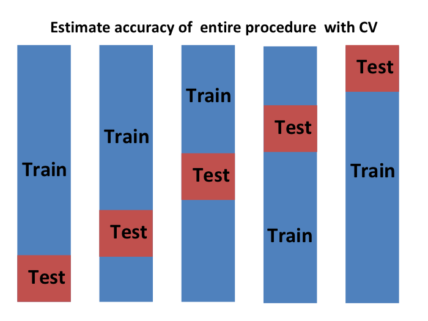

# Cross validation


```{r message=FALSE, warning=FALSE, echo=FALSE}
library(tidyverse)
library(dslabs)
ds_theme_set()
```

Previously we described that the goal machine learning is often to find an algorithm that produces predictors $\hat{Y}$ for an outcome $Y$ that minimizes the MSE:

$$
\mbox{MSE} = \mbox{E}\left\{ \frac{1}{N}\sum_{i=1}^N (\hat{Y}_i - Y_i)^2 \right\}
$$
When all we have to our disposal is one dataset, we can estimate the MSE with the observed MSE like this:

$$
\hat{\mbox{MSE}} = \frac{1}{N}\sum_{i=1}^N (\hat{y}_i - y_i)^2
$$
These are often referred to as the _true error_ and _apparent error_ respectively.

There are two important characteristics of the apparent error we should always keep in mind:
1. It is a random variable since our data is random: for example the dataset we have may be a random sample from a larger population. So an algorithm having a lower apparent error than another, may be due to luck.

2. If we train an algorithm on the same dataset that we use to compute the apparent error we might be overtraining. In general, when we do this, the apparent error will be an underestimate of the true error. We saw an extreme example of this with k nearest neighbor.


Cross validation is a technique that permits us to alleviate both these problems. There several approaches
To understand cross validation it helps to think of the true error, a theoretical quantity, as the average of many many apparent errors obtained by applying the algorithm to $B$ new random samples of the data, none of them used to train the algorithm. As shown in a previously we think of the true error as :


$$
\frac{1}{B} \sum_{b=1}^B \frac{1}{N}\sum_{i=1}^N \left(\hat{y}_i^b - y_i^b\right)^2 
$$
with $B$ a large number that can be though off as practically infinite. As we mentioned this is theoretical quantity because one only get one set of outcomes $y_1, \dots, y_n$. The idea is to imitate the theoretical setup as best we can with the data we have. To do this we have to generate a series of different random samples. There are several approaches to doing this. But the general idea for all of them is to randomly generate smaller datasets that are not used for training, and instead used to estimate the true error.

## K-fold cross validation

The first one we describe is _K-fold cross validation_. 
Generally speaking a machine learning challenge starts with a dataset (blue). We need to build an algorithm using this dataset that will eventually be used in completely independent datasets (yellow)

```{r, echo=FALSE,  out.width = "500px", out.extra='style="display: block; margin-left: auto; margin-right: auto; background-color: #000; padding:3px;"'}
knitr::include_graphics("img/cv-1.png")
```

But we don't get to see these independent dataset. 

```{r, echo=FALSE,  out.width = "500px", out.extra='style="display: block; margin-left: auto; margin-right: auto; background-color: #000; padding:3px;"'}
knitr::include_graphics("img/cv-2.png")
```

So to imitate this situation, we carve out a piece of our dataset and pretend it is an independent dataset: we divide the dataset into a _training set_ (blue) and a _test set_ (red). We will train our algorithm exclusively on the training set and use the test set only for evaluation purposes.

We usually try to select a small piece of the dataset so that we have as much data as possible to train. However, we also want the test set to be large so that we obtain stable estimate of the loss. Typical choices are to use 10%-20% of the data for testing. 

```{r, echo=FALSE,  out.width = "500px", out.extra='style="display: block; margin-left: auto; margin-right: auto; background-color: #000; padding:3px;"'}
knitr::include_graphics("img/cv-3.png")
```

Let's reiterate that it indispensable that we do not use the test set at all: not for filtering out rows, not for selecting features, nothing! 

Now this presents a new problem because for most machine learning algorithms we need to select parameters, for example the number of neighbors k in k-nearest neighbors. Here we will refer to the set of parameters as $\lambda$
We need to optimize algorithm parameters without using our test set and we know that if we optimize and evaluate on the same dataset we will overtrain. So here is where we use cross validation. This is where cross validation is most useful.

So for each set of algorithm parameters being considered, we we want an estimate of the MSE and the we will chose the parameters with the smallest MSE. Cross validation provides this estimate.

First, we it is important that before we start the cross validation procedure, we fix all the algorithm parameters. So although we will train the algorithm on set of training sets, the parameters $\lambda$ will be the same across all training sets. We will use $\hat{y}_i(\lambda)$ to denote the predictors obtained when we use parameters $\lambda$.

So, if we are going to imitate the definition


$$
\mbox{MSE}(\lambda) = \frac{1}{B} \sum_{b=1}^B \frac{1}{N}\sum_{i=1}^N \left(\hat{y}_i^b(\lambda) - y_i^b\right)^2 
$$

we want to consider datasets that can be thought of as an independent random sample and we want to do this several times. With K-fold cross validation we do it $K$ times. In the cartoons we are showing an example with $K=5$. 

We will eventually end up with $K$ samples but let's start by describing how to construct the first:  we simply pick $M=N/K$ (we round if $M$ is not a round number) observations at random and think of these as a random sample $y_1^b, \dots, y_M^b$, with $b=1$. We call this the validation set:


```{r, echo=FALSE,  out.width = "500px", out.extra='style="display: block; margin-left: auto; margin-right: auto; background-color: #000; padding:3px;"'}
knitr::include_graphics("img/cv-4.png")
```

Now we can fit the model in the training set then compute the apparent error on the independent set:

$$
\hat{\mbox{MSE}}_b(\lambda) = \frac{1}{M}\sum_{i=1}^M \left(\hat{y}_i^b(\lambda) - y_i^b\right)^2 
$$

Note that this is just one sample and will therefore return a noisy estimate of the true error. This is why we take $K$ samples, not just one. In K-cross validation we randomly split the observations into $K$ non-overlapping sets:


```{r, echo=FALSE,  out.width = "500px", out.extra='style="display: block; margin-left: auto; margin-right: auto; background-color: #000; padding:3px;"'}
knitr::include_graphics("img/cv-5.png")
```


Now we we repeat the calculation above for each of these sets $b=1,\dots,B$ and obtain $\hat\mbox{MSE}}_1(\lambda),\dots, \hat{\mbox{MSE}}_B(\lambda)$. Our final estimate we compute the average:

$$
\hat{\mbox{MSE}}(\lambda) = \frac{1}{B} \sum_{b=1}^K \hat{\mbox{MSE}}_b(\lambda)
$$

and obtain an estimate of our loss. A final step would be to select the $\lambda$ that minimizes the MSE.

So we have described how to use cross validation to optimize parameters. However, now we have to take into account the fact that the optimization occurred on the training data so we need to an estimate of our final algorithm based on data that was not used to optimize the choice. Here is where we use the test set we separated early on:


```{r, echo=FALSE,  out.width = "500px", out.extra='style="display: block; margin-left: auto; margin-right: auto; background-color: #000; padding:3px;"'}
knitr::include_graphics("img/cv-6.png")
```

We can do cross validation again 

```{r, echo=FALSE,  out.width = "500px", out.extra='style="display: block; margin-left: auto; margin-right: auto; background-color: #000; padding:3px;"'}

```

And obtain an final estimate of our expected loss. However, note that this involves 
that our entire compute time gets multiplied by $K$. You will soon learn that performing this task take time because we are performing many complex computations and are always looking for ways to reduce this. For the final evaluation, we often just use the one test set.

Once we are satisfied with this model and want to make it available to others, we could refit the model on the entire dataset, without changing the parameters.


```{r, echo=FALSE,  out.width = "500px", out.extra='style="display: block; margin-left: auto; margin-right: auto; background-color: #000; padding:3px;"'}

```


Now how do we pick the cross validation $K$. Large values of $K$ are preferable because the training data  better imitate the original dataset. However, larger values of $K$ will have much slower computation time: for example 100-fold cross validation will be 10 times slower than 10-fold cross validation. For this reason the choices of $K=5$ and $K=10$ are popular.

One way we can improve the variance of our final estimate is to take more samples. To do this, we would no longer require the training set to be partitioned into non-overlapping sets. Instead we would just pick $K$ sets of some size at random.

One popular version of this technique, at each fold, picks observations at random with replacement (which means the same observation can appear twice). This approach 
has some advantages (not discussed here) is generally referred to as the _Bootstrap_. In fact, this is the default approach in the `caret` package.  Below we include a explanation of how it works in genera.


# Bootstrap

Suppose the income distribution of your population is as follows:

```{r, echo = FALSE}
n <- 10^6
income <- 10^(rnorm(n, 4.656786, 0.4394738))
```

```{r}
hist(log10(income))
```

The population median is 
```{r}
m <- median(income)
m
```

Suppose we don't have access to the entire population but want to estimate the median $m$. We take a sample of 250 and estimate the population median $m$ with the sample median $M$:

```{r}
set.seed(1)
N <- 250
X <- sample(income, N)
M <- median(X)
M
```

Can we construct a confidence interval? What is the distribution of $M$ ?

From a Monte Carlo simulation we see that the distribution of $M$ is approximately normal with the following expected value and standard error:

```{r}
B <- 10^5
Ms <- replicate(B, {
  X <- sample(income, N)
  M <- median(X)
})
par(mfrow=c(1,2))
hist(Ms)
qqnorm(Ms)
qqline(Ms)
mean(Ms)
sd(Ms)
```

The problem here is that, as we have described before, in practice we do not have access to the distribution. In the past we have used the central limit theorem. But the CLT we studies applies to averages and here we are interested in the median. 

The Bootstrap permits us to approximate a Monte Carlo simulation without access to the entire distribution. The general idea is relatively simple. We act as if the sample is the distribution and sample (with replacement) datasets of the same size. Then we compute the summary statistic, in this case median, on this _bootstrap sample_. 

There is theory telling us that the distribution of the statistics obtained with bootstrap samples approximate the distribution of our actual statistic. This is how we construct bootstrap samples and an approximate distribution:


```{r}
B <- 10^5
M_stars <- replicate(B, {
  X_star <- sample(X, N, replace = TRUE)
  M_star <- median(X_star)
})
```

Now we can check how close it is to the actual distribution
```{r}
qqplot(Ms, M_stars)
abline(0,1)  
```

We see it is not perfect but it provides a decent approximation:

```{r}
quantile(Ms, c(0.05, 0.95))
quantile(M_stars, c(0.05, 0.95))
```

This is much better than what we get if we mindlessly use the CLT:
```{r}
median(X) + 1.96 * sd(X)/sqrt(N) * c(-1,1)
```


If we know the distribution is normal, we can use the bootstrap to estimate the mean:
```{r}
mean(Ms) + 1.96*sd(Ms)*c(-1,1)
mean(M_stars) + 1.96*sd(M_stars)*c(-1,1)
```

# The caret package

```{r, echo=FALSE, message=FALSE, warning=FALSE}
set.seed(1)
```

We have already learned about regression, logistic regression, and kNN as machine learning algorithms. In later sections we learn several others. And this is just a small subset of all the algorithms out there. Many of these algorithms are implemented in R. However, they are distributed via different packages, developed by different authors, and often use different syntax. The caret package tries to consolidates these differences and provide consistency. It currently includes 237 different methods which are summarized [here](https://topepo.github.io/caret/available-models.html). Note that caret does not include the packages and to implement a package through caret you still need to install the library. The required package for each method is included [here](https://topepo.github.io/caret/train-models-by-tag.html).

The caret package also provides a function that performs cross validation for us. Here we provide some examples showing how we use this incredibly helpful package. We will use the 2 or 7 example to illustrate:

```{r}
data("mnist_27")
```


## The `train` functon

The `train` function let's us train different algorithms using similar syntax. So for example we can type

```{r}
library(caret)
train_glm <- train(y ~ ., method = "glm", data = mnist_27$train)
train_knn <- train(y ~ ., method = "knn", data = mnist_27$train)
```

Now to make predictions we can use the output of this function directly without needing to look at the specifics of `predict.glm` and `predict.knn`. Instead we can learn how to obtain predictions from `predict.train`.

So the code looks the same for both methods:
```{r}
y_hat_glm <- predict(train_glm, mnist_27$test, type = "raw")
y_hat_knn <- predict(train_knn, mnist_27$test, type = "raw")
```

and quickly study the confusion matrix. For example we can compare the accuracy like this:
```{r}
confusionMatrix(y_hat_glm, mnist_27$test$y)$overall["Accuracy"]
confusionMatrix(y_hat_knn, mnist_27$test$y)$overall["Accuracy"]
```

## Cross validation

When an algorithm includes a tuning parameter, train automatically uses cross validation to decide among a few default values. To find out what parameter or parameters are optimized you can read [this](http://topepo.github.io/caret/available-models.html) or study the output of 

```{r, eval=FALSE}
getModelInfo("knn")
```

or a quick look up like this

```{r}
modelLookup("knn")
```

If we run it with default values 

```{r}
train_knn <- train(y ~ ., method = "knn", data = mnist_27$train)
```

you can quickly see the results of the cross-validation using the `ggplot` function. The argument highlight highlights the max:

```{r}
ggplot(train_knn, highlight = TRUE)
```

By default the cross validation is performed by taking 25 bootstrap samples comprised of 25% of the observations. For `knn` method, the default is to try $k=5,7,9$. To change this we use the `tuneGrid` parameters. The grid of values must be supplied by a data frame with the parameters names as specified in the `modelLookup` output. 

Here we present an example trying out 30 values between 9 and 67. We need to use the column name `k` so use something like this: 
`data.frame(k = seq(9, 67, 2))`.

Note that when running this code, we were are fitting 30 version of kNN to 25 bootstrapped samples. So we are fitting $30 \times 25 = 750$ kNN models, and thus running this code will take several seconds:

```{r train-knn-plot}
train_knn <- train(y ~ ., method = "knn", 
                   data = mnist_27$train,
                   tuneGrid = data.frame(k = seq(9, 71, 2)))
ggplot(train_knn, highlight = TRUE)
```

To access the parameter that maximized the accuracy you can use this:

```{r}
train_knn$bestTune
```

and the best performing model like this:

```{r}
train_knn$finalModel
```

The function `predict` will use this performing model. Here is the accuracy of the best model when applied to the test data, which we have not used at all yet, the cross validation was done on the training set:

```{r}
confusionMatrix(predict(train_knn, mnist_27$test, type = "raw"),
                mnist_27$test$y)$overall["Accuracy"]
```

If we want to change of how we perform cross validation we can use the `trainControl` function. We can make the code above go a bit faster by using, for 10-fold cross validation. This means we have 10 samples using 10% of the observations each. We accomplish this:

```{r}
control <- trainControl(method = "cv", number = 10, p = .9)
train_knn_cv <- train(y ~ ., method = "knn", 
                   data = mnist_27$train,
                   tuneGrid = data.frame(k = seq(9, 71, 2)),
                   trControl = control)
ggplot(train_knn_cv, highlight = TRUE)
```

We notice that the accuracy estimates are more variable, as expected since we changed the number of samples used to estimate accuracy.

We can also use the standard deviation bars obtained from the cross validation samples:

```{r}
train_knn$results %>% 
  ggplot(aes(x = k, y = Accuracy)) +
  geom_line() +
  geom_point() +
  geom_errorbar(aes(x = k, 
                    ymin = Accuracy - AccuracySD, 
                    ymax = Accuracy + AccuracySD))
```


## Example: fitting with loess

```{r, echo=FALSE}
plot_cond_prob <- function(p_hat=NULL){
  tmp <- mnist_27$true_p
  if(!is.null(p_hat)){
    tmp <- mutate(tmp, p=p_hat)
  }
  tmp %>% ggplot(aes(x_1, x_2, z=p, fill=p)) +
  geom_raster(show.legend = FALSE) +
  scale_fill_gradientn(colors=c("#F8766D","white","#00BFC4")) +
  stat_contour(breaks=c(0.5),color="black")
}
```

The best fitting kNN model approximates the true conditional probability:
```{r, echo=FALSE}
plot_cond_prob(predict(train_knn, mnist_27$true_p, type = "prob")[,2])
```

However, we do see that the boundary is somewhat wiggly. This is because kNN, like the basic bin smoother does not use a kernel. To improve this we could try loess. By reading through the [available models](https://topepo.github.io/caret/available-models.html) we see we can use the `gamLoess` method. 

From [here](https://topepo.github.io/caret/train-models-by-tag.html) we see we need to install the `gam` package if we do not have done so already:

```{r, eval=FALSE}
install.packages("gam")
```

Then we see that we have two parameters to optimize:

```{r}
modelLookup("gamLoess")
```

We will stick to a degree of 1. But to try out different values for the span we still have to include a column in the table with the name `degree` so we can do this:

```{r}
grid <- expand.grid(span = seq(0.15, 0.65, len = 10), degree = 1)
```

We will use the default cross validation control parameters.

```{r, warning=FALSE, message=FALSE}
train_loess <- train(y ~ ., 
                   method = "gamLoess", 
                   tuneGrid=grid,
                   data = mnist_27$train)
ggplot(train_loess, highlight = TRUE)
```

We can see that the method performs similar to kNN:

```{r}
confusionMatrix(data =predict(train_loess, mnist_27$test), 
                reference = mnist_27$test$y)$overall["Accuracy"]
```

and procedures a smoother estimate of the conditional probability:

```{r, warning=FALSE}
plot_cond_prob(predict(train_loess, mnist_27$true_p, type = "prob")[,2])
```


# Trees and Random Forrests

## The Curse of Dimensionality

We described how methods such as LDA and QDA are not meant to be used with many predictors $p$ because the number of parameters that we need to estimate becomes too large. For example with the digits example $p=784$ so QDA would have 784 parameters we would have over 600,000 parameters with LDA and we would multiple that by the number of classes for QDA. Kernel methods such as kNN or local regression do not have model parameters to estimate, but they also face a challenge when multiple predictors are used due to what is referred to the _curse of dimensionality_. The _dimension_ here refers to the fact that when we have $p$ predictors, the distance between two observations is computed in $p$-dimensional space.

A useful way of understanding the curse of dimensionality is by considering how large we have to make a span/neighborhood/window to include a given percentage of the data. Remember that with larger neighborhoods, our methods loose flexibility. 

For example, suppose we have one continuous predictor with equally spaced points in the [0,1] interval and we want create windows that include 1/10-th of data. Then it's easy to see that our windows have to be of size 0.1:

```{r, fig.width=10, fig.height=1}
rafalib::mypar()
x <- seq(0,1,len=100)
y <- rep(1, 100)
plot(x,y, xlab="",ylab="", cex=0.25, yaxt="n", xaxt="n",type="n")
lines(x[c(15,35)], y[c(15,35)], col="blue",lwd=3)
points(x,y, cex = 0.25)
points(x[25],y[25],col="blue", cex = 0.5, pch=4)
text(x[c(15,35)], y[c(15,35)], c("[","]"))
```

Now, for two predictors, if we decide to keep the neighborhood just as small, 10% for each dimension, we include only 1 point:

```{r, echo=FALSE, fig.width=10, fig.height=10}
tmp <- expand.grid(1:10,1:10)
x <- tmp[,1]
y <- tmp[,2]
rafalib::mypar()
plot(x,y, xlab="",ylab="", cex=0.25, yaxt="n", xaxt="n",type="n")
polygon(c(x[25]-0.5, x[25]-0.5, x[25]+0.5, x[25]+0.5),
        c(y[25]-0.5, y[25]+0.5, y[25]+0.5, y[25]-0.5), col="blue")
points(x,y, cex = 0.25)
points(x[25],y[25], cex = 0.5, pch=4)
```

If we want to include 10% of the data, then we need to increase the size of each side of the square to  to $\sqrt{10} \approx .316$:

```{r, echo=FALSE, fig.width=10, fig.height=10}
rafalib::mypar()
plot(x,y, xlab="",ylab="", cex=0.25, yaxt="n", xaxt="n",type="n")
polygon(c(x[25]-sqrt(10)/2, x[25]-sqrt(10)/2, x[25]+sqrt(10)/2, x[25]+sqrt(10)/2),
        c(y[25]-sqrt(10)/2, y[25]+sqrt(10)/2, y[25]+sqrt(10)/2, y[25]-sqrt(10)/2),
        col="blue")
points(x,y, cex = 0.25)
points(x[25],y[25], cex = 0.5, pch=4)
```

Using the same logic, if we want to include 10% of the data in a three dimensional space, then the side of each cube is  $\sqrt[3]{10} \approx 4.64$.
In general, to include 10% of the data in a case with $p$ dimensions we need an interval with each side of size $\sqrt[p]{.10}$ of the total. This proportion gets close to 1 (including all the data and no longer smoothing) quickly:

```{r}
p <- 1:100
qplot(p, .1^(1/p), ylim = c(0,1))
```

So by the time we reach 100 predictors, the neighborhood is no longer very local, as each side covers almost the entire dataset.

Here we look at a set of elegant and versatile methods that adapt to higher dimensions and also allow these regions to take more complex shapes while still producing models that are interpretable. These are very popular, well-known and studied methods. We will concentrate on Regression and Decision Trees and their extension to Random Forests.


## Classification and Regression Trees (CART)

To motivate this section we will use a new dataset 
that includes the breakdown of the composition of olive oil into 8 fatty acids:

```{r}
data("olive")
head(olive)
names(olive)
```

For illustrative purposes we will try to predict the region using the fatty acid composition values as predictors.

```{r}
table(olive$region)
```

We remove the `area` column, because we won't use it as a predictor.

```{r}
olive <- select(olive, -area)
```

Let's very quickly see how we can do using kNN:

```{r}
library(caret)
fit <- train(region ~ .,  method = "knn", tuneGrid = data.frame(k = seq(1, 15, 2)), data = olive)
ggplot(fit)
```

We see that using just one neighbor we can predict relatively well. However, a bit of data exploration reveals that we should be able to do even better. For example, if we look at the distribution of each predictor stratified by region:

```{r}
olive %>% gather(fatty_acid, percentege, -region) %>%
  ggplot(aes(region, percentege, fill = region)) +
  geom_boxplot() +
  facet_wrap(~fatty_acid, scales = "free")
```

We see that eicosenoic is only present in Southern Italy and that linolenic separates Northern Italy from Sardina. This implies that we should be able to build an algorithm that predicts perfectly! We can see this clearly by plotting the values for these two predictors:

```{r}
p <- olive %>% 
  ggplot(aes(eicosenoic, linoleic, color = region)) + 
  geom_point()
p
```

We can, by eye, construct a prediction rule that partitions the predictor space like this:

```{r}
p + geom_vline(xintercept = 0.065, lty = 2) + 
  geom_segment(x = -0.2, y = 10.535, xend = 0.065, yend = 10.535, color = "black", lty = 2)
```

Specifically, we define the following decision rule. If eicosnoic is larger than 0.065 predict Southern Italy. If not, then if linoleic is larger than $10.535$ predict Sardinia and Norther Italy otherwise. We can draw this decision tree like this:

```{r, echo=FALSE, warning=FALSE, message=FALSE}
library(caret)
library(rpart)
train_rpart <- train(region ~ .,
      method = "rpart",
      data = olive)

plot(train_rpart$finalModel)
text(train_rpart$finalModel, fancy  = TRUE)
```

Decision trees like this are often used in practice. For example to decide if a person is at risk of having  heart attack doctors use the following:

```{r, echo=FALSE}
knitr::include_graphics("https://www.researchgate.net/profile/Douglas_Walton/publication/228297479/figure/fig1/AS:301828123185152@1448972840090/Decision-Tree-for-Heart-Attack-Victim-adapted-from-Gigerenzer-et-al-1999-4.png")
```

The general idea of the methods we are describing is to define an algorithm that uses data to create these tress. 

Regression and decision trees operate by predicting an outcome variable $Y$ by partitioning predictor space.


## Regression Tree

When the outcome is continuous we call this method _regression_ trees. We will use a continuous case, the 2008 poll data introduced earlier, to describe the basic idea of how we build these algorithms. We will try to estimate the conditional expectation $f(x) = \mbox{E}(Y | X = x)$ with $Y$ the poll margin and $x$ the day. 

```{r}
data("polls_2008")
qplot(day, margin, data = polls_2008)
```

The general idea here is to build a decision tree and at end of each _node_ we will have a different prediction $\hat{Y}$. The regression tree model then:

1. Partitions feature space into $J$ non-overlapping regions, $R_1, R_2, \ldots, R_J$.
2. For every observation that falls within region $x \in R_j$, predict with $\hat{f}(x) = $ the  average of the training observations $Y_i$ in the region: $x_i \in R_j$.

But how do we decide on the partition  $R_1, R_2, \ldots, R_M$ and how do we choose $M$?

Regression trees create partitions recursively. So suppose we already have a partition. We then have to decide what predictor $j$ to use to make the next partition and where to make it. 

So suppose we already have a partition so that every observation $i$ is in exactly one of these partitions. For each of these partitions we will divide further using the following algorithm:

Find predictor $j$ and value $s$ that define two new partitions $R_1(j,s)$ and $R_2(j,s)$ that split our observations into 

$$
R_1(j,s) = \{\mathbf{X} \mid X_j < s\} \mbox{  and  } R_2(j,s) = \{\mathbf{X} \mid X_j \geq s\}
$$

and define the averages $\bar{y}_{R_1}$ and $\bar{y}_{R_2}$ the average of the $y$s for the observations in both those partitions. Now we find the predictor $j$ and split location $s$ that minimizes the residual sum of square (RSS):
$$
\sum_{i:\, x_i \in R_1(j,s)} (y_i - \hat{y}_{R_1})^2 +
\sum_{i:\, x_i \in R_2(j,s)} (y_i - \hat{y}_{R_2})^2
$$


This is then applied recursively to the new regions $R_1$ and $R_2$. Once we are done partitioning the predictor space into regions, in each region a prediction is made using the observations in that region. 

Let's take a look at what this algorithm does on the 2008 presidential election poll data. We will use the `rpart` function in the rpart package.

```{r}
fit <- rpart(margin ~ ., data = polls_2008)
```

Here there is only one predictor. So we do not have to decide which predictor $j$ to split by, we simply have to decide what value $s$ we use to split. We can visually see where the splits were made:

```{r, fig.height=14, fig.height=7}
plot(fit, margin = 0.1)
text(fit, cex = 0.5)
```

The first split is made one day 39.5. One of those regions is then split at day 86.5. The two resulting new partitions are split on days 49.5 and 117.5 respectively, and so on. We end with 8 partitions. The final estimate $\hat{f}(x)$ looks like this:

```{r, fig.height=10, fig.height=7}
polls_2008 %>% 
  mutate(y_hat = predict(fit)) %>% 
  ggplot() +
  geom_point(aes(day, margin)) +
  geom_step(aes(day, y_hat), col="red")
```

Now, why did the algorithm stop partitioning at 8? There are some details of the algorithm we did not explain above. 

1. **Complexity parameter**:
Note that every time we split and define two new partitions, our training set RSS decreases. This is because with more partitions our model has flexibility to adapt to the training data. In fact, if you split until every point is its own partition, then  RSS goes all the way down to 0 since the average of one value is that same value. To avoid this, the algorithm sets a minimum for how much the RSS must improve for another partition to be added. This parameter is referred to as the _complexity parameter_ (cp). The RSS must improve by a factor of cp for the new partition to be added. 

2. `minsplit`: The algorithm sets a minimum number of observations to be partitioned. The default is 20. 

3. `minbucket`: The algorithm also sets a minimum on the number of observations in each partition. So if the optimal split results in a partition with less observations than this minimum, it is not considered. The default is `round(minsplit/3)`

As expected if we set `cp = 0` and `minsplit=2` then our prediction is our original data:

```{r}
fit <- rpart(margin ~ ., data = polls_2008, control = rpart.control(cp = 0, minsplit = 2))
polls_2008 %>% 
  mutate(y_hat = predict(fit)) %>% 
  ggplot() +
  geom_point(aes(day, margin)) +
  geom_step(aes(day, y_hat), col="red")
```

Note that we can _prune_ tree by _snipping of_ partitions that do not meet a  `cp` criterion:

```{r}
pruned_fit <- prune(fit, cp = 0.01)
polls_2008 %>% 
  mutate(y_hat = predict(pruned_fit)) %>% 
  ggplot() +
  geom_point(aes(day, margin)) +
  geom_step(aes(day, y_hat), col="red")
```

So how do we pick `cp`? Well, we can use cross validation just like with any tuning parameter.

```{r}
library(caret)
train_rpart <- train(margin ~ ., 
                     method = "rpart",
                     tuneGrid = data.frame(cp = seq(0, 0.05, len = 25)),
                     data = polls_2008)
ggplot(train_rpart)
```

To see the resulting tree we access the `finalModel` and plot it:

```{r}
plot(train_rpart$finalModel)
text(train_rpart$finalModel)
```

And because we only have one predictor we can actually plot $\hat{f}(x)$:

```{r}
polls_2008 %>% 
  mutate(y_hat = predict(train_rpart)) %>% 
  ggplot() +
  geom_point(aes(day, margin)) +
  geom_step(aes(day, y_hat), col="red")
```


## Classification (Decision) Trees

Classification, or decision trees, are used in classification problems, where the outcome is categorical. We use the same partitioning principle with some differences to account for the fact that we are now working with categorical data 

The first is that rather than taking the average, in each partition we predict with class that forms the observations in the training set. 

The second is that we can no longer use RSS to decide on the partition. While we could use a naive approach of looking for partitions that minimize training error, better performing approaches use more sophisticated metrics. Two of the more popular one are the _Gini Index_ and _Entropy_.  If we define $\hat{p}_{m,k}$ as the proportion of observations in partition $m$ that are of class $k$, then the  _Gini Index_ is defined as 
$$
\mbox{Gini} = \sum_{k=1}^K \hat{p}_{m,k}(1-\hat{p}_{m,k})
$$

and  **Entropy** is defined as 

$$
\mbox{Entropy} = -\sum_{k=1}^K \hat{p}_{m,k}\log(\hat{p}_{m,k}), \mbox{ with } 0 \times \log(0) \mbox{ defined as }0
$$

Both of these seek to partition observations into subsets that have the same class. Note that if a partition has only one class, say the first one, then $\hat{p}{m,1} = 1, \hat{p}{m,2} = 0, \dots, \hat{p}{m,K} = 0$ and both the Gini Index and Entropy are 0.

Let us look at how a classification tree performs on the digits example we examined before:

```{r, echo=FALSE}
data("mnist_27")
```

```{r, echo=FALSE}
plot_cond_prob <- function(p_hat=NULL){
  tmp <- mnist_27$true_p
  if(!is.null(p_hat)){
    tmp <- mutate(tmp, p=p_hat)
  }
  tmp %>% ggplot(aes(x_1, x_2, z=p, fill=p)) +
  geom_raster(show.legend = FALSE) +
  scale_fill_gradientn(colors=c("#F8766D","white","#00BFC4")) +
  stat_contour(breaks=c(0.5),color="black")
}
```


```{r, fig.width=14, fig.height=6, echo = FALSE}
train_rpart <- train(y ~ .,
                     method = "rpart",
                     tuneGrid = data.frame(cp = seq(0.0, 0.1, len = 25)),
                     data = mnist_27$train)
plot(train_rpart)
```

We can see that the accuracy is better than regression but not as good as the kernel methods

```{r}
confusionMatrix(predict(train_rpart, mnist_27$test), mnist_27$test$y)$overall["Accuracy"]
```

The plot of the estimate conditional probability shows us the limitations of classification trees:

```{r, echo=FALSE}
plot_cond_prob(predict(train_rpart, mnist_27$true_p, type = "prob")[,2])
```


With decision trees the boundary can't be smooth.

Classification trees have certain advantages that make them very useful. They are
highly interpretable, even more so than linear models. Are easy to visualize (if small enough), they (maybe) model human decision processes and don't require that dummy predictors for categorical variables are used.

On the other hand, the greedy approach via recursive partitioning is a bit harder to train than, for example, linear regression or KNN. It may not always be the best performing method since it is not very flexible and are highly unstable to changes in training data. Random Forests, explained next, improve on several of these shortcomings.


## Random Forests

Random Forests are a **very popular** approach that address the shortcomings of decision trees using a clever idea. The goal is to improve prediction performance and reduce instability by _averaging_ multiple decision trees (a forest of trees constructed with randomness). It has two features that help accomplish this.

The first trick is _bootstrap aggregation_ or _bagging_. The general  scheme for bagging is as follows:
  1. Build many decision trees $T_1, T_2, \dots, T_B$ using the  training set. We later explain how we assure they are different.
  2. For every observation in the test set, form a a prediction $\hat{y}_j$ using tree $T_j$.
  3. For continuous outcomes: for a final prediction with $\hat{y} = \frac{1}{B} \sum_{j=1}^B \hat{y}_j$. For categorical data  classification: predict $\hat{y}$ with majority vote (most frequent class among $\hat{y}_1, \dots, \hat{y}_T$)
     
So how do we get many decision trees from a single training set?

For this we use the _bootstrap_. To create $T_j, \, j=1,\ldots,B$ from training set of size $N$:

1. Create a bootstrap training set by sampling $N$ observations from the training set **with replacement**
2. Build a decision tree from bootstrap training set

Here is the Random Forest estimate of the 2008 polls data:

```{r}
library(randomForest)

fit <- randomForest(margin~., data = polls_2008) 
```

We can see the algorithm improves as we added more trees:

```{r}
rafalib::mypar(1,1)
plot(fit)
```
In this case we see that by the time we get to 200 trees the algorithm is not changing much. But note that more complex problems will require more trees to converge.

```{r}
polls_2008 %>%
  mutate(y_hat = predict(fit, newdata = polls_2008)) %>% 
  ggplot() +
  geom_point(aes(day, margin)) +
  geom_line(aes(day, y_hat), col="red")
```

The averaging is what permits estimates that are not step functions.
The following animation helps illustrate this procedure. In the animated figure you see each of $b=1,\dots,50$ bootstrap samples appear in order, for each one we see the tree that is fitted, and in blue we see the result of bagging the trees up to that point.

```{r, echo=FALSE}
if(!file.exists("rf.gif")){
library(rafalib)
set.seed(1)
ntrees <- 50
sum <- rep(0,nrow(polls_2008))
res <- vector("list", ntrees)
XLIM <- range(polls_2008$day)
YLIM <- range(polls_2008$margin)
path <- tempdir()
for(i in 0:ntrees){
  png(file.path(path,sprintf("plot%02d.png",i)), width = 480, height = 350)
  mypar(1,1)
  if(i==0){
    with(polls_2008, plot(day, margin, pch = 1, main="Data", xlim=XLIM,
                          ylim=YLIM,
                          xlab = "Days", ylab="Obama - McCain"))
  } else{
    ind <- sort(sample(1:nrow(polls_2008), replace = TRUE))
    tmp <- polls_2008[ind,]
    fit <- rpart(margin~day, data = tmp)
    pred <- predict(fit, newdata = tmp)
    res[[i]] <- data_frame(day = tmp$day, margin=pred)
    pred <- predict(fit, newdata = polls_2008)
    sum <- sum+pred
    avg <- sum/i
    with(tmp, plot(day, margin, pch=1, xlim=XLIM, ylim=YLIM, type="n",
                   xlab = "Days", ylab="Obama - McCain",
                   main=ifelse(i==1, paste(i, "tree"),paste(i, "trees"))))
    for(j in 1:i){
      with(res[[j]], lines(day, margin, type="s", col="grey", lty=2))
    }
    with(tmp, points(day, margin, pch=1))
    with(res[[i]], lines(day, margin, type="s",col="azure4",lwd=2))
    lines(polls_2008$day, avg, lwd=3, col="blue")
  }
  dev.off()
}
for(i in 1:5){
  png(file.path(path,sprintf("plot%2d.png",ntrees+i)), width = 480, height = 350)
  mypar(1,1)
  with(polls_2008, plot(day, margin, pch = 1, main="Final", xlim=XLIM, ylim=YLIM,
                          xlab = "Days", ylab="Obama - McCain"))
  lines(polls_2008$day, avg, lwd=3, col="blue")
  dev.off()
}
system(paste0("cd ",path,";convert -loop 0 -delay 50 *.png rf.gif; mv rf.gif ",getwd(),"/"))
}

```


Here is the random forest fit for our digits example two predictor:

```{r}
library(randomForest)
train_rf <- randomForest(y ~ ., data=mnist_27$train)

confusionMatrix(predict(train_rf, mnist_27$test),
                mnist_27$test$y)$overall["Accuracy"]
```

Here is what the conditional probabilities look like:

```{r}
plot_cond_prob(predict(train_rf, mnist_27$true_p, type = "prob")[,2])
```

We can train the parameters of the random forest. Below we use the caret package to optimize over the minimum node size:

```{r}
fit <- train(y ~ .,
      method = "Rborist",
      tuneGrid = data.frame(predFixed= 2, minNode = seq(3, 50)),
      data = mnist_27$train)
confusionMatrix(predict(fit, mnist_27$test), mnist_27$test$y)$overall["Accuracy"]
```

```{r}
plot_cond_prob(predict(fit, mnist_27$true_p, type = "prob")[,2])
```

We can control the "smoothness" of the random forest estimate in several ways. One is to limit the size of each node. We can require the number of points per node to be larger:


The second Random Forests feature is to use a random selection of features to split when deciding on partitions. Specifically, when building each tree $T_j$, at each recursive partition only consider a randomly selected subset of predictors to check for best split. A different random choice of predictors is made for each tree. This reduces correlation between trees in forest, improving prediction accuracy. The argument for this tuning parameter in `randomeForrest` is `mtry`.

A disadvantage of random forests is that we lose interpretability. However, we can use the fact that a bootstrap sample was used to construct trees to measure _variable importance_ from the random forest.

# Case study: MNIST


Now that we have learned several methods and illustrate them with illustrative example, we are going to try them out on a real example: the MNIST digits. 

We can load this data using the following dslabs package:

```{r}
mnist <- read_mnist()
```

The dataset includes two components: a training set and test set:

```{r}
names(mnist)
```

Each of these components includes a matrix with features in the columns:

```{r}
dim(mnist$train$images)
```

and vector with the classes as integers:

```{r}
class(mnist$train$labels)
table(mnist$train$labels)
```

Because we want this example to run a small laptop and in less than one hour, we will consider a subset of the dataset. We will sample 10,000 random rows from the training set and 1,000 random rows from the test set:

```{r}
set.seed(123)
index <- sample(nrow(mnist$train$images), 10000)
x <- mnist$train$images[index,]
y <- factor(mnist$train$labels[index])

index <- sample(nrow(mnist$train$images), 1000)
x_test <- mnist$train$images[index,]
y_test <- factor(mnist$train$labels[index])
```

## Preprocessing

In machine learning we often transform predictors before running the machine algorithm. We also remove predictors that are clearly not useful. We call these steps _preprocessing_. 

Examples of preprocessing include standardizing the predictors, taking the log transform of some predictors, removing predictors that are highly correlated with others, and removing predictors with very few non-unique values or close to zero variation. We show an example of this one here.

We can run the `nearZero` function to see that several feature that do not vary much from observation to observation. We can see that there are a large number of features with 0 variability

```{r}
library(matrixStats)
sds <- colSds(x)
qplot(sds, bins = 256, color = I("black"))
```

This is expected because there are parts of the image that rarely contain writing (dark pixels). 

The caret packages includes a function that recommends features to be removed due _near zero variance_:

```{r}
library(caret)
nzv <- nearZeroVar(x)
```

We can see the columns that are removed:
```{r}
image(matrix(1:784 %in% nzv, 28, 28))
```

So we end up keeping these many columns:

```{r}
col_index <- setdiff(1:ncol(x), nzv)
length(col_index)
```

Now we are ready to fit some models. Before we start we need to add column names to the feature matrices as these are required by caret:

```{r}
colnames(x) <- 1:ncol(mnist$train$images)
colnames(x_test) <- colnames(mnist$train$images)
```

## kNN

Let's start with kNN. The first step is to optimize for $k$. Keep in mind that when we run the algorithm we will have to compute a distance between each observation in the test set and each observation in the training set. These are a lot of computations. We will therefore use k-fold cross validation to improve speed.

If we run the following code, the computing time on a standard laptop will be several minutes. 

```{r, eval=FALSE}
control <- trainControl(method = "cv", number = 10, p = .9)
train_knn <- train(x[,col_index], y, 
                   method = "knn", 
                   tuneGrid = data.frame(k = c(3,5,7)),
                   trControl = control)
ggplot(train_knn)
```

In general, it is a good idea to test out with a subset of the data first to get an idea of timing before we start running code that might take hours to run.  You can do this like this:

```{r, eval = FALSE}
n <- 1000
b <- 2
index <- sample(nrow(x), n)
control <- trainControl(method = "cv", number = b, p = .9)
train_knn <- train(x[index ,col_index], y[index,] 
                   method = "knn", 
                   tuneGrid = data.frame(k = c(3,5,7)),
                   trControl = control)
```

increase `n` and `b` to get an idea of how long it takes a function of these values.

Once we optimize our algorithm, we can fit it to the entire dataset:

```{r}
fit_knn<- knn3(x[ ,col_index], y,  k = 5)
```

The accuracy is almost 0.95!
```{r}
y_hat_knn <- predict(fit_knn, 
                        x_test[, col_index], 
                        type="class")
cm <- confusionMatrix(y_hat_knn, factor(y_test))
cm$overall["Accuracy"]
```

From the specificity and sensitivity we also see that 8s are the hardest to detect and the most commonly incorrectly predicted digit is 7.

```{r}
cm$byClass[,1:2]
```

Now let's see if we can do even better with random forests. 

With random forest computation time is a challenge. For each forest we need to build hundreds of trees. We also have several parameters we can tune. Here we implement 

We use the random forest implementation in the Rborist package which is faster than the one in randomForest. 

Because with random forests the fitting is the slowest part of the procedure rather than the predicting (as with kNN) we will use only 5 fold cross validation.

We will also keep the reduce the number of trees that are fit since we 
since we are not yet building our final model. 

Finally, we will take of sample observations when constructing each tree. We can change this number with the `nSamp` argument.


```{r}
library(Rborist)
control <- trainControl(method="cv", number = 5, p = 0.8)
grid <- expand.grid(minNode = c(1) , predFixed = c(10, 15, 35))

train_rf <-  train(x[ , col_index], 
                   y, 
                   method = "Rborist", 
                   nTree = 50,
                   trControl = control,
                   tuneGrid = grid,
                   nSamp = 5000)

ggplot(train_rf)
train_rf$bestTune
```

Now that we have optimized our tree, we are ready to fit our final model:
```{r}
fit_rf <- Rborist(x[, col_index], y, 
                  nTree = 1000,
                  minNode = train_rf$bestTune$minNode,
                  predFixed = train_rf$bestTune$predFixed)
```


We now achieve an accuracy of almost 0.955!
```{r}
y_hat_rf <- factor(levels(y)[predict(fit_rf, x_test[ ,col_index])$yPred])
```

Here are some examples of the original images and our calls:
```{r mnist-examples-of-calls}
rafalib::mypar(3,4)
for(i in 1:12){
  image(matrix(x_test[i,], 28, 28)[, 28:1], 
        main = paste("Our prediction:", y_hat_rf[i]),
        xaxt="n", yaxt="n")
}
```

We achieve an accuracy of over 0.95:
```{r}
cm <- confusionMatrix(y_hat_rf, y_test)
cm$overall["Accuracy"]
```

With some further tunning we can get even higher accuracy.

## Variable importance 

Unfortunately the Rborist implementation of random forest does not yet support importance calculations. So we demonstrate with a quick fit using randomForest:

```{r}
library(randomForest)
rf <- randomForest(x, y,  ntree = 50)
```

The following function computes the importance of each feature.
```{r}
imp <- importance(rf)
```

We can see which features most being used by plotting an image:

```{r}
image(matrix(imp, 28, 28))
```

## Visual assessments

An important part of data science is visualizing results to determine why we  are failing. How we do this depends on the application. Here we will find digits for which we were quite certain of the cal

We can compare what we get with kNN to random forests:

```{r}
p_max <- predict(fit_knn, x_test[,col_index])
p_max <- apply(p_max, 1, max)
ind  <- which(y_hat_knn != y_test)
ind <- ind[order(p_max[ind], decreasing = TRUE)]

rafalib::mypar(3,4)
for(i in ind[1:12]){
  image(matrix(x_test[i,], 28, 28)[, 28:1], 
        main = paste0("Pr(",y_hat_knn[i],")=",p_max[i]," is a ",y_test[i]),
        xaxt="n", yaxt="n")
}
```


```{r, echo=FALSE}
p_max <- predict(fit_rf, x_test[,col_index])$census  
p_max <- p_max / rowSums(p_max)
p_max <- apply(p_max, 1, max)

ind  <- which(y_hat_rf != y_test)
ind <- ind[order(p_max[ind], decreasing = TRUE)]

rafalib::mypar(3,4)
for(i in ind[1:12]){
  image(matrix(x_test[i,], 28, 28)[, 28:1], 
        main = paste0("Pr(",y_hat_rf[i],")=",p_max[i]," is a ",y_test[i]),
        xaxt="n", yaxt="n")
}
```

# Ensambles

The idea of an ensemble is similar to the idea of combining data from different pollsters to obtain a better estimate of the true support for each candidate. 

In Machine Learning one can usually greatly improve the final results by combining the results of different algorithms. 

Here is a simple example where we compute new class probabilities by taking the average of random forests and kNN. We can see that the accuracy improves to 0.96:

```{r}
p_rf <- predict(fit_rf, x_test[,col_index])$census  
p_rf<- p_rf / rowSums(p_rf)
p_knn  <- predict(fit_knn, x_test[,col_index])
p <- (p_rf + p_knn)/2
y_pred <- factor(apply(p, 1, which.max)-1)
confusionMatrix(y_pred, y_test)
```


